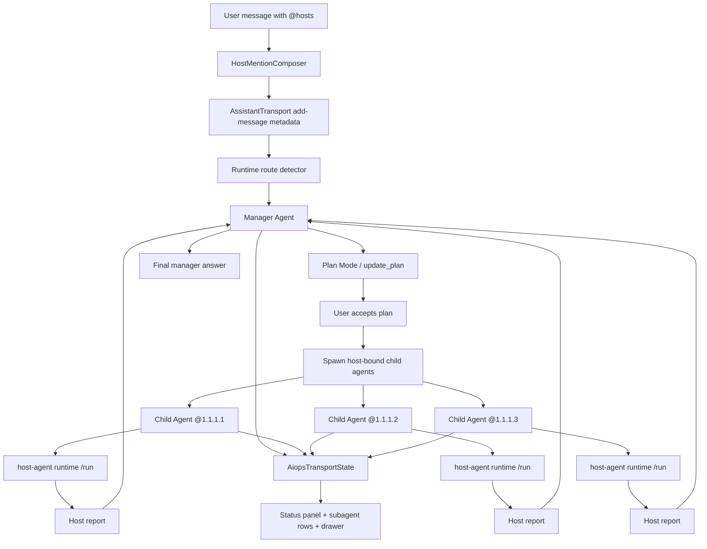

# AIOps AI 对话页 @主机、计划模式与 host-agent 子 Agent 实现设计

日期：2026-06-04

## 1. 背景

当前 aiops-v2 的 AI 对话页已经具备 Assistant UI 对话、结构化 transport stream、Runner Workflow、host-agent 注册与远程执行能力。用户希望在 AI 对话输入中直接 `@主机`，让主页面 Agent 作为管理者，对每台被提及的主机启动独立的 `host-agent` 子 Agent 执行运维工作。

示例：

```text
@1.1.1.1和@1.1.1.2作为pg节点,搭建一个主从集群,@1.1.1.3作为pg_mon.
```

这个请求应触发：

- 主页面 Agent 进入管理者角色，只负责理解需求、制定计划、分发任务、汇总结果。
- 对 `1.1.1.1`、`1.1.1.2`、`1.1.1.3` 分别启动 3 个独立 host-bound 子 Agent。
- 每个子 Agent 只处理自己绑定主机上的运维动作，不能越权操作其他主机。
- 多主机任务必须先进入计划模式，计划展示在输入框上方。
- 子 Agent 列表也展示在输入框上方。
- 点击某个子 Agent 后，在右侧弹窗中查看该子 Agent 独立对话，包括主 Agent 给它发了什么、它返回了什么、它执行了哪些工具。

## 2. 目标

1. 在 AI 对话输入框支持 `@主机` mention，并把 mention 解析为结构化主机引用。
2. 对多主机运维任务强制进入计划模式，执行前必须有结构化计划。
3. 主 Agent 只作为 manager，不直接执行跨主机运维命令。
4. 每个被提及主机启动一个独立 host-bound 子 Agent。
5. 子 Agent 的 host 绑定不可变，工具执行必须落在对应 host-agent runtime。
6. UI 在输入框上方展示一个 Codex 风格的紧凑状态面板，面板内包含计划列表和子 Agent 状态行。
7. 点击子 Agent 状态行的 `打开` 入口，打开侧边弹窗，展示该子 Agent 的独立对话和工具过程。
8. 复用 aiops-v2 现有 structured transport、planning tool、agentmgr、host-agent、runner dispatcher 能力。
9. 参考 `codex/` 的计划更新、collab agent tool call、子线程、任务卡片等设计，但按 AIOps 运维安全约束重构。

## 3. 非目标

- 不把主页面 Agent 变成直接 SSH/命令执行者。
- 不用最终 Markdown 文本解析子 Agent、计划或工具状态。
- 不绕过现有 `AiopsTransportState -> AssistantTransport data stream -> assistant-ui React` 生产路径。
- 不把多个主机合并给一个子 Agent 执行。
- 不允许子 Agent 在运行中修改绑定主机。
- 不在第一阶段实现复杂拓扑自动发现或完整 CMDB 自动补全，先支持 inventory + IP/hostname mention。

## 4. 现有基础

### 4.1 aiops-v2 前端与 transport

当前生产路径由 `AGENTS.md` 明确约束：

```text
TurnItem -> AiopsTransportState -> AssistantTransport data stream -> assistant-ui React
```

关键文件：

- `web/src/chat/ChatPage.tsx`
  - 当前 Chat 页面入口。
  - 使用 `ChatTransportProvider`、`AiopsThread`、`AiopsComposer`。
- `web/src/chat/components/AiopsComposer.tsx`
  - 当前输入框和 pending approval/context request 交互入口。
  - 发送 `add-message` command，并携带 session target metadata。
- `web/src/chat/components/AiopsThread.tsx`
  - 渲染 assistant message、process transcript、artifact。
- `web/src/chat/components/ProcessBlockPart.tsx`
  - 已支持 `kind: "plan"` 的 plan process block。
- `web/src/transport/aiopsTransportTypes.ts`
  - `AiopsTransportState`、turn、process block、pending approval、runtime liveness 类型定义。

### 4.2 aiops-v2 后端 transport

关键文件：

- `internal/appui/transport_state.go`
  - Go 侧 transport state mirror。
  - 当前 schema version 为 `aiops.transport.v2`。
- `internal/appui/transport_projector.go`
  - 将 `runtimekernel.TurnSnapshot` 投影为 `AiopsTransportState`。
  - 新的计划状态、子 Agent 状态应从这里进入前端，而不是从最终文本解析。
- `internal/server/assistant_transport_stream.go`
  - SSE/stream 中以 `aui-state:` 发送 state op。
- `internal/server/assistant_transport_request.go`
  - 当前支持 `add-message`、retry、stop、approval decision、choice answer、mcp 等 command。

### 4.3 计划能力

关键文件：

- `internal/planning/types.go`
  - `PlanState`、`PlanStep`、status 定义。
- `internal/planning/tool.go`
  - `update_plan` tool。
- `internal/planning/reducer.go`
  - 校验 plan step，不允许含糊步骤，同时最多一个 `in_progress`。

这部分应作为多主机计划模式的核心，而不是重新设计一个 Markdown plan。

### 4.4 Agent 管理能力

关键文件：

- `internal/agentmgr/definition.go`
  - `AgentKindPlanner`、`AgentKindWorker`、`AgentInstance`、`HostID`、`ParentID`、`MissionID`。
- `internal/agentmgr/manager.go`
  - `Spawn`、`RunAgent`、`KillAgent`、`CollectResults`。
- `internal/agentmgr/parallel.go`
  - 并行 worker agent 执行框架。
- `internal/agentmgr/kernel_adapter.go`
  - agent manager 与 runtimekernel 的桥接。
- `internal/agentmgr/factory.go`
  - 已存在 `CreateHostAgent` 方向的 host agent 创建逻辑。

现有 `internal/integrations/agents/tools.go` 的 `spawn_agent` / `wait_agent` 偏只读证据收集，不应直接用于 mutating 运维工作。新的 host ops 子 Agent 编排需要独立安全策略。

### 4.5 host-agent 与远程执行

关键文件：

- `cmd/host-agent/main.go`
  - host-agent 进程，提供 `/run`、任务状态、取消能力。
- `internal/appui/host_agent_service.go`
  - host-agent 注册、heartbeat、managed/executable 标记。
- `internal/server/host_agent_api.go`
  - `/api/v1/host-agents/register`、`/api/v1/host-agents/heartbeat`。
- `pkg/runner/scheduler/hybrid_dispatcher.go`
  - 通过 host-agent URL/token 派发远程任务并轮询状态。

新设计应把主机命令执行收敛到 host-agent runtime，不能由主 Agent 直接执行本地 shell 或跨主机 SSH。

host-agent 的 HTTP register/heartbeat、HTTP `/run` 和 gRPC executable stream 都必须使用同一套 host-agent token 治理。gRPC register 在进入 connected host-agent 列表前必须校验 token 与 inventory 中保存的 `AgentTokenRef` 匹配；不能让 gRPC 成为绕过 HTTP `/run` token 校验的第二入口。跨不可信网络部署时，gRPC 通道还需要 TLS/mTLS 或等价传输层保护。

### 4.6 Agent runtime 术语澄清

这里需要区分两个容易混淆的对象：

- `cmd/host-agent` 是安装在目标主机上的执行守护进程，只负责接收 `/run`、执行任务、上报状态和取消任务。
- `host-bound child agent` 是 LLM Agent，和 AI Chat 页面里的 Agent 使用同一套 agent runtime、model/tool loop、prompt compiler、tool registry、approval、stream/projection 机制。

因此“host-agent 的 agent”和 AI Chat 的 agent 不是两套不同的大模型执行框架。正确闭环是：

- AI Chat manager agent 使用 workspace/session 配置，拥有计划、调度、汇总和 `spawn_host_agent` 等 manager-only tools。
- host-bound child agent 使用同一个 agent runtime，但以 host session / worker kind 启动，只注入一个不可变 `boundHostId`。
- child agent 的能力是 AI Chat agent 能力的子集：只能看到绑定主机相关 host tools、approval/evidence/report tools，不能看到 manager tools、workspace tools、跨 host 选择工具或本地 shell。
- child agent 需要执行主机动作时，仍通过 host tool adapter 到 runner hybrid dispatcher，再到目标主机上的 `cmd/host-agent /run`。

生产闭环不应再新增一套“host-agent 专用 LLM runner”。应抽取或复用当前 `runtimekernel.RunTurn` 使用的共享迭代执行器，使 `AgentManager.RunAgent` 和主 Chat turn 共用同一条模型/tool loop。

### 4.7 codex/ 参考点

可借鉴设计：

- `codex/codex-rs/app-server-protocol/schema/typescript/v2/ThreadItem.ts`
  - `plan` item。
  - `collabAgentToolCall` item，包含 `senderThreadId`、`receiverThreadIds`、`prompt`、`agentsStates`。
- `codex/codex-rs/app-server-protocol/schema/typescript/v2/TurnPlanUpdatedNotification.ts`
  - 结构化 plan update notification。
- `codex/codex-rs/core/src/tools/handlers/multi_agents_v2/spawn.rs`
  - spawn 子 Agent 事件、child thread、agent metadata。
- `codex/codex-rs/core/src/tools/handlers/multi_agents_v2/message_tool.rs`
  - manager 给子 Agent 发送消息、follow-up task。
- `codex/codex-rs/tui/src/multi_agents.rs`
  - 子 Agent 状态展示、等待/完成/关闭状态文本。
- `codex/openwork/apps/app/src/app/components/session/composer.tsx`
  - `@` mention 的 contenteditable chip 交互。
- `codex/openwork/apps/app/src/app/components/session/message-list.tsx`
  - task/subagent 嵌套 thread 展示与打开子会话入口。

AIOps 需要借鉴这些交互和协议思想，但必须增加 host 绑定、安全审批、远程执行边界和多主机强制 plan。

## 5. 核心原则

1. **主 Agent 是 manager**
   - 负责意图理解、计划、拆分、调度、汇总。
   - 不直接执行被 `@` 主机上的运维命令。

2. **每台主机一个子 Agent**
   - `@1.1.1.1`、`@1.1.1.2`、`@1.1.1.3` 必须启动 3 个 child agents。
   - 即使多个主机承担相同角色，也不能合并为一个 child agent。

3. **host 绑定不可变**
   - 子 Agent 创建后绑定 `hostId`。
   - 运行期间不能改绑，也不能调用其他 host 的工具。

4. **多主机必须 plan first**
   - mention 主机数 `>= 2` 时，进入计划模式。
   - 未生成计划或计划未确认时，不得执行 mutating host operation。

5. **结构化状态驱动 UI**
   - plan、子 Agent、子对话、工具状态必须进入 `AiopsTransportState` 或可查询的结构化 transcript API。
   - 禁止通过最终回答 Markdown 反推 UI 状态。

6. **host-agent 是执行边界**
   - 子 Agent 的主机工具最终通过 host-agent `/run` 或 runner hybrid dispatcher 执行。
   - 主 Agent 不能绕过 host-agent 直接做主机操作。

7. **审批与审计优先**
   - 高风险操作继续走 approval/action token。
   - 子 Agent drawer 和主页面都能看到关联 approval。

8. **同一 Agent runtime，按角色裁剪能力**
   - manager agent、host-bound child agent、普通 AI Chat host/session agent 都必须复用同一套 LLM agent runtime。
   - 角色差异通过 `AgentKind`、`SessionType`、tool pack、prompt asset、metadata、`boundHostId` 和 policy 控制。
   - host-bound child agent 不允许拥有单独绕过主 Chat 运行时的模型调用、工具执行器或 transcript 写入路径。

## 6. 用户体验设计

### 6.1 页面布局

AI 对话页保持当前大结构，但输入框上方不做分散的大卡片 dock，而是参考 Codex 的紧凑状态面板。计划模式和子 Agent 都收敛在同一个圆角面板中：上半部分是计划列表，下半部分是一行子 Agent 状态。面板下方紧贴 composer。

```text
┌──────────────────────────────────────────────┐
│ Conversation Thread                           │
│                                              │
│ Assistant / tool / result messages            │
│                                              │
│                                              │
│ ┌──────────────────────────────────────────┐ │
│ │ ⌘ 共 5 个任务，已经完成 0 个          ↗ │ │
│ │ ○ 1. 确认三台主机纳管与运行态入口        │ │
│ │ ○ 2. 为 pg 节点分配 primary/standby     │ │
│ │ ○ 3. 分别执行 PostgreSQL 安装与配置      │ │
│ │ ○ 4. 配置 pg_mon 并接入监控              │ │
│ │ ○ 5. 运行复制、监控与连通性验证          │ │
│ │──────────────────────────────────────────│ │
│ │ ⚭ 3 个后台智能体（使用 @ 标记智能体） ■⌄ │ │
│ │ Franklin(@1.1.1.1) 正在等待指示     打开 │ │
│ │ Ada(@1.1.1.2) 正在检查环境          打开 │ │
│ │ Grace(@1.1.1.3) 需要审批            打开 │ │
│ └──────────────────────────────────────────┘ │
│ ┌──────────────────────────────────────────┐ │
│ │ 要求提供后续变更 或 @ 提及智能体          │ │
│ │ +  默认权限 ˅            5.5 超高 ˅  ◼   │ │
│ └──────────────────────────────────────────┘ │
└──────────────────────────────────────────────┘

右侧 Sheet:
┌──────────────────────────────┐
│ Host Agent: @1.1.1.1          │
│ role: pg primary candidate    │
├──────────────────────────────┤
│ Manager -> child prompt        │
│ Child -> response              │
│ tool call /run                 │
│ tool result                    │
├──────────────────────────────┤
│ Follow-up input to this child  │
└──────────────────────────────┘
```

布局约束：

- 计划和子 Agent 必须在同一个状态面板内，不能拆成上下两个视觉重量相同的大模块。
- 状态面板必须紧贴 composer 上方，中间不插入额外说明文案。
- 面板采用轻边框、白底、8px 到 16px 圆角，视觉重量接近 Codex 截图。
- 计划步骤使用紧凑单行列表，不使用表格，不使用大号标题，不使用营销式说明。
- 子 Agent 默认只显示一到三行摘要；超过三行时折叠，通过右侧箭头展开。
- 每个子 Agent 行右侧提供 `打开` 入口，点击后打开右侧 drawer。
- 面板右上角提供展开/收起入口；收起时只保留 header 和当前活跃子 Agent 摘要。

### 6.2 @主机输入

输入框支持：

- `@1.1.1.1`
- `@hostname`
- 从下拉菜单选择 inventory 中的主机。
- 已选主机显示为 mention chip。

交互参考 `codex/openwork/apps/app/src/app/components/session/composer.tsx`，但在 AIOps 中建议实现为 React 组件：

- `HostMentionComposer`
- `ComposerHostMentionMenu`
- `HostMentionChip`

mention 数据来源：

1. 优先查 inventory host：
   - host id
   - hostname
   - IP/address
   - display name
2. 若输入是 IP 但 inventory 不存在：
   - 可以创建 `unresolved` mention。
   - 计划阶段标记为 `blocked`，要求先纳管或安装 host-agent。
   - 执行阶段不得直接运行。

mention 只负责识别主机，不负责完全理解角色。角色如 `pg节点`、`pg_mon` 由 manager 在计划阶段结合自然语言生成结构化分工。

### 6.3 多主机强制计划模式

触发条件：

- 当前 user message 中解析到 `>= 2` 个唯一 host mentions。
- 或者 manager 判断该任务是跨主机拓扑变更，即使只显式 mention 1 个 host，也可以要求补充主机并进入 plan。

UI 行为：

- 输入框上方显示一个 `HostOpsStatusPanel`，不是独立的大号计划卡片。
- 发送后先展示 `计划中`，不立即执行 host operation。
- plan 生成后显示：
  - 总步骤数、已完成数、当前步骤。
  - 每个 step 的 status。
  - step 关联的 host/subagent。
  - `确认计划并执行`、`要求修改计划`、`取消` 操作，但操作按钮放在面板展开态或 header 菜单中，避免挤占计划列表。
- 未确认前：
  - 不 spawn mutating child agent。
  - 可以 spawn 只读预检 child agent，但必须标记 `dry_run` 或 `precheck`。

单主机任务：

- 可展示轻量 plan，但不强制。
- 如果涉及高风险变更，仍由 policy 要求计划或审批。

### 6.4 子 Agent 状态行

子 Agent 不渲染成多张独立卡片，而是在计划面板底部渲染为 Codex 风格的后台智能体状态行。每一行代表一个 host-bound child agent。

状态行字段：

- host display：`@1.1.1.1`
- role：`pg primary candidate`、`pg standby candidate`、`pg_mon`
- status：
  - `planned`
  - `spawning`
  - `running`
  - `waiting`
  - `approval_required`
  - `completed`
  - `failed`
  - `cancelled`
- last activity preview：
  - `正在检查 PostgreSQL 版本`
  - `等待安装 pg_monitor`
  - `需要审批: 修改 postgresql.conf`
- badges：
  - `online`
  - `offline`
  - `host-agent missing`
  - `approval`
  - `error`

视觉规则：

- 第一行是分组标题：`3 个后台智能体（使用 @ 标记智能体）`。
- 标题左侧用小图标，右侧显示 stop/collapse 控件。
- agent 名称可用自动生成昵称 + host，例如 `Franklin(@1.1.1.1)`。
- 状态摘要使用低饱和文本，例如 `正在等待指示`、`正在检查环境`。
- 每个 agent 行右侧显示 `打开`，点击打开右侧 `Sheet` drawer。
- 正在运行的 agent 行可以使用轻量 spinner 或状态点，但不能撑高行高。
- pending approval 的 agent 行显示 `需要审批`，并让 `打开` 入口保持可点。

### 6.5 子 Agent 侧边弹窗

建议复用现有 `web/src/components/ui/sheet.tsx`。

drawer 内容：

- Header：
  - 子 Agent 名称
  - host
  - role
  - mission id
  - status
- Transcript：
  - manager 给子 Agent 的初始任务。
  - manager 后续发送的 follow-up。
  - 子 Agent 的 assistant 回复。
  - 子 Agent 工具调用。
  - 工具结果、approval、错误。
- Composer：
  - 用户可以给当前子 Agent 发 follow-up。
  - follow-up 必须带 `childAgentId`，不能改变 host 绑定。
- Footer actions：
  - stop child
  - retry failed step
  - copy summary

drawer 中显示的是子 Agent 独立对话，不是主线程消息的简单过滤。

## 7. 总体架构



## 8. 数据模型设计

### 8.1 HostMention

新增 domain model，建议放在 `internal/hostops/types.go`：

```go
type HostMention struct {
    TokenID      string    `json:"tokenId"`
    Raw          string    `json:"raw"`
    SpanStart    int       `json:"spanStart"`
    SpanEnd      int       `json:"spanEnd"`
    HostID       string    `json:"hostId,omitempty"`
    Address      string    `json:"address,omitempty"`
    DisplayName  string    `json:"displayName,omitempty"`
    Source       string    `json:"source"` // inventory, ip_literal, hostname_literal
    Resolved     bool      `json:"resolved"`
    Confidence   float64   `json:"confidence"`
    CreatedAt    time.Time `json:"createdAt"`
}
```

说明：

- `TokenID` 是前端 chip 和后端 mention 的稳定关联 id。
- `HostID` 存在时必须来自 inventory。
- `Address` 可以是 IP literal 或 host record address。
- `Resolved=false` 的 mention 只能进入计划和阻塞提示，不能执行。

### 8.2 HostOperationMission

```go
type HostOperationMission struct {
    ID               string             `json:"id"`
    ThreadID         string             `json:"threadId"`
    UserTurnID       string             `json:"userTurnId"`
    ManagerAgentID   string             `json:"managerAgentId"`
    Status           HostMissionStatus  `json:"status"`
    PlanRequired     bool               `json:"planRequired"`
    PlanAccepted     bool               `json:"planAccepted"`
    Mentions         []HostMention      `json:"mentions"`
    ChildAgentIDs    []string           `json:"childAgentIds"`
    CreatedAt        time.Time          `json:"createdAt"`
    UpdatedAt        time.Time          `json:"updatedAt"`
}
```

status：

- `planning`
- `waiting_plan_acceptance`
- `spawning_children`
- `running`
- `waiting_approval`
- `completed`
- `failed`
- `cancelled`

### 8.3 HostChildAgent

```go
type HostChildAgent struct {
    ID                string                `json:"id"`
    MissionID         string                `json:"missionId"`
    ParentAgentID     string                `json:"parentAgentId"`
    SessionID         string                `json:"sessionId"`
    HostID            string                `json:"hostId"`
    HostAddress       string                `json:"hostAddress"`
    Role              string                `json:"role"`
    Task              string                `json:"task"`
    Status            HostChildAgentStatus  `json:"status"`
    PlanStepIDs       []string              `json:"planStepIds"`
    LastInputPreview  string                `json:"lastInputPreview"`
    LastOutputPreview string                `json:"lastOutputPreview"`
    Error             string                `json:"error,omitempty"`
    StartedAt         time.Time             `json:"startedAt"`
    UpdatedAt         time.Time             `json:"updatedAt"`
    CompletedAt       *time.Time            `json:"completedAt,omitempty"`
}
```

status：

- `planned`
- `spawning`
- `running`
- `waiting`
- `approval_required`
- `completed`
- `failed`
- `cancelled`

### 8.4 HostAgentReport

子 Agent 完成或阶段性汇报时返回结构化报告：

```go
type HostAgentReport struct {
    AgentID       string            `json:"agentId"`
    HostID        string            `json:"hostId"`
    Status        string            `json:"status"`
    Summary       string            `json:"summary"`
    ActionsTaken  []string          `json:"actionsTaken"`
    EvidenceRefs  []string          `json:"evidenceRefs"`
    ChangedFiles  []string          `json:"changedFiles"`
    OpenRisks     []string          `json:"openRisks"`
    NeedsApproval bool              `json:"needsApproval"`
    Error         string            `json:"error,omitempty"`
    Metadata      map[string]string `json:"metadata,omitempty"`
}
```

## 9. Transport State 扩展

保持 `aiops.transport.v2` 生产路径，新增 optional fields，避免破坏现有前端。若后续发现前后端无法兼容，再单独升级 schema version。

### 9.1 TypeScript

修改 `web/src/transport/aiopsTransportTypes.ts`：

```ts
export type AiopsTransportState = {
  schemaVersion: string;
  sessionId?: string;
  threadId?: string;
  status: AiopsTransportStatus;
  currentTurnId?: string;
  turns: Record<string, AiopsTransportTurn>;
  turnOrder: string[];
  pendingApprovals: Record<string, AiopsPendingApproval>;
  mcpSurfaces: Record<string, AiopsMcpSurface>;
  artifacts: Record<string, AiopsTransportArtifact>;
  runtimeLiveness?: AiopsRuntimeLiveness;
  hostMissions?: Record<string, AiopsTransportHostMission>;
  childAgents?: Record<string, AiopsTransportChildAgent>;
  activeHostMissionId?: string;
  lastError?: AiopsTransportError;
  seq: number;
  updatedAt?: string;
};
```

新增：

```ts
export type AiopsTransportHostMission = {
  id: string;
  turnId: string;
  status: HostMissionStatus;
  planRequired: boolean;
  planAccepted: boolean;
  mentionedHosts: AiopsTransportHostMention[];
  childAgentIds: string[];
  managerAgentId?: string;
  activeChildAgentId?: string;
  createdAt?: string;
  updatedAt?: string;
};

export type AiopsTransportChildAgent = {
  id: string;
  missionId: string;
  parentAgentId?: string;
  sessionId: string;
  hostId: string;
  hostAddress?: string;
  hostDisplayName: string;
  role?: string;
  task?: string;
  status: HostChildAgentStatus;
  planStepIds?: string[];
  lastInputPreview?: string;
  lastOutputPreview?: string;
  error?: string;
  startedAt?: string;
  updatedAt?: string;
  completedAt?: string;
};

export type AiopsTransportHostMention = {
  tokenId: string;
  raw: string;
  hostId?: string;
  address?: string;
  displayName?: string;
  source: "inventory" | "ip_literal" | "hostname_literal";
  resolved: boolean;
};
```

`AiopsTransportProcessKind` 建议新增：

```ts
| "subagent"
```

用于展示 spawn、send、wait、finish 等过程卡片。也可以命名为 `"agent"`，但 `"subagent"` 更贴近 UI。

### 9.2 Go

同步修改 `internal/appui/transport_state.go`：

```go
type AiopsTransportState struct {
    SchemaVersion       string                               `json:"schemaVersion"`
    SessionID           string                               `json:"sessionId,omitempty"`
    ThreadID            string                               `json:"threadId,omitempty"`
    Status              AiopsTransportStatus                 `json:"status"`
    CurrentTurnID       string                               `json:"currentTurnId,omitempty"`
    Turns               map[string]AiopsTransportTurn        `json:"turns"`
    TurnOrder           []string                             `json:"turnOrder"`
    PendingApprovals    map[string]AiopsPendingApproval      `json:"pendingApprovals"`
    McpSurfaces         map[string]AiopsMcpSurface           `json:"mcpSurfaces"`
    Artifacts           map[string]AiopsTransportArtifact    `json:"artifacts"`
    RuntimeLiveness     *AiopsRuntimeLiveness                `json:"runtimeLiveness,omitempty"`
    HostMissions        map[string]AiopsTransportHostMission `json:"hostMissions,omitempty"`
    ChildAgents         map[string]AiopsTransportChildAgent  `json:"childAgents,omitempty"`
    ActiveHostMissionID string                               `json:"activeHostMissionId,omitempty"`
    LastError           *AiopsTransportError                 `json:"lastError,omitempty"`
    Seq                 int64                                `json:"seq"`
    UpdatedAt           string                               `json:"updatedAt,omitempty"`
}
```

并新增 Go mirror types。

### 9.3 Projector

修改 `internal/appui/transport_projector.go`：

- 从 `runtimekernel.TurnSnapshot` 或 host ops store 读取 mission/child agent 状态。
- 投影到 `HostMissions`、`ChildAgents`。
- 将 child agent lifecycle event 映射为 `kind: "subagent"` process block：
  - `spawn_host_agent`
  - `send_message`
  - `wait_agent`
  - `agent_report`
  - `agent_failed`

## 10. 请求与命令协议

### 10.1 add-message metadata

前端发送 `add-message` 时，metadata 增加 host mentions：

```json
{
  "hostMentions": [
    {
      "tokenId": "hm_1",
      "raw": "@1.1.1.1",
      "hostId": "host_abc",
      "address": "1.1.1.1",
      "displayName": "1.1.1.1",
      "source": "inventory",
      "resolved": true
    }
  ],
  "hostOps": {
    "planRequired": true,
    "clientDetectedMultiHost": true
  }
}
```

后端必须重新解析和校验，不信任客户端 metadata。

### 10.2 新 command

在 `internal/server/assistant_transport_request.go` 增加：

1. `aiops.host-plan-accept`

```json
{
  "type": "aiops.host-plan-accept",
  "missionId": "mission_123",
  "planId": "plan_123"
}
```

2. `aiops.host-plan-revise`

```json
{
  "type": "aiops.host-plan-revise",
  "missionId": "mission_123",
  "instruction": "先检查现有PG版本，再决定是否安装"
}
```

3. `aiops.child-agent-message`

```json
{
  "type": "aiops.child-agent-message",
  "childAgentId": "agent_1",
  "content": "只检查配置文件，不要修改"
}
```

4. `aiops.child-agent-stop`

```json
{
  "type": "aiops.child-agent-stop",
  "childAgentId": "agent_1"
}
```

这些 command 都必须校验：

- child agent 属于当前 thread/session。
- child agent 的 parent mission 属于当前主会话。
- stop/message 不允许改变 child agent host binding。

### 10.3 transcript API

子 Agent drawer 需要读取独立 transcript。两种方案：

方案 A：完整 transcript 进入 `AiopsTransportState`

- 优点：UI 数据单一路径。
- 缺点：多子 Agent 长 transcript 会让主 stream 状态过大。

方案 B：transport 只放 summary/index，drawer 打开时调用 API 拉 transcript

- 优点：主线程状态轻量。
- 缺点：需要额外 API。

建议采用方案 B：

```http
GET /api/v1/host-ops/child-agents/{childAgentId}/transcript
POST /api/v1/host-ops/child-agents/{childAgentId}/messages
POST /api/v1/host-ops/child-agents/{childAgentId}/stop
```

同时，drawer 发送 follow-up 也可以走 AssistantTransport command，保持实时更新。

## 11. 后端编排设计

### 11.0 真实执行闭环架构

闭环目标不是“能在 UI 里显示子 Agent”，而是 manager agent 能实际启动 host-bound child agent，child agent 能用同一套 AI Chat agent runtime 运行模型、调用受限工具、经 host-agent 执行主机操作，并把结果回写到独立 transcript 和主 mission 状态。

目标链路：

```text
用户 @主机 请求
  -> AI Chat manager turn(runtimekernel.RunTurn / shared iteration loop)
  -> update_plan
  -> 用户确认 plan
  -> manager 调用 spawn_host_agent
  -> hostops.Orchestrator.SpawnChildren
  -> agentmgr.AgentFactory.CreateHostChildAgent
  -> agentmgr.AgentManager.Spawn
  -> agentmgr.AgentManager.RunAgent
  -> shared AI Chat agent runtime executes child AgentConfig
  -> child agent calls host-bound tools
  -> hostops.ExecutionAdapter / runner hybrid dispatcher
  -> cmd/host-agent /run on the bound host
  -> tool result and assistant output
  -> child transcript store + TurnItem/projection
  -> wait_host_agents / mission summary
  -> manager final answer
```

必补的生产接口：

- `AgentRunner` 不能是另一套实现；它必须包装同一套 AI Chat agent iteration loop。推荐命名为 `runtimekernel.AgentConfigRunner` 或 `agentmgr.SharedRuntimeRunner`，输入是 `agentmgr.AgentConfig`，输出是 agent final text 和结构化 lifecycle events。
- `AgentManager` 需要支持异步运行 worker：`Spawn` 只注册实例，`RunAgent` 使用 shared runner 执行；hostops spawn 后要立即调度 `RunAgent`，不能只返回 `spawning`。
- `KernelAdapter.SpawnHostChild` 需要创建 `AgentConfig` 后保存/传入运行器，或者返回 child 后由 orchestrator 调用 `RunHostChild`。二者只能选一个生产路径，避免 spawn/run 分裂。
- `KernelAdapter.SendMessage` 必须把 drawer follow-up 转成该 child session 的新 child turn，并再次走 shared runner；不能只更新 `LastInputPreview`。
- child transcript 必须来自 shared runtime 的 user/assistant/tool TurnItems 或 lifecycle events，而不是手写模拟文本。

状态闭环要求：

- child spawn 成功后状态从 `spawning` 进入 `running`。
- shared runner 结束后，child 状态必须进入 `completed` / `failed` / `blocked` / `cancelled`。
- `wait_host_agents` 读取的状态必须来自 `AgentManager` 和 hostops store 的同一份事实源。
- manager final answer 只能在所有 required child agents 终态或被用户取消后生成。

### 11.1 hostops 包

新增包：

```text
internal/hostops/
  types.go
  mention_parser.go
  resolver.go
  mission_store.go
  orchestrator.go
  child_agent_runtime.go
  transcript_store.go
  policy.go
```

职责：

- 解析与解析后校验 host mentions。
- 创建 `HostOperationMission`。
- 管理 plan required / accepted 状态。
- 调用 `agentmgr` 创建 host-bound child agents。
- 保存 child agent transcript。
- 汇总 child agent report。
- 暴露给 runtimekernel/server 的 orchestration API。

### 11.2 mention parser

客户端 parser 只服务 UX。后端 parser 是权威。

基础规则：

- 识别 `@` 后的连续 token。
- 支持 IPv4、IPv6 bracket、hostname、inventory alias。
- 中文语境中允许 `@1.1.1.1和@1.1.1.2`，第二个 `@` 仍可识别。
- 去重以 resolved host id 为准；未 resolved 时以 normalized address 为准。

伪代码：

```go
func ParseHostMentions(input string) []HostMention {
    spans := scanAtTokens(input)
    mentions := make([]HostMention, 0, len(spans))
    for _, span := range spans {
        raw := input[span.Start:span.End]
        token := strings.TrimPrefix(raw, "@")
        mentions = append(mentions, normalizeMention(raw, token, span))
    }
    return mentions
}
```

解析后调用 resolver：

```go
func ResolveMentions(ctx context.Context, mentions []HostMention) ([]HostMention, []HostMentionError)
```

resolver 匹配顺序：

1. exact host id
2. exact host address
3. exact hostname/display name
4. normalized IP literal

### 11.3 route detector

在 runtime 入口增加 host ops route：

```go
type RouteDecision struct {
    Kind          string // normal_chat, host_ops
    Mentions      []HostMention
    PlanRequired  bool
    Reason        string
}
```

规则：

- `len(uniqueResolvedOrLiteralMentions) >= 1` 且用户请求包含运维意图，route 为 `host_ops`。
- `len(uniqueMentions) >= 2` 时 `PlanRequired=true`。
- 若 mention 存在 unresolved host，仍进入 `host_ops`，但 mission status 为 `planning/blocked`，计划中加入纳管/安装 host-agent 步骤。

运维意图判断：

- 第一阶段可用 deterministic keyword + model route 双层判断。
- 关键词只用于快速召回，不做最终执行授权。
- 最终是否执行 mutating action 由 plan、policy、approval 决定。

### 11.4 manager agent prompt 约束

manager system prompt 增加：

```text
你是多主机运维任务的管理者。
当用户消息包含多个 @主机 时，你必须先制定结构化计划。
你不能直接在任何被 @ 的主机上执行命令。
你必须为每个被 @ 的唯一主机启动一个独立 host-bound 子 Agent。
每个子 Agent 只能处理其绑定主机上的任务。
你需要等待子 Agent 汇报，合并结果，并向用户说明整体进度、风险和最终结果。
```

manager 可见内部工具：

- `update_plan`
- `spawn_host_agent`
- `send_host_agent_message`
- `wait_host_agents`
- `stop_host_agent`

这些工具只暴露给 manager agent，不暴露给 host child agent。

### 11.5 spawn_host_agent

内部工具 schema：

```json
{
  "name": "spawn_host_agent",
  "input_schema": {
    "type": "object",
    "required": ["missionId", "hostId", "role", "task"],
    "properties": {
      "missionId": { "type": "string" },
      "hostId": { "type": "string" },
      "role": { "type": "string" },
      "task": { "type": "string" },
      "planStepIds": {
        "type": "array",
        "items": { "type": "string" }
      }
    }
  }
}
```

执行逻辑：

1. 校验 mission 存在且 plan 已确认。
2. 校验 host 属于 mission mentions。
3. 校验 host resolved、managed、executable、host-agent online。
4. 检查该 host 是否已经有 child agent。
5. 调用 `agentmgr.AgentFactory.CreateHostChildAgent` 生成 child `AgentConfig`，该 config 复用 AI Chat agent runtime，只裁剪 prompt/tools/host binding。
6. 调用 `agentmgr.AgentManager.Spawn` 创建 worker instance 和 child session/thread。
7. 立即调度 `agentmgr.AgentManager.RunAgent`，由 shared runtime runner 执行 child `AgentConfig`。
8. 写入 mission store、transcript store，并投影 `childAgents[agentId].status = "spawning/running"`。

对于用户示例，spawn 结果必须是 3 个：

```text
agent_host_1 -> host 1.1.1.1 -> pg node role
agent_host_2 -> host 1.1.1.2 -> pg node role
agent_host_3 -> host 1.1.1.3 -> pg_mon role
```

### 11.6 child agent prompt 约束

host child agent system prompt：

```text
你是 host-bound 运维子 Agent。
你的绑定主机是 {hostDisplayName}，hostId={hostId}。
你只能对这个主机执行检查、配置、安装或诊断。
如果任务需要其他主机信息，你只能向 manager 汇报需要协调，不能直接操作其他主机。
所有命令必须通过允许的 host tools 执行。
高风险变更必须请求审批。
你的输出必须包含结构化 HostAgentReport。
```

child agent 可见工具：

- host status/read tools
- package/service/file/config tools
- runner command tools
- approval request tool
- evidence report tool

这些工具不是一套新的 host-agent agent 工具系统，而是 AI Chat tool registry 中按 `host_child` profile / tool pack 裁剪出的子集。tool context 必须携带：

```go
ToolContext{
    AgentKind:   AgentKindHostChild,
    BoundHostID: child.HostID,
    MissionID:   child.MissionID,
    SessionID:   child.SessionID,
}
```

child agent 不可见工具：

- `spawn_host_agent`
- `wait_host_agents`
- `send_host_agent_message`
- `stop_host_agent`
- 任意跨 host 选择工具
- workspace 本地 shell，除非明确是安全只读上下文工具

### 11.7 child agent host enforcement

工具层必须做强制校验：

```go
func EnforceHostBinding(ctx ToolContext, requestedHostID string) error {
    if ctx.AgentKind != AgentKindHostChild {
        return nil
    }
    if requestedHostID == "" {
        requestedHostID = ctx.BoundHostID
    }
    if requestedHostID != ctx.BoundHostID {
        return ErrCrossHostDenied
    }
    return nil
}
```

任何 host tool、runner dispatch、file operation 都必须经过此校验。

### 11.8 执行边界

child agent 执行命令的路径：

```text
Child Agent
  -> shared AI Chat agent runtime
  -> host tool adapter
  -> runner workflow / hybrid dispatcher
  -> host-agent /run
  -> task status polling
  -> tool result
  -> child transcript
  -> HostAgentReport
```

不允许：

```text
Manager Agent -> local shell -> ssh root@host
Manager Agent -> direct host-agent /run
Child Agent @hostA -> host-agent @hostB
```

## 12. 前端组件设计

### 12.1 文件变更建议

```text
web/src/chat/components/
  AiopsComposer.tsx
  HostMentionComposer.tsx
  ComposerHostMentionMenu.tsx
  HostMentionChip.tsx
  HostOpsStatusPanel.tsx
  HostOpsPlanSection.tsx
  HostSubagentStatusRow.tsx
  HostSubagentDrawer.tsx

web/src/transport/
  aiopsTransportTypes.ts
  aiopsTransportConverter.ts

web/src/api/
  hosts.js
  hostOps.ts
```

`AiopsComposer.tsx` 不建议一次性重写。第一阶段可以保留现有 Assistant UI composer 逻辑，把 host mention 能力封装为内部输入层。

### 12.2 HostOpsStatusPanel

职责：

- 读取 `AiopsTransportState.activeHostMissionId`。
- 找到 mission、child agents。
- 决定是否展示紧凑计划区域。
- 决定是否展示后台智能体状态行。
- 控制面板展开/收起。
- 管理 active drawer child agent id。
- 保证面板位于 composer 上方，并与 composer 形成一组连续的底部交互区。

伪代码：

```tsx
export function HostOpsStatusPanel() {
  const state = useAiopsTransportState();
  const mission = selectActiveHostMission(state);
  const [drawerAgentId, setDrawerAgentId] = useState<string | null>(null);
  const [expanded, setExpanded] = useState(true);

  if (!mission) return null;

  return (
    <div className="rounded-2xl border bg-background shadow-sm">
      <HostOpsPanelHeader
        mission={mission}
        expanded={expanded}
        onExpandedChange={setExpanded}
      />
      {expanded ? (
        <>
          <HostOpsPlanSection mission={mission} />
          <HostSubagentStatusRow
            mission={mission}
            agents={selectMissionAgents(state, mission.id)}
            onOpenAgent={setDrawerAgentId}
          />
        </>
      ) : (
        <HostOpsCompactSummary mission={mission} />
      )}
      <HostSubagentDrawer
        childAgentId={drawerAgentId}
        open={drawerAgentId != null}
        onOpenChange={(open) => !open && setDrawerAgentId(null)}
      />
    </div>
  );
}
```

组件放置位置：

```tsx
<AiopsThread />
<div className="mx-auto w-full max-w-thread px-4">
  <HostOpsStatusPanel />
  <AiopsComposer />
</div>
```

`HostOpsStatusPanel` 和 `AiopsComposer` 之间只保留 8px 到 12px 间距，形成 Codex 截图中的底部操作区。

### 12.3 Plan section

Plan section 数据来源：

- mission `planRequired`
- 当前 turn 的 `kind: "plan"` process block
- 或 host mission 挂载的 `planState`

建议渲染规则：

- `planRequired=true` 且没有 plan：显示 `正在制定多主机计划`。
- 有 plan 且 `planAccepted=false`：显示确认/修改按钮。
- `planAccepted=true`：显示执行进度和当前 step。
- 计划失败：显示失败原因和重新规划入口。

视觉规则：

- Header 文案使用 `共 N 个任务，已经完成 M 个`。
- 步骤列表单行显示，左侧为状态圆点或 spinner，右侧为步骤文本。
- 步骤文本过长时一行截断，不撑高面板；展开详情时再显示完整内容。
- 不使用大按钮占据主视觉，确认/修改/取消放在 header 右侧菜单或展开详情区。

### 12.4 Subagent status row

子 Agent 区域是计划面板底部的一段状态行，不是独立横向卡片区。它与计划步骤之间用一条细分割线隔开。

推荐视觉：

- 分组标题：`3 个后台智能体（使用 @ 标记智能体）`。
- 每个 agent 一行：昵称/host + role + last activity + `打开`。
- 右侧 status dot、spinner 或 stop/collapse 控件。
- pending approval 用醒目但克制的 badge。

移动端：

- 默认只显示当前活跃 agent 和 `共 N 个后台智能体`。
- 点击展开后显示完整 agent 列表。
- drawer 变成 bottom sheet 或 full screen sheet。

### 12.5 Subagent drawer

数据加载：

```ts
GET /api/v1/host-ops/child-agents/:id/transcript
```

drawer 打开后：

- 立即加载历史 transcript。
- 若 child agent running，订阅 transport state 更新来刷新 status 和 last preview。
- follow-up 使用 `aiops.child-agent-message` command。

transcript item 类型：

```ts
type HostChildTranscriptItem =
  | { type: "manager_message"; content: string; createdAt: string }
  | { type: "user_followup"; content: string; createdAt: string }
  | { type: "assistant_message"; content: string; createdAt: string }
  | { type: "tool_call"; name: string; input: unknown; createdAt: string }
  | { type: "tool_result"; name: string; output: unknown; createdAt: string }
  | { type: "approval"; approvalId: string; status: string; createdAt: string }
  | { type: "error"; message: string; createdAt: string };
```

## 13. 示例流程

用户输入：

```text
@1.1.1.1和@1.1.1.2作为pg节点,搭建一个主从集群,@1.1.1.3作为pg_mon.
```

流程：

1. Composer 识别 3 个 host mentions。
2. 前端发送 `add-message`，metadata 中包含 host mention candidates。
3. 后端重新解析并 resolve：
   - `1.1.1.1 -> host_a`
   - `1.1.1.2 -> host_b`
   - `1.1.1.3 -> host_c`
4. route detector 判断为 `host_ops`，且 `PlanRequired=true`。
5. 创建 `HostOperationMission`，状态为 `planning`。
6. manager agent 调用 `update_plan`，生成计划：
   - 检查三台主机 host-agent 状态和 PostgreSQL 环境。
   - 确定 `1.1.1.1` / `1.1.1.2` 主从角色。
   - 在 pg 节点安装/配置 PostgreSQL。
   - 在 `1.1.1.3` 安装/配置 pg_mon。
   - 做复制、监控、连通性验证。
7. UI 在输入框上方显示紧凑计划面板，等待用户确认。
8. 用户确认计划。
9. manager spawn 3 个 child agents：
   - `host-agent child: host_a`
   - `host-agent child: host_b`
   - `host-agent child: host_c`
10. 三个 child agents 并行执行各自主机预检。
11. 需要修改配置或安装包时，各 child agent 发起 approval。
12. 用户可从主页面 approval 区或 child drawer 处理审批。
13. child agents 完成后提交 `HostAgentReport`。
14. manager 汇总最终结果，更新 plan steps，输出最终回答。

## 14. 安全与审批

### 14.1 风险分级

至少区分：

- read-only：
  - 查询版本、状态、日志、配置。
- low-risk change：
  - 创建临时目录、读取备份。
- high-risk change：
  - 安装软件包。
  - 修改 PostgreSQL 配置。
  - 重启服务。
  - 修改防火墙。
  - 初始化主从复制。
- destructive：
  - 删除数据目录。
  - 覆盖已有集群。
  - 停止生产服务。

high-risk 和 destructive 必须审批。destructive 默认拒绝，除非用户明确确认并有 action token。

### 14.2 审计字段

每个 host operation 记录：

- mission id
- child agent id
- host id
- tool name
- command/script hash
- approval id
- started/completed timestamp
- stdout/stderr digest
- result status

审计记录不能包含 host-agent token 或敏感环境变量明文。

### 14.3 跨主机保护

后端必须保护：

- child agent tool context 只能有一个 bound host。
- 工具输入里的 host id 与 bound host 不一致时拒绝。
- manager 的 host operation tool 只能 spawn/send/wait，不能 run host command。
- transcript API 校验 session/thread 权限。

## 15. 错误处理

### 15.1 unresolved host

场景：

```text
@1.1.1.9 部署 pg
```

若 `1.1.1.9` 不在 inventory：

- mention chip 显示 `未纳管`。
- 计划面板显示阻塞步骤：纳管主机或安装 host-agent。
- 不允许执行部署。

### 15.2 host-agent offline

若 host 已纳管但 heartbeat 过期：

- 子 Agent 状态行显示 `blocked` 或 `failed`。
- plan step 标记 `blocked`。
- manager 提示先恢复 host-agent。

### 15.3 spawn failed

若某台 host spawn 失败：

- 只影响该 host 的 child agent。
- mission 进入 `failed` 或 `partial_failed`。
- manager 汇总说明哪些 host 未执行。

### 15.4 approval rejected

若用户拒绝某个 high-risk operation：

- 对应 child agent 停止该动作。
- plan step 标记 `blocked` 或 `cancelled`。
- manager 重新规划或输出无法继续的原因。

### 15.5 child timeout

若 child agent 长时间无响应：

- status 更新为 `waiting` 或 `timeout`。
- UI card 显示最后活动时间。
- 用户可以 stop/retry。

## 16. 测试方案

### 16.1 后端单元测试

建议覆盖：

- `ParseHostMentions`：
  - `@1.1.1.1和@1.1.1.2`
  - hostname
  - duplicate host
  - malformed mention
- `ResolveMentions`：
  - address match
  - hostname match
  - unresolved IP
- route detector：
  - 单 host 不强制 plan。
  - 多 host 强制 plan。
  - 多 host 未确认 plan 不 spawn mutating child agent。
- host binding：
  - child agent 请求自身 host 允许。
  - child agent 请求其他 host 拒绝。
- mission orchestration：
  - 3 mentions 创建 3 child agents。
  - duplicate mention 只创建 1 child agent。
  - offline host 进入 blocked。
- transport projector：
  - mission/child agent 投影到 `AiopsTransportState`。
  - subagent process block 正确生成。

命令：

```bash
go test ./internal/hostops ./internal/planning ./internal/agentmgr ./internal/appui ./internal/server
```

### 16.2 前端测试

建议覆盖：

- mention composer：
  - 输入 `@` 打开 host suggestion。
  - 选择 host 生成 chip。
  - `@1.1.1.1和@1.1.1.2` 识别两个 mention。
- host ops status panel：
  - 多 host mission 显示紧凑计划面板。
  - plan 未确认时显示确认/修改按钮。
  - child agents 作为面板底部状态行显示在 composer 上方。
- child drawer：
  - 点击 agent 行的 `打开` 入口打开 drawer。
  - transcript 正确渲染 manager message、assistant reply、tool call。
  - follow-up command 带 childAgentId。
- responsive：
  - 移动端默认显示当前活跃 agent，展开后显示完整列表。
  - drawer 不遮挡 composer 状态。

命令：

```bash
cd web
npm run test
npm run test:ui:snapshots
```

### 16.3 集成测试

构造 3 个 fake host-agent：

- `host_a`：正常。
- `host_b`：需要 approval。
- `host_c`：第一次执行失败后 retry 成功。

验证：

- 主线程进入 plan mode。
- 紧凑计划面板出现在输入框上方。
- 生成 3 个 child agent 状态行。
- 三个 child transcript 独立。
- manager 最终汇总包含三台主机状态。

## 17. 分阶段落地

### 阶段 1：数据契约与 parser

交付：

- `internal/hostops` types/parser/resolver。
- TS/Go transport optional fields。
- 后端 route detector 初版。
- parser/resolver 单元测试。

验收：

- 输入多 `@主机` 后，后端能创建 host mission。
- 多主机 mission 标记 `planRequired=true`。

### 阶段 2：输入框 mention 与 Dock UI

交付：

- `HostMentionComposer`。
- `HostOpsStatusPanel`。
- `HostOpsPlanCard`。
- `HostSubagentStrip`。
- 前端 snapshot 测试。

验收：

- 输入框可插入 host chips。
- 多 host 后紧凑计划面板显示在输入框上方。
- mock child agents 可在输入框上方展示。

### 阶段 3：manager route 与强制计划

交付：

- `host_ops` route。
- manager prompt 约束。
- 多主机 plan first 逻辑。
- `aiops.host-plan-accept` / `aiops.host-plan-revise`。

验收：

- 多主机请求未确认计划前不会执行 mutating tool。
- 用户确认计划后才进入 spawn 阶段。

### 阶段 4：host-bound child agent 生命周期

交付：

- `spawn_host_agent`、`send_host_agent_message`、`wait_host_agents`、`stop_host_agent`。
- `HostChildAgent` store。
- child transcript store/API。
- `HostSubagentDrawer`。

验收：

- 示例请求创建 3 个 child agents。
- 点击任意 child agent 行的 `打开` 入口可打开独立 drawer。
- drawer 能看到 manager input 和 child output。

### 阶段 5：共享 AI Chat agent runtime 闭环

交付：

- 为 `agentmgr.AgentManager` 提供生产 `AgentRunner`，该 runner 复用 `runtimekernel.RunTurn` 当前使用的 shared iteration loop。
- `KernelAdapter.SpawnHostChild` 不只注册 worker，还能把 `AgentFactory.CreateHostChildAgent` 生成的 child `AgentConfig` 调度到 `RunAgent`。
- `KernelAdapter.SendMessage` 把 drawer follow-up 转成 child session 的新 turn，并再次进入 shared runtime。
- child transcript 从真实 child turn 的 user/assistant/tool events 写入，不使用 fixture 或 preview 字段模拟。
- `wait_host_agents` 能等待真实 running child agents 进入终态。

验收：

- 示例请求确认计划后，3 个 child agents 从 `spawning` 进入 `running`，最终进入 `completed/failed/blocked/cancelled`。
- 每个 child agent 的模型调用、工具调用、审批、输出都能在 drawer transcript 中看到。
- child agent 的 final output 可被 manager 汇总，manager 不直接执行主机工具。
- host child agent 和普通 AI Chat agent 使用同一套 model/tool loop；差异仅来自 prompt、tools、metadata、bound host 和 policy。

### 阶段 6：host-agent 执行与安全审批

交付：

- child host tools 接入 runner hybrid dispatcher。
- host binding enforcement。
- high-risk approval。
- audit log。

验收：

- child agent 只能操作绑定 host。
- 跨 host 工具调用被拒绝。
- 修改配置、安装包、重启服务进入审批。

### 阶段 7：稳定性与可观测

交付：

- timeout/retry/cancel。
- partial failure 汇总。
- mission metrics。
- e2e fake host-agent 测试。

验收：

- 单 host 失败不会污染其他 child transcript。
- manager final answer 清楚说明每台主机结果。
- 页面刷新后 mission、plan、child agent 状态可恢复。

## 18. 验收标准

以用户示例为准：

```text
@1.1.1.1和@1.1.1.2作为pg节点,搭建一个主从集群,@1.1.1.3作为pg_mon.
```

必须满足：

1. 前端识别 3 个 host mentions。
2. 后端解析并校验 3 个唯一主机。
3. 主线程进入多主机计划模式。
4. 紧凑计划面板显示在输入框上方。
5. 计划确认前不执行 mutating host operation。
6. 计划确认后启动 3 个独立 host-bound child agents。
7. 子 Agent 状态行显示在计划面板底部，并整体位于输入框上方。
8. 每个 child agent 只绑定自己的 host。
9. 点击任一 child agent 打开右侧 drawer。
10. drawer 中能看到该 child agent 独立对话、工具调用和结果。
11. child agent 使用和 AI Chat 相同的 shared agent runtime，只暴露 host-bound 子集能力。
12. `@1.1.1.1` child agent 能通过 host-agent `/run` 在绑定主机上执行 PostgreSQL 安装/检查命令。
13. manager 最终回答汇总三台主机的执行状态、风险和下一步。
12. 高风险动作必须审批。

## 19. 需确认事项

1. 未纳管 IP mention 的产品策略：
   - 建议允许作为 `unresolved mention` 进入计划，但执行前必须纳管。
2. 多主机计划是否需要用户显式点击确认：
   - 建议必须显式确认，尤其涉及安装、配置、重启。
3. 子 Agent drawer 是否允许用户直接 follow-up：
   - 建议允许，但 follow-up 只能发送给当前 child agent，且不能修改 host binding。
4. 子 Agent transcript 是否需要长期持久化：
   - 建议至少持久化到 mission 结束后可审计，保留策略与现有会话一致。
5. PostgreSQL 这类跨主机角色分配是否允许 manager 自动决定 primary/standby：
   - 建议 manager 在计划中给出角色分配，并等待用户确认。

## 20. 推荐实现顺序

最小可用路径：

1. 后端 host mention parser + resolver。
2. Transport state 增加 mission/child agents optional fields。
3. 前端输入框上方 `HostOpsStatusPanel`，先用 mock/state 驱动。
4. 多主机 route 强制 `planRequired=true`。
5. 接通 `update_plan` 和 plan accept command。
6. 接通 `agentmgr` 创建 host-bound child agents。
7. 接通 child transcript drawer。
8. 最后接入 host-agent `/run` 和高风险审批。

这样可以先验证 UI/UX 和协议，再逐步打开真实主机执行能力。
