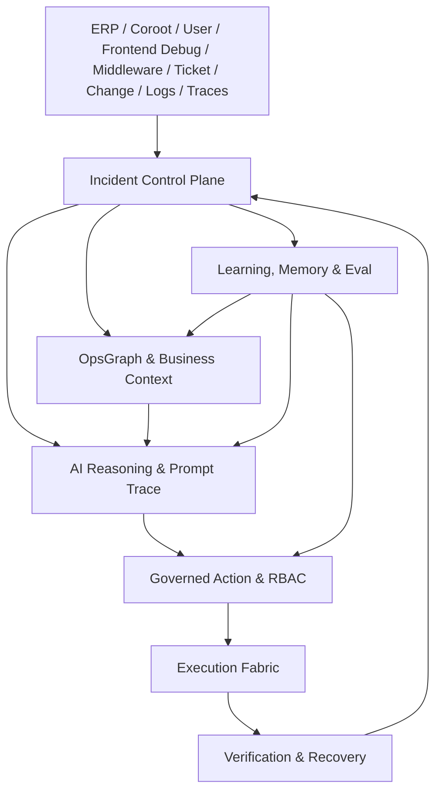

# aiops-v2 企业级智能运维控制平面总体设计

日期：2026-05-11
状态：总纲索引与跨模块约束
范围：`aiops-v2` 企业级智能运维平台的终局目标、模块边界、跨模块数据流和系统不变量。

## 1. 北极星

`aiops-v2` 的终极目标不是“会 SSH 的 AI 聊天框”，也不是“接入很多 MCP 的工具集合”，而是企业生产运维的智能控制平面。

平台北极星：

> aiops-v2 让企业生产事故从发现到解决形成可审计、可控、可学习的智能闭环：AI 负责理解、关联、推理、提案和编排，平台负责权限、证据、锁、审批、执行、验证和沉淀，最终逐步把重复性应急运维转化为可复用、可治理、可演进的企业运维资产。

推荐产品定位是 **Human-governed Autonomous Operations Platform**：人治理，AI 推理和编排，平台掌握生产边界。它允许逐步自动化，但每一步都必须能解释、审计、回滚和验证。

## 2. 总体链路

```text
告警 / 用户问题 / ERP 业务异常 / 用户侧慢请求调试 / 中间件异常
  -> IncidentCase / OperationCase / DebugCase
  -> Evidence / TraceContext / OpsGraph / BusinessImpact
  -> AI Reasoning / Prompt Trace / Runbook Match / Hypothesis
  -> ActionProposal / Policy / RBAC / Approval / HostLease
  -> Workflow / Tool / Host Agent / MCP / K8s / ERP Action
  -> Verification / Recovery / Postmortem
  -> Experience Pack / Memory / OpsGraph Patch / Eval
```



## 3. 模块设计文档

总纲只保留目标、边界和跨模块约束。详细设计按模块拆分：

| 顺序 | 模块 | 文档 | 主要问题 |
| --- | --- | --- | --- |
| 01 | Incident Control Plane | [2026-05-11-aiops-v2-01-incident-control-plane-module-design.zh.md](2026-05-11-aiops-v2-01-incident-control-plane-module-design.zh.md) | 如何把告警、对话、调试、ERP 和中间件异常统一成 case |
| 01a | Incident Control Plane Frontend | [2026-05-11-aiops-v2-01a-incident-control-plane-frontend-design.zh.md](2026-05-11-aiops-v2-01a-incident-control-plane-frontend-design.zh.md) | 如何设计 case 队列、case 工作台、证据、动作、验证和资产沉淀页面 |
| 01b | Incident Control Plane Frontend TODO | [2026-05-11-aiops-v2-01b-incident-control-plane-frontend-todo.zh.md](2026-05-11-aiops-v2-01b-incident-control-plane-frontend-todo.zh.md) | 如何按任务落地 Incident Control Plane 前端 |
| 02 | Governed Action & Multi-user RBAC | [2026-05-11-aiops-v2-02-governed-action-rbac-module-design.zh.md](2026-05-11-aiops-v2-02-governed-action-rbac-module-design.zh.md) | 如何把动作、权限、审批、主机锁和审计做成生产硬边界 |
| 02a | Governed Action & RBAC Frontend | [2026-05-11-aiops-v2-02a-governed-action-rbac-frontend-design.zh.md](2026-05-11-aiops-v2-02a-governed-action-rbac-frontend-design.zh.md) | 如何设计动作治理中心、审批、主机锁、RBAC、审计和 break-glass 页面 |
| 02b | Governed Action & RBAC Frontend TODO | [2026-05-11-aiops-v2-02b-governed-action-rbac-frontend-todo.zh.md](2026-05-11-aiops-v2-02b-governed-action-rbac-frontend-todo.zh.md) | 如何按任务落地动作治理和多入口复用的前端 |
| 03 | OpsGraph & ERP Business Context | [2026-05-11-aiops-v2-03-opsgraph-business-context-module-design.zh.md](2026-05-11-aiops-v2-03-opsgraph-business-context-module-design.zh.md) | 如何把业务、服务、资源、trace、经验和 ERP 闭环连接成推理图谱 |
| 03a | OpsGraph & ERP Business Context Frontend | [2026-05-11-aiops-v2-03a-opsgraph-business-context-frontend-design.zh.md](2026-05-11-aiops-v2-03a-opsgraph-business-context-frontend-design.zh.md) | 如何设计业务影响图、根因路径、资产匹配、图谱补丁审核和 ERP 上下文页面 |
| 03b | OpsGraph & ERP Business Context Frontend TODO | [2026-05-11-aiops-v2-03b-opsgraph-business-context-frontend-todo.zh.md](2026-05-11-aiops-v2-03b-opsgraph-business-context-frontend-todo.zh.md) | 如何按任务落地 OpsGraph 前端和 Case/ERP/Debug 集成 |
| 04 | Observability, Coroot & Debug Trace | [2026-05-11-aiops-v2-04-observability-debug-trace-module-design.zh.md](2026-05-11-aiops-v2-04-observability-debug-trace-module-design.zh.md) | 如何从 Coroot 和用户侧 Debug Mode 获得可治理证据 |
| 05 | AI Reasoning & Prompt Trace | [2026-05-11-aiops-v2-05-ai-reasoning-prompt-trace-module-design.zh.md](2026-05-11-aiops-v2-05-ai-reasoning-prompt-trace-module-design.zh.md) | AI 如何基于证据推理、生成计划，并留下可回放治理记录 |
| 06 | Execution Fabric, Runbook & Workflow | [2026-05-11-aiops-v2-06-execution-fabric-runbook-workflow-module-design.zh.md](2026-05-11-aiops-v2-06-execution-fabric-runbook-workflow-module-design.zh.md) | 如何统一执行本地、远程、MCP、K8s、ERP action 和 Runner workflow |
| 07 | Verification & Recovery | [2026-05-11-aiops-v2-07-verification-recovery-module-design.zh.md](2026-05-11-aiops-v2-07-verification-recovery-module-design.zh.md) | 如何证明修复有效、失败可收敛、恢复可解释 |
| 08 | Middleware Repair | [2026-05-11-aiops-v2-08-middleware-repair-module-design.zh.md](2026-05-11-aiops-v2-08-middleware-repair-module-design.zh.md) | 如何处理 PG、Redis、MQ 等中间件异常的 RCA、修复和经验沉淀 |
| 09 | Learning, Experience Pack, Memory & Eval | [2026-05-11-aiops-v2-09-learning-memory-eval-module-design.zh.md](2026-05-11-aiops-v2-09-learning-memory-eval-module-design.zh.md) | 如何把真实运维过程转成经验包、记忆、图谱补丁和评测用例 |
| 10 | Experience Pack 自我演化详设 | [2026-05-11-aiops-v2-10-experience-packs-design.zh.md](2026-05-11-aiops-v2-10-experience-packs-design.zh.md) | 如何从真实运维、Debug Trace 和中间件修复中沉淀可审核经验 |
| 11 | Multi-Agent Collaboration | [2026-05-11-aiops-v2-11-multi-agent-module-design.zh.md](2026-05-11-aiops-v2-11-multi-agent-module-design.zh.md) | 多 Agent 如何协作但不分裂事实源、权限和审计 |

已有专题文档继续作为局部设计来源：

- [2026-05-11-runner-embedded-runtime-design.md](2026-05-11-runner-embedded-runtime-design.md)：Runner Embedded Runtime 设计。
- [2026-05-10-local-coroot-mcp-aiops-v2-design.zh.md](2026-05-10-local-coroot-mcp-aiops-v2-design.zh.md)：Coroot MCP 接入设计。
- [2026-05-03-erp-sre-runtime-design.zh.md](2026-05-03-erp-sre-runtime-design.zh.md)：ERP SRE runtime 设计。

## 4. 跨模块系统不变量

这些规则高于任何单模块实现：

1. 生产动作不能绕过 `ToolDispatcher`、Runner governance 或 Action governance。
2. 非只读动作必须绑定 `ActionProposal`，除非处于显式 break-glass。
3. 需要独占资源的动作必须持有 `HostLease`。
4. 审批只批准具体动作，不批准模糊意图。
5. AI 生成的经验只能进入 candidate 或 draft。
6. Prompt Trace 是可回放治理记录，不是临时日志。
7. Runbook 不直接执行工具，只生成下一步动作提案。
8. Workflow 不替代 RBAC、Policy、ActionToken 和 HostLease。
9. OpsGraph 是业务影响和根因推理的上下文源，不是静态 CMDB 的复制品。
10. Postmortem、Experience Pack、Memory、Eval 必须来自真实 case 证据。
11. 前端生产过程 UI 只消费统一事件和 transport，不新增页面私有执行流。
12. 所有外部系统接入都必须声明数据权限、数据保留和脱敏策略。
13. 用户侧慢请求调试必须贯通 trace id；没有 trace id 的调试事件只能进入“证据不足”状态，不能直接给出自动修复结论。
14. 中间件修复必须先完成根因分析和 `RepairPlan`；不得把自然语言“修复集群”直接映射为重启、failover、删数据或配置写入。
15. 经验包只能作为已审核路径被复用；未审核经验、候选经验和生成计划不能跳过用户确认、审批和验证。

## 5. 终态成功判据

当 `aiops-v2` 达到目标形态时，它应该能完成以下闭环：

1. Coroot 告警自动创建事故，关联 ERP 业务影响和 OpsGraph。
2. 业务用户开启 Debug Mode 后再次点击慢按钮，系统能把浏览器、网关、后端、数据库和中间件证据关联到同一个 trace id。
3. 用户在 AI Chat 请求修复 PG 等中间件集群时，系统能先做 RCA，命中已审核经验则复用，未命中则生成 RepairPlan 并等待确认。
4. AI 基于证据提出根因假设，并展示支持证据、反证、置信度和下一步验证。
5. 系统匹配 Runbook、Workflow 或生成受治理 fallback 动作。
6. 非只读动作先签发 ActionProposal，再通过 RBAC、HostLease 和审批。
7. Workflow 能在目标主机组上按标签、顺序或并发策略执行。
8. 执行结果自动进入 Evidence、Timeline、Prompt Trace 和 Audit。
9. 平台用 Coroot、ERP、K8s、主机检查、业务指标或用户侧 trace 验证恢复。
10. 事故关闭时生成复盘草稿。
11. 成功和失败经验进入经验包候选，经审核后发布为 Runbook、Workflow、Memory、OpsGraph patch 或 Eval case。

## 6. 非目标

- 不把 `aiops-v2` 设计成单纯 ChatOps UI。
- 不把 MCP 接入数量当作核心目标。
- 不以全自动无人运维作为第一性定位。
- 不让 Runbook 内部绕过 ToolDispatcher 执行工具。
- 不让 Workflow 绕过平台治理直接修改生产。
- 不用 prompt 约束替代 RBAC、Policy、ActionToken、HostLease 和审批。
- 不让经验包自动发布到生产资产。
- 不为每个页面新增私有状态机、私有 SSE、私有执行链路。
- 不采集用户请求体、密码、token、cookie 原文作为调试证据；用户侧 trace 只能保存脱敏摘要、trace id、span、指标和引用。
