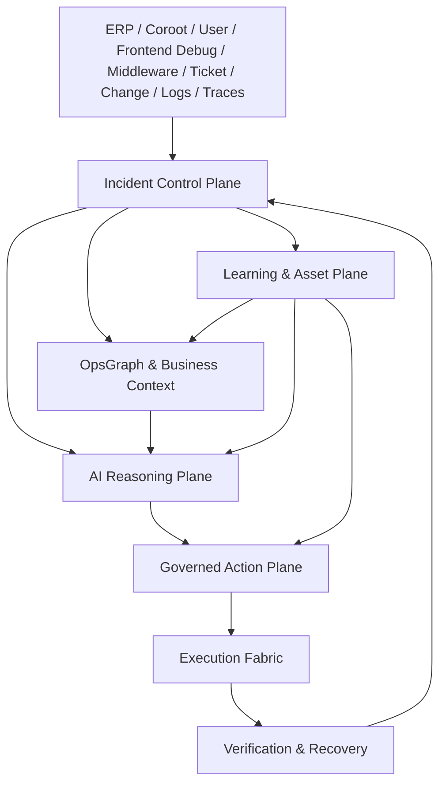

# aiops-v2 企业级智能运维控制平面总体设计

日期：2026-05-11
状态：总体目标与平台设计方案
范围：`aiops-v2` 的终局产品定位、平台架构、领域边界、治理模型、学习闭环与现有能力调整方向。

## 1. 核心结论

`aiops-v2` 的终极目标不是“会 SSH 的 AI 聊天框”，也不是“接入很多 MCP 的工具集合”。它应该成为企业生产运维的智能控制平面：

```text
告警 / 用户问题 / ERP 业务异常 / 用户侧慢请求调试 / 中间件异常
  -> IncidentCase
  -> Evidence / TraceContext / OpsGraph / Business Impact
  -> AI Reasoning / Runbook Match / Hypothesis
  -> ActionProposal / Policy / RBAC / Approval / HostLease
  -> Workflow / Tool / Host Agent / MCP / K8s / ERP Action
  -> Verify / Postmortem / Experience Pack / Memory / Eval
```

平台北极星：

> aiops-v2 让企业生产事故从发现到解决形成可审计、可控、可学习的智能闭环：AI 负责理解、关联、推理、提案和编排，平台负责权限、证据、锁、审批、执行、验证和沉淀，最终逐步把重复性应急运维转化为可复用、可治理、可演进的企业运维资产。

推荐产品定位是 **Human-governed Autonomous Operations Platform**：人治理，AI 推理和编排，平台掌握生产边界。它允许逐步自动化，但每一步都必须能解释、审计、回滚和验证。

## 2. 设计原则

### 2.1 Incident-first

所有生产运维行为都应尽量归属到一个 `IncidentCase`、`OperationCase` 或 `DebugCase`。聊天、用户侧调试事件、Coroot、Runbook、Workflow、审批、主机锁、工具结果、复盘、经验包都围绕 case 组织。

这能避免系统退化成零散聊天记录和工具日志。平台首先回答：

- 这是什么事故或操作目标。
- 如果来自用户侧调试，用户在哪个页面、哪个动作、哪个 trace id 上观察到慢。
- 影响哪个业务能力、服务、租户、主机和 SLO。
- 当前证据是什么，根因假设是什么。
- 下一步动作为什么合理，风险和回滚是什么。
- 谁审批、谁执行、在哪些资源上执行。
- 执行后如何证明恢复。
- 最后沉淀成什么经验。

### 2.2 AI proposes, platform governs

AI 可以提出诊断路径、根因假设、Runbook 匹配、Workflow 草稿和动作建议，但不能绕过平台硬边界直接改变生产。

生产动作必须经过：

```text
ActionProposal
  -> ActionToken
  -> Policy / RBAC / HostLease / Approval
  -> ToolDispatcher / Runner / Agent
  -> ToolResult / Evidence
  -> Verification
```

### 2.3 Evidence before action

平台应鼓励先读后写、先证据后动作。非只读动作必须能够解释它依赖哪些证据、预期效果是什么、验证方法是什么、失败如何回滚。

### 2.4 Knowledge becomes assets

一次成功处理不能只留下聊天记录。它应该进入资产化流水线：

```text
Incident / Chat / Workflow Run / Tool Result / Postmortem
  -> Experience Candidate
  -> Human Review
  -> Runbook / Workflow / Memory / OpsGraph Update
  -> Eval Regression
```

### 2.5 One execution fabric

所有真实能力都进入统一执行面，不新增平行 capability 池：

- 本地命令和远程命令。
- MCP tools。
- Coroot、ERP、K8s、changes、opsgraph。
- Runner workflow action。
- Host agent task。

统一执行面必须共享 tool schema、权限判断、审批、事件、trace、审计和结果引用。

## 3. 非目标

- 不把 `aiops-v2` 设计成单纯 ChatOps UI。
- 不把 MCP 接入数量当作核心目标。
- 不以全自动无人运维作为第一性定位。
- 不让 Runbook 内部绕过 ToolDispatcher 执行工具。
- 不让 Workflow 绕过平台治理直接修改生产。
- 不用 prompt 约束替代 RBAC、Policy、ActionToken、HostLease 和审批。
- 不让经验包自动发布到生产资产。
- 不为每个页面新增私有状态机、私有 SSE、私有执行链路。
- 不采集用户请求体、密码、token、cookie 原文作为调试证据；用户侧 trace 只能保存脱敏摘要、trace id、span、指标和引用。

## 4. 平台总体架构



### 4.1 Incident Control Plane

职责：

- 管理 `IncidentCase`、`OperationCase`、证据、假设、影响面、时间线、处置状态和复盘。
- 把 Coroot webhook、用户问题、用户侧调试事件、ERP 异常、中间件异常、工单事件统一映射为 case。
- 汇总业务影响、技术影响、当前风险和待验证项。
- 作为所有生产操作的审计根对象。

关键对象：

```text
IncidentCase
EvidenceRef
TraceContext
DebugEvent
Hypothesis
BusinessImpact
ActionRecord
ApprovalRecord
VerificationRecord
PostmortemDraft
```

### 4.2 OpsGraph & Business Context

职责：

- 建立企业运维知识图谱，连接 ERP 模块、业务能力、服务、DB、MQ、Redis、主机、Pod、租户、Runbook、Workflow、变更和 SLO。
- 支持业务影响推导和根因路径搜索。
- 为 AI prompt、Runbook 匹配、经验包匹配提供结构化上下文。

图谱不是静态 CMDB 的复制品，而是运维推理用的关系层：

```text
ERP Module -> Business Capability -> Service -> Runtime Resource -> Host/Pod
Service -> DB/MQ/Redis
Service -> SLO / Coroot Application
Frontend Page / User Action -> API Route -> Service -> Middleware
Trace Span -> Service / API / DB / Cache / MQ
Service -> Recent Deployment / Config Change
Capability -> Tenant / Business Process
Entity -> Runbook / Workflow / Experience Pack
```

### 4.3 AI Reasoning Plane

职责：

- 驱动单 Agent 和多 Agent 运维推理。
- 负责编译 prompt、选择工具、生成计划、解释证据、提出根因假设和动作建议。
- 负责把用户侧 trace、Coroot RCA、服务拓扑、慢 SQL、资源瓶颈和变更记录归并为可解释的根因路径。
- 提供完整 Prompt Trace、模型输入 diff、工具可见性、评测回归和失败归因。

核心规则：

- AI 可以建议动作，但生产动作必须变成 `ActionProposal`。
- AI 的每次关键判断应能回放：看到了哪些消息、工具、证据、图谱和规则。
- Prompt Trace 是治理能力，不只是调试页面。
- Eval 应覆盖事故场景、工具使用、权限拒绝、审批恢复、Runbook 选择和复盘质量。

### 4.4 Governed Action Plane

职责：

- 把 AI 建议、Runbook 下一步、Workflow 节点和人工操作统一变成受治理动作。
- 判断是否允许执行、是否需要证据、是否需要审批、是否需要主机锁。
- 防止跨会话、跨用户、跨资源、跨风险等级滥用动作。

关键机制：

```text
ActionProposal
ActionToken
PolicyEngine
RBAC
Approval
HostLease
SecretRef
AuditLog
BreakGlass
```

`ActionToken` 绑定：

- `sessionId`
- `turnId`
- `incidentId`
- `userId`
- `toolName`
- `normalizedInputHash`
- `source`
- `risk`
- `expiresAt`

`HostLease` 绑定：

- `hostId`
- `sessionId`
- `turnId`
- `userId`
- `incidentId`
- `leaseMode`
- `ttl`
- `heartbeat`
- `releasedAt`

聊天或 Workflow 发起时，如果目标主机组中任一主机已被不兼容会话锁定，应整体拒绝并释放已申请锁，避免半启动。

### 4.5 Execution Fabric

职责：

- 执行所有经过治理的动作。
- 统一承载本机、远程主机、Kubernetes、MCP、ERP action、脚本和 Runner workflow。
- 输出结构化结果、进度事件、日志引用和证据引用。

执行链路：

```text
ActionToken / Approved Request
  -> ToolDispatcher or Runner Engine
  -> Host Agent / MCP / K8s / ERP
  -> ToolResult / RunEvent / Artifact / Evidence
  -> Verification
```

Runner Workflow 是执行编排层，不是治理替代品。Workflow 节点可以表达 DAG、变量、审批节点、分支、循环、回调和输出，但实际高风险动作仍要进入平台权限和审计。

### 4.6 Verification & Recovery

职责：

- 执行后证明问题是否解决。
- 支持自动验证、人工确认、指标恢复、SLO 恢复、业务验证和回滚验证。
- 把验证结果写回 case、Runbook instance、Workflow run 和经验包候选。

验证来源：

- Coroot SLO、metrics、timeline、RCA。
- ERP business metrics、tenant impact、job status。
- 用户侧调试事件重放后的端到端 trace、接口耗时和页面动作耗时。
- K8s rollout status、events、logs。
- 主机只读检查。
- Workflow output variables。
- 用户人工确认。

### 4.7 Learning & Asset Plane

职责：

- 从真实事故和操作中沉淀经验。
- 管理经验包候选、审核、版本、适用环境、发布记录。
- 将稳定经验转化为 Runbook、Workflow、Memory、OpsGraph 更新和 Eval case。

学习闭环：

```text
Case closed
  -> Postmortem
  -> Experience Candidate
  -> Review
  -> Publish Runbook / Workflow / Memory / OpsGraph Patch
  -> Eval Case
  -> Future Recommendation
```

经验包不直接自动进入生产资产。自动生成只能生成 candidate 或 draft，必须经过审核和验证。

## 5. 产品体验主线

### 5.1 事故工作台

事故工作台是生产运维的第一屏，而不是单纯聊天页。

它展示：

- 事故标题、状态、严重级别、来源和负责人。
- 业务影响：ERP 能力、租户、订单/任务/SLA。
- 技术影响：服务、主机、Pod、DB/MQ/Redis、Coroot 状态。
- 证据链：指标、日志、trace、变更、工具结果。
- AI 假设：候选根因、置信度、支持证据。
- 下一步动作：Runbook、Workflow、只读诊断、受治理变更。
- 审批和锁：谁持有主机锁，哪些动作待审批。
- 验证与复盘：恢复指标、遗留风险、复盘草稿。

### 5.2 AI 对话

聊天仍然重要，但它是 case 内的交互入口。

聊天应支持：

- 从 case 上下文自动带入业务、图谱、证据、权限和目标主机。
- 对每句话能点进 Prompt Trace，看到本轮 LLM 输入、工具、系统规则和 diff。
- 工具、审批、命令和输出进入同一条 Interleaved Transcript。
- 用户可以从对话中提炼 Runbook、Workflow draft、经验包候选或 postmortem 片段。

### 5.3 用户侧慢请求调试

业务用户或运维人员在业务页面觉得某个功能太慢时，可以进入 `Debug Mode`。进入调试状态后，用户再次点击页面按钮，前端发起一个 `DebugEvent`：

```text
Debug Mode enabled
  -> user clicks button
  -> frontend creates trace id
  -> browser request carries traceparent / baggage / aiops-debug headers
  -> gateway / backend / middleware / db / mq spans inherit trace id
  -> Coroot and trace backend collect service, topology, latency, resource, error evidence
  -> aiops-v2 creates DebugCase or attaches to IncidentCase
  -> AI performs root cause analysis
  -> platform proposes remediation and verification
```

调试事件必须记录：

- 页面、路由、按钮或用户动作。
- 前端耗时：click to request、TTFB、接口耗时、渲染耗时。
- trace id、span ids、服务链路、慢 span、错误 span。
- Coroot service topology、SLO、资源瓶颈和 RCA。
- 后端 API、DB、缓存、MQ、中间件调用链。
- 最近部署、配置变更和相关经验包命中。

AI 输出不应只是“接口慢”，而要给出：

- 慢在哪里：浏览器、网关、后端服务、数据库、中间件、下游依赖或资源瓶颈。
- 为什么慢：证据、span、Coroot 指标、拓扑和变更关联。
- 有什么建议：只读诊断、配置建议、代码/SQL 建议、扩容或重启等操作建议。
- 哪些可以自动化修复：可执行 Runbook、Workflow 或受治理 ActionProposal。
- 用户确认后如何修复：签发 ActionToken、申请 HostLease、审批、执行、验证。
- 修复失败时报告失败点：哪个动作、哪个节点、哪个 span 或哪个验证项失败。

这个场景的本质是把“用户主观觉得慢”转成可追踪的 `DebugCase`，并把前端行为、后端链路、Coroot 观测和修复闭环连接起来。

### 5.4 中间件自治修复

当用户在 AI 对话中说“帮我修复 xxx 的 PG 集群”时，系统应进入中间件修复流程，而不是直接执行重启或 failover。

固定流程：

```text
User request
  -> identify middleware resource: pg cluster / redis / mq / elasticsearch
  -> create OperationCase or IncidentCase
  -> collect evidence: Coroot / middleware tools / logs / replication / locks / disk / network
  -> match approved Experience Pack / Capsule / Runbook / Workflow
  -> if matched and compatible: reuse reviewed remediation path
  -> if no match: generate repair plan
  -> user confirms plan
  -> ActionProposal / ActionToken / RBAC / Approval / HostLease
  -> execute repair workflow
  -> verify middleware health and business recovery
  -> generate or update Experience Pack candidate
```

中间件修复需要比普通服务修复更严格：

- 先根因分析，再修复；不能把“修复 PG 集群”直接解释为重启。
- 必须识别集群角色、主从状态、复制延迟、连接数、锁等待、磁盘、水位、WAL、备份和 failover 风险。
- 必须区分只读诊断、低风险缓解、高风险变更和破坏性操作。
- 如果命中已审核经验包，应展示来源、适用环境、成功率、禁用条件和验证项。
- 如果没有经验，应生成 `RepairPlan`，列出假设、步骤、风险、回滚和验证，用户确认后才进入执行。
- 修复成功后生成经验包候选；修复失败后也要沉淀失败经验、禁用条件或变体需求。

最终报告必须包括：

- 根因结论和证据。
- 执行了哪些动作、谁审批、哪些资源被锁定。
- 每一步结果。
- 修复是否成功，业务和中间件指标是否恢复。
- 如果失败，失败点、失败原因、已回滚状态和下一步建议。

### 5.5 Runbook

Runbook 是知识型处置方案，不是内部执行器。

职责：

- 描述适用条件、症状、风险、前置证据、步骤、验证和回滚。
- 根据 case 生成下一步 `ActionProposal`。
- 记录实例进度和每一步观察结果。

不负责：

- 自己执行命令。
- 绕过 ToolDispatcher。
- 绕过审批和主机锁。

### 5.6 Workflow

Workflow 是执行型编排方案。

职责：

- 表达 DAG、并行、顺序、循环、条件、审批、变量、输出、回调和发布审阅。
- 支持手工创建和 AI 创建。
- 在 Start 定义目标主机组、标签选择器、运行变量和锁策略。
- 每个步骤明确目标标签、fanout 策略和失败策略。
- End 查看输出变量、验证结果、回调和经验沉淀建议。

关键扩展：

```text
targetSelector:
  labels:
    role: web
    env: prod
fanoutMode: sequential | parallel
lockMode: exclusive | shared_readonly | none
outputs:
  - key: recovered
    source: verification.slo
callbacks:
  - type: incident.update
  - type: webhook
```

### 5.7 Experience Pack

经验包是学习资产容器。

它包含：

- 适用场景。
- 环境画像。
- 证据和来源。
- 成功/失败运行记录。
- Runbook draft。
- Workflow draft。
- 禁用条件。
- 风险、回滚和验证。
- 审核记录和版本 lineage。

经验包可以发布为 Runbook、Workflow、Memory 或 OpsGraph patch，但发布必须显式审核。

### 5.8 多用户与企业治理

多用户不是 UI 用户列表，而是企业边界：

- 用户、团队、角色、权限。
- 会话归属和会话隔离。
- 主机、服务、环境、Runbook、Workflow、经验包的资源权限。
- 审批权限和职责分离。
- 操作审计和证据保留。
- 只读共享和生产写操作隔离。

## 6. 领域模型

### 6.1 Case

```text
Case
  id
  type: incident | operation | debug | middleware_repair | maintenance | drill
  status
  severity
  source
  environment
  ownerUserId
  ownerTeamId
  businessCapabilityIds
  affectedServiceIds
  affectedHostIds
  affectedMiddlewareIds
  debugEventIds
  traceContextRefs
  evidenceRefs
  hypotheses
  actionRecords
  verificationRecords
  postmortemId
```

### 6.2 Evidence

```text
EvidenceRef
  id
  caseId
  source: coroot | erp | tool | workflow | user | frontend_debug | change | log | trace | middleware
  entityId
  rawRef
  summary
  confidence
  createdBy
  createdAt
  redactionStatus
  digest
```

### 6.3 TraceContext 与 DebugEvent

```text
TraceContext
  id
  caseId
  traceId
  rootSpanId
  source: frontend_debug | coroot | trace_backend | gateway
  frontendRoute
  userAction
  apiRoute
  servicePath
  slowSpanIds
  errorSpanIds
  baggageSummary
  redactionStatus
  createdAt

DebugEvent
  id
  caseId
  userId
  sessionId
  pageUrlHash
  routeName
  actionName
  traceContextId
  frontendTimings
  backendTimings
  corootEvidenceRefs
  status: captured | analyzing | remediating | verified | failed
```

`DebugEvent` 的目标是把“用户觉得慢”转成可治理 case。它只能保存 trace id、span、指标、摘要和脱敏引用，不能保存请求体、cookie、token 或用户敏感输入原文。

### 6.4 MiddlewareResource 与 RepairPlan

```text
MiddlewareResource
  id
  kind: postgres | redis | mq | elasticsearch | kafka | mysql | other
  clusterName
  environment
  topology
  roleMap
  criticality
  safetyProfile
  opsGraphEntityIds

RepairPlan
  id
  caseId
  middlewareResourceId
  source: experience_pack | capsule | runbook | generated
  rootCauseHypothesisIds
  assumptions
  diagnosticSteps
  remediationSteps
  riskLevel
  approvalPolicy
  rollbackPlan
  verificationSpec
  experiencePackRef
  status: draft | awaiting_confirmation | approved | running | succeeded | failed
```

中间件修复必须先生成或命中 `RepairPlan`。即使用户直接说“帮我修复 PG 集群”，平台也必须先完成根因分析、风险分级、验证项和回滚设计，再进入 ActionProposal / Workflow 执行。

### 6.5 Hypothesis

```text
Hypothesis
  id
  caseId
  title
  rootCauseCategory
  confidence
  supportingEvidenceRefs
  contradictingEvidenceRefs
  suggestedNextActions
  status: active | rejected | confirmed
```

### 6.6 ActionProposal

```text
ActionProposal
  id
  caseId
  sessionId
  turnId
  source: runbook | workflow | fallback | manual | break_glass
  toolName
  toolInput
  normalizedInputHash
  risk
  approvalRequired
  hostLeaseRequired
  expectedEffect
  rollback
  verificationSpec
  evidenceRefs
  actionToken
  expiresAt
```

### 6.7 HostLease

```text
HostLease
  id
  hostId
  caseId
  sessionId
  turnId
  userId
  mode: exclusive | shared_readonly
  status: active | released | expired
  reason
  acquiredAt
  heartbeatAt
  expiresAt
  releasedAt
```

### 6.8 Experience Pack

```text
ExperiencePack
  id
  title
  status: candidate | review_pending | approved | published | rejected | deprecated
  scenarioSignature
  environmentProfile
  evidenceRefs
  runbookDraftRef
  workflowDraftRef
  memoryPatchRef
  opsGraphPatchRef
  confidence
  reviewRecords
  lineage
```

## 7. 现有能力调整方向

### 7.1 Coroot

Coroot 的目标不是“多一个 MCP server”，而是观测证据入口：

- `coroot.*` tool 输出应转成 `EvidenceRef`。
- Coroot webhook 应创建或更新 `IncidentCase`。
- Coroot service、SLO、topology 应映射到 OpsGraph。
- Coroot trace、service topology、RCA 和慢 span 应能通过 trace id 关联到 `DebugEvent`。
- Coroot RCA 只能作为证据和假设来源，不能直接当最终根因。

### 7.2 Frontend Debug 与 Trace 贯通

前端调试不是简单埋点，而是生产诊断入口：

- 业务页面需要提供受权限控制的 `Debug Mode`，只在用户显式开启时创建 `DebugEvent`。
- 前端请求必须生成或复用 W3C `traceparent`，并携带受控 `baggage` 与 `aiops-debug` 标记。
- Gateway、Backend、Middleware、DB、MQ span 必须继承 trace id，便于 Coroot 和 trace backend 汇聚证据。
- 前端 SDK 只上报页面、路由、动作、耗时、trace id 和脱敏摘要，不上传请求体、cookie、token 或用户输入原文。
- DebugEvent 应创建 `DebugCase`，或关联到已有 `IncidentCase`，后续修复仍必须走统一 ActionProposal、Approval、HostLease 和 Verification。

### 7.3 Prompt Trace

Prompt Trace 应升级为 AI 治理系统：

- 每轮对话可以从 transcript 直接进入 trace。
- trace 展示 prompt layers、messages、visible tools、tool governance、memory、case context、opsgraph context。
- trace 和 eval report 关联，支持提示词变更后的回归判断。
- trace 默认不保存敏感原文到外部系统，本地调试和生产审计分级处理。

### 7.4 Runner Workflow

Runner 应升级为平台执行编排核心：

- 默认内嵌到 aiops-v2，同生命周期、同数据目录、同认证边界。
- 支持 Start target selector、host labels、lock policy、run variables。
- 支持 step fanout 策略：顺序、并发、批次、失败阈值。
- 支持 End outputs、verification、callbacks。
- 发布必须经过 validate、dry-run、risk review、audit。
- 高风险节点执行仍必须走 ActionProposal / Approval / HostLease。

### 7.5 Runbook

Runbook 应从静态目录升级为可版本化知识资产：

- 支持 match、start、next_action、observe_result、close。
- Runbook step 只签发动作提案，不直接执行。
- Runbook 与 OpsGraph、Experience Pack、IncidentCase 双向关联。
- Runbook 变更应支持 review、版本和回滚。

### 7.6 Middleware Repair

中间件修复应作为专门的受治理能力：

- PG、Redis、MQ、Elasticsearch 等中间件需要建模为 `MiddlewareResource`，包含拓扑、角色、复制、容量、水位和业务关键性。
- AI Chat 收到“修复 xxx 集群”时，先创建 `IncidentCase` 或 `OperationCase`，再收集 Coroot、日志、原生命令、K8s、备份和变更证据。
- 命中已审核经验包时，必须展示来源、适用环境、成功率、禁用条件和验证项，不能静默执行。
- 未命中经验包时，只能生成 `RepairPlan` 草稿；用户确认后才生成 ActionProposal 或 Workflow run。
- 修复成功和失败都要回写 Experience Pack 候选：成功沉淀处置路径，失败沉淀禁用条件、风险边界和变体需求。

### 7.7 Memory

Memory 应分层：

- user memory：用户偏好和操作习惯。
- session memory：当前会话上下文。
- service memory：服务画像、常见故障、历史恢复方式。
- host memory：主机画像、OS、agent capabilities、限制。
- incident memory：事故经验、证据、验证结果。
- org memory：组织规则、变更窗口、审批习惯。

每条 memory 必须有 scope、source、confidence、ttl、redaction、lastUsedAt 和 stale 标记。

### 7.8 Multi-Agent

多 Agent 是协作形态，不是独立目标。

建议角色：

- `Incident Commander Agent`：统筹 case、状态、风险和下一步。
- `Observer Agent`：收集 Coroot、ERP、日志、trace、K8s 证据。
- `Diagnosis Agent`：维护假设和根因路径。
- `Runbook Agent`：匹配和推进 Runbook。
- `Execution Agent`：执行通过治理的动作。
- `Verification Agent`：验证恢复和回归。
- `Learning Agent`：生成经验包候选和 eval case。

多 Agent 共享同一个 case、event log、policy、host lease 和 audit，不各自维护独立事实源。

## 8. 企业级平台能力要求

### 8.1 数据与持久化

生产形态需要从本地 JSON / in-memory 演进到可靠持久化：

- 关系型数据库保存 case、用户、权限、审计、资产元数据。
- 对象存储保存大工具结果、trace、artifact、日志片段。
- 向量或检索索引用于 memory、经验包、Runbook 搜索。
- 所有状态对象需要 migration、backup、retention 和 encryption。

### 8.2 安全

平台必须具备：

- SSO / OIDC / LDAP 接入。
- RBAC 和资源级授权。
- SecretRef 和密钥托管。
- 审批链路和职责分离。
- Break-glass 流程。
- 命令 allowlist / denylist / risk classification。
- 敏感输出脱敏。
- 用户侧调试数据脱敏和字段级保留策略，禁止保存请求体、cookie、token、密码和个人敏感输入。
- 审计不可篡改存储。

### 8.3 可观测性

平台自身也要可观测：

- 用户侧 DebugEvent 到后端 trace 的贯通率、trace 缺失率和脱敏失败率。
- runtime span。
- model call span。
- tool call span。
- workflow run metrics。
- approval wait time。
- host lease conflicts。
- incident MTTA、MTTR、automation rate、rollback rate。
- prompt regression score。

### 8.4 可靠性

关键要求：

- 长任务可恢复。
- 审批后可 resume。
- server 重启后 workflow run 和 host lease 可 reconcile。
- agent 离线可检测、可转移、可失败收敛。
- 工具输出可 spill，不阻塞主上下文。
- 幂等动作可重试，非幂等动作必须显式声明。
- DebugEvent、RepairPlan 和长运行修复 workflow 在服务重启后可恢复或明确失败收敛。

## 9. 系统不变量

这些规则应成为后续实现和评审的硬标准：

1. 生产动作不能绕过 `ToolDispatcher` 或 Runner governance。
2. 非只读动作必须绑定 `ActionProposal`，除非处于显式 break-glass。
3. 需要独占资源的动作必须持有 `HostLease`。
4. 审批只批准具体动作，不批准模糊意图。
5. AI 生成的经验只能进入 candidate 或 draft。
6. Prompt Trace 是可回放治理记录，不是临时日志。
7. Runbook 不直接执行工具。
8. Workflow 不替代 RBAC、Policy、ActionToken 和 HostLease。
9. OpsGraph 是业务影响和根因推理的上下文源。
10. Postmortem、Experience Pack、Memory、Eval 必须来自真实 case 证据。
11. 前端生产过程 UI 只消费统一事件和 transport，不新增页面私有执行流。
12. 所有外部系统接入都必须声明数据权限、数据保留和脱敏策略。
13. 用户侧慢请求调试必须贯通 trace id；没有 trace id 的调试事件只能进入“证据不足”状态，不能直接给出自动修复结论。
14. 中间件修复必须先完成根因分析和 `RepairPlan`；不得把自然语言“修复集群”直接映射为重启、failover、删数据或配置写入。
15. 经验包只能作为已审核路径被复用；未审核经验、候选经验和生成计划不能跳过用户确认、审批和验证。

## 10. 成功判据

当 `aiops-v2` 达到目标形态时，它应该能完成以下闭环：

1. Coroot 告警自动创建事故，关联 ERP 业务影响和 OpsGraph。
2. AI 基于证据提出根因假设，并展示支持和反证。
3. 系统匹配 Runbook 或生成受治理 fallback 动作。
4. 非只读动作先签发 ActionProposal，再通过 RBAC、HostLease 和审批。
5. Workflow 能在目标主机组上按标签、顺序或并发策略执行。
6. 执行结果自动进入 Evidence 和 Timeline。
7. 平台用 Coroot、ERP、K8s 或主机检查验证恢复。
8. 事故关闭时生成复盘草稿。
9. 成功经验进入经验包候选，经审核发布为 Runbook 或 Workflow。
10. 新经验转化为 Memory、OpsGraph patch 和 Eval case，影响后续推荐。
11. 业务用户开启 Debug Mode 后再次点击慢按钮，系统能把浏览器、网关、后端、数据库和中间件证据关联到同一个 trace id，并给出可解释的慢点、根因、建议、可自动化修复方案和修复结果。
12. 用户在 AI Chat 请求修复 PG 等中间件集群时，系统能先做 RCA，命中已审核经验则复用，未命中则生成 RepairPlan 并等待确认；修复后沉淀成功或失败经验包候选。

## 11. 与既有文档关系

本设计是 `aiops-v2` 企业级智能运维平台的总纲，覆盖并约束以下局部设计：

- ERP SRE runtime 设计：作为 Incident Control Plane 和 OpsGraph 的业务事故场景。
- Coroot MCP 设计：作为观测证据入口。
- React Chat v2 设计：作为 case 内 AI 对话和过程 UI。
- Runner Embedded Runtime 设计：作为 Execution Fabric 的 Workflow 编排组件。
- Experience Pack 设计：作为 Learning & Asset Plane 的资产沉淀组件。

后续新增设计应说明它服务于哪个平面、操作哪个领域对象、如何进入治理链路、如何沉淀证据。

## 12. 自检

- 本文档定义的是终局目标和总体设计，不包含具体实施排期。
- 设计中心从功能清单调整为 `Incident-driven governed autonomous operations`。
- Coroot、用户侧 Debug Trace、Prompt Trace、Workflow、Runbook、Experience Pack、Memory、多用户、多 Agent、ERP 和中间件修复都被纳入统一平台架构。
- 关键生产边界明确为 Evidence、ActionProposal、ActionToken、RBAC、Approval、HostLease、Verification 和 Audit。
- 文档没有要求 AI 自动绕过治理，也没有把自我进化设计为自动发布生产资产。
