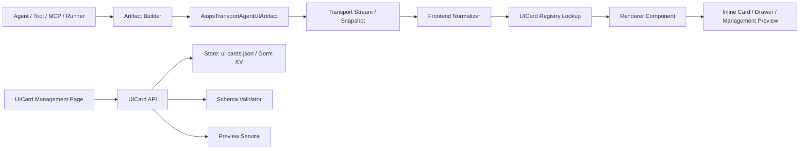

# aiops-v2 Agent-to-UI 轻量协议与本地注册表设计方案

日期：2026-05-16
状态：设计方案
方案：A - 自研轻量协议 + 本地注册表
范围：复用当前 `AgentUIArtifact` transport，补充 schema、renderer registry、preview、版本治理和管理页面。本文只定义设计，不包含实现代码。

## 1. 背景

`aiops-v2` 已经具备 Agent-to-UI 的核心雏形：

- Go transport 在 `internal/appui/transport_state.go` 中通过 `AiopsTransportTurn.AgentUIArtifacts` 承载每轮对话产生的 UI artifact。
- 前端在 `web/src/api/agentUiArtifacts.ts` 中完成类型归一化、危险字段清理、默认跳转 action 注入和 unsupported 降级。
- 前端在 `web/src/components/chat/AgentUiArtifactPart.tsx` 中按 artifact type 分发到 Coroot 图表、Trace、拓扑、Workflow、验证、经验命中、运维手册等卡片。
- `/ui-cards` 页面已经存在，但当前偏调试页面，后端 `/api/v1/ui-cards` 也还没有接入真实 store、schema、preview 和版本治理。

当前问题不是缺少 UI 卡片，而是缺少一个稳定的 Agent-to-UI 控制面。没有控制面时，artifact type 会继续散落在代码里，新增卡片要同时改后端、normalizer、dispatcher、测试和管理入口，模型或工具输出也难以被统一校验、预览和灰度。

## 2. 设计目标

一句话目标：

```text
Agent 只输出结构化运维结果，前端只渲染本地可信卡片，让 Chat、Case、Prompt Trace、Runner、Coroot 共用同一套 Agent-to-UI 管理能力。
```

具体目标：

- 复用现有 `AgentUIArtifact` transport，不引入外部运行时协议作为核心依赖。
- 增加本地 `UICardDefinition` 注册表，管理 artifact type、schema、renderer、placement、样例、权限、版本和启用状态。
- 增加 preview 能力，让开发和运营人员在管理页用样例 payload 验证卡片显示效果。
- 将硬编码 renderer 分发逐步迁移为 registry lookup，保留现有 hardcoded fallback。
- 为工作流、监控图表、运维动作、审批、证据、Trace、拓扑建立统一卡片规范。
- 保持卡片简单、可读、好看，避免把 Chat 变成复杂大盘。
- 所有 artifact 都能追溯到 Case、Evidence、Prompt Trace、Workflow Run 或外部观测系统引用。

## 3. 非目标

- 不在第一阶段接入 AG-UI、A2UI 或 CopilotKit 作为运行时依赖。
- 不允许 Agent 返回任意 HTML、JavaScript、iframe、React 代码或 CSS。
- 不做完整 Grafana 替代品，不把 Chat 内卡片设计成监控大盘。
- 不让 UI 卡片直接执行生产写操作。生产动作仍走现有审批、租约、Dry Run、Runner 和审计链路。
- 不在第一阶段实现复杂低代码卡片编辑器。第一阶段以 schema、样例、预览、启停、版本为主。

## 4. 外部项目借鉴

### 4.1 A2UI / CopilotKit

A2UI 的关键思想是声明式 UI：Agent 输出 JSON 结构，前端或平台从受控组件目录中渲染组件，不执行模型生成的代码。CopilotKit 的 Generative UI 文档也强调把 tool call 或 agent output 渲染成本地 React 组件，而不是展示原始 JSON。

对 `aiops-v2` 的借鉴：

- `AgentUIArtifact.type` 只选择受控 renderer。
- `payload` 只提供数据，不提供样式和代码。
- `UICardDefinition.schema` 决定 payload 能否被渲染。
- 未注册 type 必须显示安全 fallback，而不是尝试动态执行。

### 4.2 AG-UI

AG-UI 的重点是事件流和状态同步：agent backend 持续发事件，前端按事件更新 UI 状态。

对 `aiops-v2` 的借鉴：

- 保留现有 transport event 模型。
- 卡片可以被同一个 artifact id 增量 upsert，例如工作流从 `running` 更新到 `success` 或 `error`。
- `updatedAt`、`version`、`status` 要成为 UI 可见状态，不只存在 payload 里。

### 4.3 n8n / Kestra / Flowise

这些 workflow 项目的共同点是把设计态、执行态和执行历史分开管理。n8n execution 页面关注状态、时间、节点输入输出和脱敏；Kestra 的 flow 模型强调 tasks、inputs、outputs、triggers、errors；Flowise 把 Agent flow 设计、运行和 tracing 结合。

对 `aiops-v2` 的借鉴：

- `workflow_result` 卡片只展示执行摘要，详细节点输入输出进入 Runner Run Detail。
- 卡片 action 主要跳转到 workflow run、case、trace，不在卡片内塞完整执行日志。
- 执行 payload 默认脱敏，管理页预览必须能模拟 restricted/redacted 状态。

### 4.4 Grafana / Coroot

Grafana 的经验是 panel 是最终可视化单元，query 和 transform 在 panel 前完成；Coroot 的经验是 service map、health、RCA inspection 要围绕服务和根因路径组织。

对 `aiops-v2` 的借鉴：

- Chat 内监控卡片只放单一 insight、少量指标和小图。
- 完整图表、复杂查询和长时间序列跳转到 Coroot 或专门详情页。
- `coroot_chart`、`topology_slice`、`trace_summary` 卡片要带 `subject`、`timeRange`、`freshness` 和 `evidenceRef`。

### 4.5 Langfuse / Phoenix

LLM observability 项目的核心是 trace、span、tool call、latency、cost、eval 和 replay。

对 `aiops-v2` 的借鉴：

- 每张 Agent UI 卡片都应能回到 Prompt Trace。
- `metadata` 中保留生成来源、tool call、model trace、输入摘要、脱敏状态。
- 管理页需要按 source、type、status、caseId、promptTraceId 过滤最近卡片。

参考链接：

- A2UI: https://github.com/google/a2ui
- AG-UI: https://github.com/ag-ui-protocol/ag-ui
- CopilotKit Generative UI: https://docs.showcase.copilotkit.ai/
- n8n Executions: https://docs.n8n.io/workflows/executions/
- Grafana query and transform: https://grafana.com/docs/grafana/latest/visualizations/panels-visualizations/query-transform-data/
- Langfuse sessions: https://langfuse.com/docs/tracing/sessions
- Arize Phoenix: https://arize.com/docs/phoenix

## 5. 总体架构



核心分层：

- Artifact Builder：后端或工具侧构造结构化 artifact，避免模型自由拼 UI。
- Transport：继续使用现有 `agentUiArtifacts` 字段。
- Normalizer：前端统一清洗、兼容旧字段、注入默认跳转 action。
- Registry：根据 `type`、`schemaVersion`、`renderer`、`status` 决定能否渲染。
- Renderer：本地 React 可信组件，不动态执行外部代码。
- Management：管理定义、样例、预览、版本、启停、兼容性和最近使用情况。

## 6. 协议设计

### 6.1 复用现有 AgentUIArtifact

现有结构保留为 transport 基础形态：

```ts
type AgentUIArtifact = {
  id: string;
  type: string;
  title?: string;
  titleZh?: string;
  summary?: string;
  summaryZh?: string;
  status?: string;
  severity?: string;
  dataRef?: string;
  inlineData?: Record<string, unknown>;
  payload?: Record<string, unknown>;
  metadata?: Record<string, unknown>;
  actions?: AgentUIAction[];
  source?: string;
  permissionScope?: string;
  redactionStatus?: string;
  createdAt?: string;
  updatedAt?: string;
};
```

新增设计约束：

- `type` 是 registry lookup key，格式使用 snake_case，例如 `metric_insight`、`workflow_run_summary`。
- `payload` 是 renderer 的主要输入，必须通过对应 schema 校验。
- `inlineData` 只用于小型 key-value fallback，不承载复杂图表。
- `metadata` 放追溯、生成来源、tool call、trace、版本等非展示主数据。
- `actions` 只声明 intent、target 和 href，不能声明任意 handler 代码。

### 6.2 标准 metadata

```ts
type AgentUIMetadata = {
  schemaVersion: "aiops.agent_ui.v1";
  cardVersion?: number;
  renderer?: string;
  subject?: {
    kind: "service" | "host" | "case" | "workflow" | "trace" | "manual" | "cluster";
    id: string;
    name?: string;
  };
  caseId?: string;
  evidenceRefs?: string[];
  promptTraceId?: string;
  workflowRunId?: string;
  toolCallId?: string;
  mcpServer?: string;
  timeRange?: {
    from: string;
    to: string;
    label?: string;
  };
  freshness?: {
    capturedAt: string;
    ttlSec?: number;
    staleAt?: string;
  };
  confidence?: "low" | "medium" | "high";
  generatedBy?: {
    component: "agent" | "tool" | "runner" | "mcp" | "system";
    name?: string;
  };
};
```

规则：

- `metadata.schemaVersion` 缺失时按 legacy artifact 处理。
- `cardVersion` 缺失时由 registry 当前 active version 解释。
- `subject` 用于列表过滤、标题辅助和后续关联。
- `freshness` 影响 UI 展示：过期卡片显示 stale badge，但仍可查看历史。

### 6.3 标准 action

```ts
type AgentUIAction = {
  id: string;
  label: string;
  intent:
    | "open_case"
    | "open_evidence"
    | "open_prompt_trace"
    | "open_coroot"
    | "open_workflow_run"
    | "open_runner"
    | "open_ops_manual"
    | "request_approval"
    | "start_dry_run"
    | "attach_to_case";
  href?: string;
  target?: Record<string, unknown>;
  mutation?: boolean;
  approvalMode?: "none" | "optional" | "required";
  disabled?: boolean;
  disabledReason?: string;
};
```

规则：

- 默认允许只读 action：`open_*`、`attach_to_case`。
- `mutation=true` 时必须设置 `approvalMode`，缺省按 `required` 处理。
- 生产写动作不能由卡片直接执行，只能打开审批、Runner 或 Dry Run。
- 未知 intent 在 normalizer 中禁用并显示原因。

## 7. 本地注册表设计

### 7.1 UICardDefinition

```ts
type UICardDefinition = {
  id: string;
  type: string;
  name: string;
  description?: string;
  renderer: string;
  rendererVersion: string;
  schemaVersion: "json-schema-draft-2020-12";
  payloadSchema: Record<string, unknown>;
  metadataSchema?: Record<string, unknown>;
  actionPolicy?: {
    allowedIntents: string[];
    mutationAllowed: boolean;
    defaultApprovalMode: "none" | "optional" | "required";
  };
  placementDefaults: Array<"inline_final" | "inline_action" | "side_panel" | "drawer" | "modal">;
  displayPolicy: {
    maxInlineHeightPx: number;
    defaultDensity: "compact" | "normal";
    detailMode: "drawer" | "route";
    emptyState: string;
  };
  redactionPolicy: {
    restrictedFields: string[];
    summaryOnlyWhenRestricted: boolean;
  };
  samplePayloads: UICardSample[];
  status: "active" | "draft" | "deprecated" | "disabled";
  builtIn: boolean;
  version: number;
  createdAt: string;
  updatedAt: string;
};
```

### 7.2 UICardSample

```ts
type UICardSample = {
  id: string;
  name: string;
  description?: string;
  artifact: AgentUIArtifact;
  expectedStatus?: string;
  expectedWarnings?: string[];
};
```

样例不是测试替代品，但必须服务三个用途：

- 管理页预览。
- schema 兼容性验证。
- 新 renderer 视觉回归基准。

### 7.3 Registry lookup

lookup 输入：

```text
artifact.type + metadata.cardVersion + registry status
```

lookup 规则：

1. 优先使用 `artifact.metadata.renderer` 指定的 renderer，但必须存在于 registry allowlist。
2. 如果指定 renderer 不存在，按 `artifact.type` 查 active definition。
3. 如果 `cardVersion` 指向 deprecated definition，仍允许只读渲染，但显示 deprecated badge。
4. 如果 type 未注册或 definition disabled，渲染 `UnsupportedArtifactCard`。
5. 如果 payload schema 校验失败，渲染 `InvalidArtifactCard`，保留 title、summary、source、trace link。

## 8. 卡片类型体系

第一阶段建议收敛为 8 类基础卡片，不为每个工具结果创建新 renderer。

### 8.1 MetricInsightCard

适用：Coroot 指标、SLO、错误率、延迟、资源指标。

原则：

- Chat 内只展示一个核心结论。
- 最多展示 3 个关键指标。
- 小图只用 sparkline 或单指标趋势，不做复杂 dashboard。

### 8.2 TopologyImpactCard

适用：服务依赖、主机关系、blast radius、上下游影响。

原则：

- 默认用列表和轻量关系结构，不使用复杂 canvas。
- 中心对象、上游、下游、异常边必须一眼可见。
- 复杂拓扑跳转到 `OpsGraphPage` 或 Coroot。

### 8.3 TraceSummaryCard

适用：调用链摘要、慢 span、错误 span、LLM trace、工具 trace。

原则：

- 展示入口、耗时、最慢环节、错误环节。
- 完整 span tree 进入详情抽屉或 Prompt Trace。

### 8.4 WorkflowRunCard

适用：Runner workflow 生成、校验、dry-run、执行、回滚、验证。

原则：

- 展示当前状态、当前节点、耗时、失败原因、下一步。
- 节点输入输出默认不在 Chat 内展开。

### 8.5 ApprovalCard

适用：命令审批、授权、变更确认、高危操作确认。

原则：

- 高亮操作对象、风险、影响范围、过期时间。
- 主按钮只进入审批动作，不直接执行生产动作。

### 8.6 EvidenceCard

适用：证据引用、RCA 证据、运维手册命中、经验命中。

原则：

- 一张卡只陈述一条证据或一个证据组。
- 显示来源、采集时间、置信度、关联 Case。

### 8.7 RemediationCard

适用：推荐修复、Runbook 步骤、变更计划、回滚建议。

原则：

- 区分“建议”和“可执行计划”。
- 可执行动作必须进入 Dry Run 或 Approval。

### 8.8 DataPreviewCard

适用：未专门建 renderer 的结构化数据 fallback。

原则：

- 最多展示 6 个字段。
- 递归清理危险字段。
- restricted 时只展示摘要，不展示字段值。

## 9. 卡片 UX 规范

每张卡统一 5 段：

1. Header：图标、标题、状态 badge、脱敏/过期 badge。
2. Summary：一句中文结论，不超过 60 个中文字符。
3. Key facts：最多 3 个事实，优先数字、状态、对象。
4. Evidence：Case、Evidence、Prompt Trace、Workflow Run、Coroot 引用。
5. Actions：最多 1 个主 action + 2 个次级 action。

视觉规则：

- 卡片框架使用白底、细边框、8px radius。
- 状态颜色只用于 badge、细边提示和少量关键指标，不铺满大面积背景。
- `error`、`warning`、`blocked` 要有明确文字原因，不只靠颜色。
- Chat 内卡片默认紧凑；详情数据进 drawer 或详情页。
- 每张卡只回答一个问题。复杂结果拆成多张卡，例如“异常指标”“影响拓扑”“建议动作”“验证结果”。
- 不在卡片里展示长 JSON、长日志、完整表格。长内容进入 detail drawer。

## 10. 管理页面设计

### 10.1 UI Card Registry

路径沿用 `/ui-cards`，升级为真实注册表管理页。

核心视图：

- Overview：总数、active、draft、deprecated、disabled、内置/自定义、最近使用。
- Registry：定义列表，支持按 type、renderer、status、builtIn、version 搜索过滤。
- Detail：schema、samples、action policy、redaction policy、placement、版本历史。
- Preview：选择样例或粘贴 artifact JSON，执行 schema 校验和 renderer 预览。
- Version：复制为新版本、启用新版本、废弃旧版本、查看兼容性警告。

### 10.2 Agent UI Center

新增页面建议路径 `/agent-ui`，用于查看最近生成的 artifact，不负责编辑 definition。

核心视图：

- Artifact feed：按时间展示最近 artifact。
- Filters：type、source、status、caseId、subject、promptTraceId、redactionStatus。
- Detail drawer：normalized artifact、schema validation、metadata、actions、raw payload。
- Trace links：跳转 Case、Evidence、Prompt Trace、Workflow Run、Coroot。

### 10.3 Renderer Preview Lab

可以作为 `/ui-cards` 的 tab，不必单独路由。

能力：

- 输入 artifact JSON。
- 选择权限上下文：normal、restricted、redacted。
- 选择 placement：inline、drawer、modal。
- 展示 validation result、normalized artifact、rendered card。
- 对比不同 card version 的显示差异。

## 11. 后端 API 设计

### 11.1 UI Cards

```text
GET    /api/v1/ui-cards
POST   /api/v1/ui-cards
GET    /api/v1/ui-cards/{id}
PUT    /api/v1/ui-cards/{id}
DELETE /api/v1/ui-cards/{id}
POST   /api/v1/ui-cards/{id}/preview
POST   /api/v1/ui-cards/{id}/validate
POST   /api/v1/ui-cards/{id}/versions
PUT    /api/v1/ui-cards/{id}/status
```

`GET /api/v1/ui-cards` 返回：

```json
{
  "items": [],
  "stats": {
    "total": 0,
    "active": 0,
    "draft": 0,
    "deprecated": 0,
    "disabled": 0,
    "builtIn": 0
  },
  "total": 0
}
```

需要兼容当前前端期待的 `items`，不要只返回 `cards`。

### 11.2 Agent UI Artifacts

```text
GET /api/v1/agent-ui-artifacts
GET /api/v1/agent-ui-artifacts/{id}
POST /api/v1/agent-ui-artifacts/validate
```

查询参数：

```text
source
type
status
caseId
promptTraceId
subjectKind
subjectId
limit
cursor
```

第一阶段 artifact feed 可以从已有 session snapshots、prompt traces、case evidence 和 runner records 汇聚，不要求新建独立事件库。后续如果查询压力变大，再引入 artifact index。

## 12. 存储设计

第一阶段复用已有 store 形态：

- JSON store：`ui-cards.json`
- Gorm store：`ui_cards` KV namespace

新增字段只追加，不破坏现有 `store.UICard`。Go 侧 `UICard` 需要扩展 schema、samples、policies、version metadata。迁移规则：

- 老数据没有 `payloadSchema` 时，自动补一个宽松 object schema，并标记 `status=draft`。
- 内置卡片由启动时 seed 或代码内 registry 提供，用户不能删除，只能禁用或复制为自定义版本。
- 自定义卡片可以编辑 schema、samples、policy，但 renderer 必须来自前端 allowlist。

## 13. 安全与治理

### 13.1 禁止动态代码

禁止字段：

```text
html
script
iframe
innerHTML
outerHTML
dangerouslySetInnerHTML
onClick
onLoad
styleText
```

清理策略：

- normalizer 递归删除危险字段。
- schema validator 默认拒绝危险字段。
- preview 显示被清理字段数量和路径。

### 13.2 Action allowlist

renderer 不接收任意 handler。action 只能通过 `intent` 和 `target` 映射到本地受控行为。

只读 action 可以直接跳转。写 action 必须走审批或 Runner，且 `mutation=true` 的 action 默认需要审批。

### 13.3 权限与脱敏

`permissionScope` 和 `redactionStatus` 控制显示层：

- `none`：正常展示。
- `redacted`：展示摘要和非敏感字段，敏感字段显示脱敏掩码。
- `restricted`：只展示 title、summary、status、允许的跳转 action。
- `denied`：不展示 payload，只展示无权限提示。

### 13.4 审计

以下行为需要审计：

- 创建、修改、启用、禁用、废弃 card definition。
- preview 使用自定义 artifact JSON。
- mutation action 被点击。
- schema validation failed 但 fallback 被展示。

## 14. 版本治理

版本规则：

- `UICardDefinition.version` 是用户可见版本，从 1 递增。
- `rendererVersion` 是前端 renderer 兼容版本，例如 `MetricInsightCard@1`。
- `metadata.cardVersion` 可以指定 artifact 期望的 definition version。
- active version 只有一个；deprecated version 可继续渲染历史 artifact。
- disabled version 不渲染，进入 fallback。

兼容策略：

- 新增 optional 字段是兼容变更。
- 删除 required 字段、修改字段类型、改变 action policy 是非兼容变更，需要新版本。
- 历史 artifact 不重写；通过 version 解释。

## 15. 预览与校验流程

Preview 输入：

```json
{
  "artifact": {
    "id": "sample-metric-1",
    "type": "metric_insight",
    "titleZh": "支付服务延迟升高",
    "summaryZh": "p95 延迟过去 15 分钟高于基线 2.4 倍。",
    "status": "warning",
    "payload": {}
  },
  "context": {
    "permissionScope": "normal",
    "placement": "inline_final"
  }
}
```

Preview 输出：

```json
{
  "valid": true,
  "definitionId": "metric-insight",
  "definitionVersion": 1,
  "renderer": "MetricInsightCard",
  "normalizedArtifact": {},
  "warnings": [],
  "redactedPaths": []
}
```

前端 preview 使用同一套 renderer。后端 preview 只做 schema、policy、normalization 结果，不返回 HTML。

## 16. 错误处理

错误状态与 UI 行为：

- 未注册 type：`UnsupportedArtifactCard`，展示原 type、title、summary、source。
- schema 失败：`InvalidArtifactCard`，展示失败字段、trace link、payload 不展开。
- renderer 缺失：`UnsupportedArtifactCard`，提示 renderer 未注册。
- payload 为空：展示 definition 的 emptyState。
- 权限不足：展示 restricted card。
- 数据过期：展示 stale badge，但允许查看历史。

任何错误都不能导致 Chat 崩溃。

## 17. 与现有页面的关系

- `ChatPage`：继续内联展示卡片，是主要消费方。
- `PromptTracePage`：展示卡片生成来源、model/tool trace 和 raw artifact。
- `IncidentWorkbenchPage`：从 Evidence、Timeline 或 Case 详情引用 artifact。
- `RunnerStudioPage`：消费 `workflow_run_summary`、`dry_run_result`、`verification_result`。
- `CorootOverviewPage`：消费 `metric_insight`、`topology_impact`、`trace_summary`。
- `UICardManagementPage`：升级为注册表和预览控制台。
- 新增 `AgentUICenterPage`：聚合最近 artifact 和跨页面跳转。

## 18. 实施阶段

### Phase 1: Registry 基础能力

- 扩展 Go `UICard` store model。
- 实现 `/api/v1/ui-cards` 真实 CRUD，返回 `items/stats/total`。
- 增加内置 card definitions seed。
- 前端 `/ui-cards` 改为 registry list、detail、preview。
- preview 支持 schema validation、normalizer、permission context。

### Phase 2: Renderer lookup

- 抽出前端 `agentUiCardRegistry`。
- 将 `AgentUiArtifactPart` 从纯 switch 迁移为 registry lookup + fallback。
- 保留现有 hardcoded renderer 作为内置 renderer map。
- 为现有 type 建立 definition：`coroot_chart`、`trace_summary`、`topology_slice`、`workflow_result`、`verification_result`、`experience_match`、`ops_manual_*`。

### Phase 3: Agent UI Center

- 新增 artifact feed API 和页面。
- 聚合 session、case、prompt trace、runner、coroot 里的 artifact。
- 支持过滤、详情抽屉、raw/normalized/schema result 对比。

### Phase 4: 版本和治理

- 支持复制版本、启用版本、废弃版本。
- 增加 action policy 和 redaction policy 编辑。
- 增加审计记录。
- 增加 Playwright 视觉回归样例。

## 19. 测试策略

后端测试：

- UI Card CRUD：list/create/update/delete/status/version。
- Store roundtrip：JSON 和 Gorm store 均能保存 schema、samples、policies。
- Preview validation：合法 artifact 通过，非法 payload 返回字段错误。
- Built-in seed：重复启动不产生重复 definition。

前端测试：

- Normalizer：危险字段清理、未知 type fallback、action allowlist、redaction。
- Registry lookup：active、deprecated、disabled、missing renderer、version mismatch。
- Management page：列表、过滤、详情、编辑、预览。
- Renderer：每个内置 card 的 normal/restricted/empty/error 状态。

端到端测试：

- Chat 中出现 artifact，能渲染对应卡片。
- 点击 Case、Prompt Trace、Workflow 跳转正确。
- `/ui-cards` 修改 sample 后 preview 更新。
- schema 失败不导致 Chat 崩溃。

## 20. 验收标准

设计完成后的第一版实现满足：

- `/api/v1/ui-cards` 返回真实 `items/stats/total`，前端不再拿到空壳 `cards`。
- `/ui-cards` 能展示内置卡片定义、查看 schema、运行 preview。
- 现有 Chat artifact 类型全部能通过 registry 找到 definition。
- 未注册或非法 artifact 有安全 fallback。
- preview 能模拟 normal、redacted、restricted 三种权限状态。
- mutation action 不会直接执行生产动作。
- 所有新增/迁移逻辑有 Vitest 或 Go 单测覆盖。

## 21. 关键取舍

- 选择自研轻量协议，是因为当前 transport、normalizer、renderer 已经存在，直接补注册表成本最低。
- 不直接采用 AG-UI，是为了避免引入一套外部事件协议后再适配现有 Chat transport。
- 不直接采用 A2UI runtime，是因为运维卡片需要强权限、审计、脱敏、审批约束，本地受控 registry 更符合场景。
- 不把卡片做成低代码编辑器，是为了先解决稳定性、治理和预览。复杂可视编辑后置。
- 不把 Chat 卡片做成大盘，是为了保持对话可读性。大图表和长日志应跳转到专门页面。

## 22. 后续实施建议

下一步应该先写实施计划，再进入代码：

1. Registry API 和 store model。
2. 内置 card definitions seed。
3. `/ui-cards` registry 管理页。
4. 前端 registry lookup 和 renderer map。
5. Agent UI Center artifact feed。
6. 版本治理、审计和视觉回归。

这个顺序能先打通控制面，再逐步迁移现有卡片，不会中断当前 Chat、Coroot、Runner、Prompt Trace 的使用。
