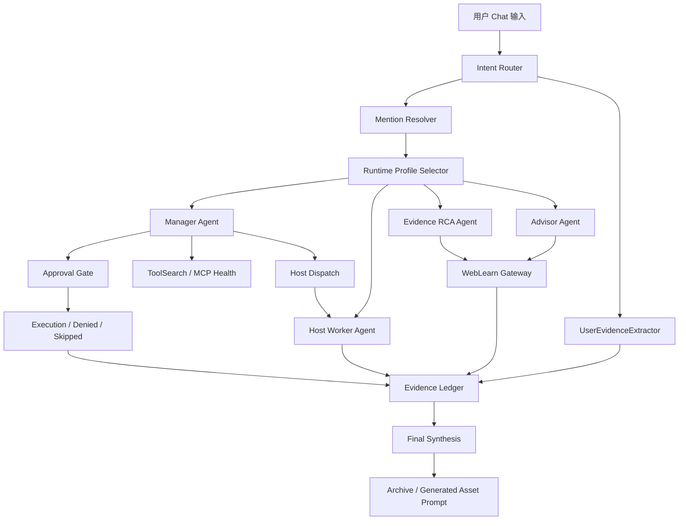

# aiops-v2 Codex-like AI Chat Runtime V2 设计方案

日期：2026-06-23  
状态：Design Spec  
依据文档：`docs/2026-06-23-aiops-v2-codex-like-ai-chat-runtime-v2-plan.zh.md`  
适用范围：AI Chat Runtime、Chat UI、Host Mention、Evidence、WebLearn、ToolSearch、Approval、Coroot MCP、OpsManual/Workflow 推荐、运行后沉淀  

## 1. 设计结论

aiops-v2 第二版闭环的核心不是新增 Case 工作台，也不是先做自愈 Operator，而是把 AI Chat 升级成接近 Codex 的运维 Agent Runtime。

V2 的第一原则：

```text
AI Chat 默认无主机绑定。
用户没有显式 @host/@local/@ip 时，Chat 只做咨询、证据分析、Web 学习、RCA 推理，不执行主机命令。
只有用户显式选择目标主机，Runtime 才进入主机执行上下文。
```

这条原则来自实测问题：当前 aiops-v2 会把复杂 PG/pgBackRest/pg_auto_failover 咨询误绑定到 `server-local`，并请求执行 `cat /etc/hosts` 或 `pg_controldata /var/lib/pgsql/data`。这会破坏用户体验，也会让模型忽略用户已经贴出的关键证据。

V2 设计应形成四类清晰运行上下文：

1. `chat_advisory`：纯咨询、机制解释、方案建议、Web 学习。
2. `evidence_rca`：用户已贴证据，系统基于证据做根因分析。
3. `host_bound_ops`：用户通过 `@host/@local/@ip` 选定单主机后做只读检查或审批执行。
4. `multi_host_ops`：用户通过多个 host mention 选定多台主机后，由管理 Agent 调度主机 Agent。

## 2. 背景问题

### 2.1 Codex rollout 的表现

参考会话：

```text
files/rollout-2026-06-22T16-34-19-019eee77-58d2-7841-9987-3c97b653124a.jsonl
```

用户问题是：pgBackRest 恢复主机 A 后，将 A 加入主机 C 的 pg_auto_failover monitor，再把主机 B 作为从节点加入集群，为什么 B 执行 `pg_autoctl create postgres` 后 timeline 比 A 高并无法同步。

Codex 的处理路径：

1. 先拆解为 PostgreSQL timeline、pgBackRest restore、pg_auto_failover state machine 三条线。
2. 主动搜索 PostgreSQL、pg_auto_failover、pgBackRest 官方资料。
3. 基于用户补充的 `pg_controldata`、`pg_is_in_recovery()`、`standby.signal`、`pg_autoctl show state` 输出逐步收敛。
4. 判断 B 不是 standby，因为 `pg_is_in_recovery=false` 且无 `standby.signal`。
5. 判断 B 的 timeline 11 不是“比 A 更新”，而是从 A 的 timeline 10 分叉出去的独立 WAL 历史。
6. 找到复发风险：A 的 `postgresql.auto.conf` 残留 `restore_command`、`recovery_target_timeline=latest`、`recovery_target_action=promote`，B 通过 basebackup 可能复制这些配置。
7. 给出安全流程：停 B、monitor drop B、A 清恢复残留、B 清 PGDATA 和 pg_autoctl state、重新加入、验收 `pg_is_in_recovery=true` 和 WAL receiver streaming。

### 2.2 aiops-v2 实测问题

在 `http://127.0.0.1:18083/` 用同一问题测试，当前 aiops-v2 的行为：

1. 第一轮把文本咨询误判为当前 `server-local` 采集，要求审批 `cat /etc/hosts`。
2. 用户跳过审批后，turn 直接结束，只留下“让我先确认当前状态”的半截回答。
3. 第二轮用户明确说“不要执行本机命令，基于这些输出分析”，Runtime 仍要求审批执行 `pg_controldata /var/lib/pgsql/data`、`psql`、`ls`、`tail`。
4. 用户拒绝后，turn 仍直接结束，没有 fallback 到证据分析。
5. 纯概念问题能回答，但没有官方来源，也没有证据链。

结论：当前缺陷在 Runtime 路由、目标绑定、工具可见性、用户证据抽取和审批 fallback，而不是单纯 prompt 不够好。

## 3. 设计目标

### 3.1 用户体验目标

1. 用户直接在 Chat 提问时，不需要先选主机。
2. 用户不输入 `@host/@local/@ip` 时，系统不执行任何主机命令。
3. 用户贴出命令输出时，系统优先从这些输出提取证据并分析。
4. 用户需要实际检查主机时，通过输入框 mention 选择目标。
5. 用户拒绝或跳过命令后，系统继续用已有证据给出受限分析，不空结束。
6. 涉及陌生中间件、版本差异、命令语义时，系统能主动查官方资料。

### 3.2 Runtime 目标

1. 支持 advisor、evidence RCA、host worker、manager 四类 Agent profile。
2. 支持 `@host` mention 解析和目标绑定。
3. 支持用户证据进入 Evidence Ledger。
4. 支持 ToolSearch 渐进发现和模式化工具面。
5. 支持 WebLearn 官方资料优先。
6. 支持 Run/Turn/Step/Checkpoint 状态。
7. 支持审批拒绝、跳过后的模型续推。

### 3.3 非目标

1. 不把 PG timeline 写成唯一专项能力。
2. 不默认创建 Case。
3. 不让 Coroot 成为所有 RCA 的必经路径。
4. 不把 `server-local` 作为 AI Chat 默认执行目标。
5. 不在没有主机绑定时暴露 `exec_command`。
6. 不让 Web 搜索结果绕过审批。
7. 不自动应用 Workflow、手册或 OpsGraph patch。

## 4. 总体架构



核心变化：

1. Intent Router 在 Runtime 前置执行，先决定模式，而不是让模型在 worker-host prompt 中自己猜。
2. Mention Resolver 只处理显式 `@host/@local/@ip`，不读取顶部默认主机作为隐式绑定。
3. UserEvidenceExtractor 把用户贴出的命令输出转成结构化证据。
4. Tool surface 由 profile 决定，不同 profile 看到的工具不同。
5. Approval Gate 的 denied/skipped 结果必须回灌模型，让模型继续受限分析。

## 5. 核心对象模型

### 5.1 ChatRuntimeRoute

```text
ChatRuntimeRoute
  - routeId
  - mode: chat_advisory | evidence_rca | host_bound_ops | multi_host_ops
  - reasons: []string
  - userProhibitedHostExec: bool
  - requiresHostBinding: bool
  - allowsExecCommand: bool
  - allowsWebLearn: bool
  - allowsCorootRCA: bool
  - confidence: high | medium | low
```

路由规则：

1. 用户问“为什么、原因、如何理解、有什么可能”时，优先 `chat_advisory`。
2. 用户贴出命令输出、日志、监控结果并要求分析时，优先 `evidence_rca`。
3. 用户显式 `@local` 或 `@host` 并要求检查/修复时，进入 host ops。
4. 用户输入多个 host mention 时，进入 multi-host ops。
5. 用户明确“不执行命令、不采集本机、只基于输出分析”时，强制禁用 `exec_command`。

### 5.2 MentionTarget

```text
MentionTarget
  - raw: "@host74"
  - kind: local | ip | hostname | alias | service | coroot
  - resolved: bool
  - targetType: host | service | observability | unknown
  - hostId
  - hostname
  - ip
  - displayName
  - confidence: high | medium | low
  - ambiguityCandidates: []TargetCandidate
  - connectionStatus: connected | disconnected | unknown
```

解析规则：

1. `@local` 是显式本机别名。
2. `@127.0.0.1` 需要查主机清单；命中本机时可解析为 local。
3. `@host74`、`@pg-primary` 需要按主机名、别名、标签、服务名解析。
4. 多候选必须让用户选择，不能自动猜。
5. 解析失败时，Runtime 只能停在 advisor/evidence 模式。

### 5.3 UserEvidenceRef

```text
UserEvidenceRef
  - id
  - runId
  - turnId
  - source: user_message
  - hostAlias
  - command
  - observedFacts: []ObservedFact
  - rawExcerptRef
  - confidence: user_provided
  - createdAt
```

PG timeline 第一批抽取字段：

1. `Database system identifier`
2. `Database cluster state`
3. `Latest checkpoint's TimeLineID`
4. `Latest checkpoint's PrevTimeLineID`
5. `Latest checkpoint's REDO WAL file`
6. `pg_is_in_recovery()`
7. `pg_current_wal_lsn`
8. `pg_last_wal_receive_lsn`
9. `pg_last_wal_replay_lsn`
10. `standby.signal` / `recovery.signal`
11. `selected new timeline ID`
12. `archive recovery complete`
13. `pg_autoctl show state` 中的 TLI、LSN、Connection、Reported State、Assigned State

该模块要设计成通用 evidence parser，PG 只是第一批解析器。

### 5.4 AgentRun / AgentStep / Checkpoint

```text
AgentRun
  - id
  - sessionId
  - route
  - userGoal
  - status
  - mentionTargets
  - evidenceRefs
  - planSnapshot
  - createdAt
  - updatedAt
  - completedAt

AgentStep
  - id
  - runId
  - kind: route | mention_resolve | evidence_extract | web_learn | tool_search | host_dispatch | approval | synthesize
  - status
  - inputSummary
  - outputSummary
  - evidenceRefs
  - createdAt

Checkpoint
  - runId
  - currentPlan
  - route
  - mentionTargets
  - evidenceRefs
  - toolSurface
  - pendingApproval
  - hostAgentStates
```

### 5.5 ToolSurfacePlan

```text
ToolSurfacePlan
  - profile: advisor | evidence_rca | manager | host_worker
  - visibleTools: []string
  - deferredTools: []string
  - deniedTools: []DeniedTool
  - reasons: []string
```

默认工具面：

| Profile | 可见工具 | 禁止/默认不暴露 |
| --- | --- | --- |
| Advisor | `web_learn`, `tool_search`, `evidence_read` | `exec_command`, mutation tools |
| Evidence RCA | `web_learn`, `evidence_read`, `tool_search` | `exec_command` |
| Manager | `tool_search`, `host_dispatch`, `request_approval`, `evidence_read` | 直接 shell |
| Host Worker | `exec_command`, `grep`, host read tools | 非本 host 工具、跨主机扩大范围 |

## 6. 关键流程设计

### 6.1 无 mention 的咨询流程

输入：

```text
为什么 pg_autoctl create postgres 后从节点 timeline 比主库高？
```

流程：

```text
Intent Router -> chat_advisory
Mention Resolver -> no targets
ToolSurface -> no exec_command
WebLearn -> PostgreSQL / pg_auto_failover / pgBackRest 官方资料
Advisor -> 输出机制解释、候选原因、建议验证命令
```

必须满足：

1. 不出现 `Host: server-local` worker 身份。
2. 不请求执行本机命令。
3. 至少说明 timeline 高不等于数据更新，而是历史分支。
4. 给出用户可复制执行的验证命令，但不自动执行。

### 6.2 用户已提供证据的 RCA 流程

输入：用户贴出 A/B/C 的 `pg_controldata`、`psql`、`pg_autoctl show state` 输出。

流程：

```text
Intent Router -> evidence_rca
UserEvidenceExtractor -> 结构化 A/B/C 证据
Evidence Ledger -> 保存 UserEvidenceRef
WebLearn -> 如需核对 timeline / pg_auto_failover 文档
Evidence RCA Agent -> 证据矩阵 + 根因候选 + 修复流程
```

必须满足：

1. 不忽略用户已贴出的证据。
2. 不重新用 `server-local` 默认路径采集。
3. 明确区分 observed facts 和 inference。
4. 输出“B 不是 standby”的判断依据：`pg_is_in_recovery=false`、无 `standby.signal`、`archive recovery complete`、timeline 11。
5. 输出“timeline 11 不是比 A 更新，而是从 timeline 10 分叉”的解释。

### 6.3 `@local` 单主机流程

输入：

```text
@local 看下 aiops-v2 当前服务端口
```

流程：

```text
Mention Resolver -> local host
Intent Router -> host_bound_ops
ToolSurface -> Host Worker exec_command 可见
Approval Policy -> 只读命令可按策略审批或直接执行
Host Worker -> 执行限定本机只读命令
Evidence Ledger -> 记录输出
Final -> 返回端口和证据
```

必须满足：

1. `@local` 必须显式出现。
2. 工具调用 scope 是 local host。
3. 不扩大到其它主机。

### 6.4 多主机流程

输入：

```text
@host74 @host92 @host91 根据实际状态只读排查 PG timeline。
```

流程：

```text
Mention Resolver -> 解析 host74/host92/host91
Intent Router -> multi_host_ops
Manager Agent -> 创建主机子任务
Host Worker(host74) -> 采集 A 事实
Host Worker(host92) -> 采集 B 事实
Host Worker(host91) -> 采集 monitor 事实
Evidence Ledger -> 汇总
Manager Agent -> 综合判断
```

必须满足：

1. 每个命令都带 hostId。
2. A/B/C 证据不能串错。
3. 未解析主机时不执行。
4. 只读采集和变更执行的审批规则分离。

### 6.5 审批拒绝 / 跳过 fallback

当前缺陷是用户跳过或拒绝后 turn 结束。V2 必须改成：

```text
Approval denied/skipped
-> Runtime 生成 tool_denied/tool_skipped step
-> 回灌模型
-> 模型基于已有证据、WebLearn、用户输入继续输出受限分析
```

如果用户选择“否，请告知 AIOps 如何调整”，UI 必须提供一个输入框；如果暂时不做输入框，Runtime 也必须注入系统事件：

```text
用户拒绝当前命令。请不要执行该命令，改用已有证据、只读非本机资料或提出最小必要问题。
```

## 7. UI/UX 设计

### 7.1 输入框 mention

输入框支持：

1. `@local`
2. `@127.0.0.1`
3. `@hostname`
4. `@host alias`
5. `@service`
6. `@Coroot`

Mention chip 显示：

```text
host74 | 172.25.1.74 | connected
```

解析失败时：

```text
未找到 @host74。请选择一个托管主机或添加临时主机。
```

### 7.2 顶部主机区域

去掉“当前主机 server-local 已激活”的默认语义。

可替代为：

1. 未选择主机。
2. 添加 `@local`。
3. 添加托管主机。
4. 查看主机列表。

顶部只能帮助用户插入 mention，不能直接改变 Runtime 绑定。

### 7.3 过程卡片

不同 profile 展示不同过程：

1. Advisor：显示“正在查官方资料 / 正在整理候选原因”。
2. Evidence RCA：显示“已从用户输入提取 A/B/C 证据”。
3. Host Worker：显示“正在 @host74 执行只读检查”。
4. Manager：显示“已派发 3 个主机任务，等待 host92 返回”。

### 7.4 结束沉淀

处理完成后，如果有价值，才询问是否生成：

1. Run Record。
2. Case。
3. 复盘。
4. Ops Skill 候选。
5. Workflow 草稿。
6. OpsGraph patch 草稿。

不应在任务开始时强制创建 Case。

## 8. API 与事件设计

### 8.1 Chat Send

```text
POST /api/v2/chat/runs
```

请求：

```json
{
  "sessionId": "sess-1",
  "message": "用户输入",
  "mentions": [
    {
      "raw": "@host74",
      "start": 0,
      "end": 7
    }
  ],
  "clientCapabilities": {
    "hostMention": true,
    "approvalDenyReason": true
  }
}
```

响应：

```json
{
  "runId": "run-1",
  "route": {
    "mode": "evidence_rca",
    "allowsExecCommand": false
  },
  "eventsUrl": "/api/v2/chat/runs/run-1/events"
}
```

### 8.2 Mention Resolve

```text
POST /api/v2/runtime/mentions/resolve
```

输入：

```json
{
  "raw": "@host74"
}
```

输出：

```json
{
  "resolved": true,
  "targetType": "host",
  "hostId": "host-74",
  "hostname": "host74",
  "ip": "172.25.1.74",
  "confidence": "high"
}
```

### 8.3 Approval Decision

```text
POST /api/v2/chat/runs/{runId}/approval
```

输入：

```json
{
  "approvalId": "approval-1",
  "decision": "deny",
  "reason": "不要执行本机命令，请基于我提供的 A/B/C 输出分析"
}
```

Runtime 必须把该 decision 转成 step，并继续模型回合。

### 8.4 WebLearn

```text
POST /api/v2/runtime/web-learn
```

输入：

```json
{
  "topic": "PostgreSQL recovery_target_timeline latest",
  "environmentFacts": [
    {
      "name": "postgresql_major_version",
      "value": "15"
    }
  ],
  "sourcePreference": ["official", "project", "vendor"]
}
```

输出：

```json
{
  "facts": [
    {
      "sourceUrl": "https://www.postgresql.org/docs/current/runtime-config-wal.html",
      "sourceType": "official",
      "applicability": "applicable",
      "summary": "recovery_target_timeline=latest follows latest timeline found in archive"
    }
  ]
}
```

## 9. 与现有代码的集成边界

### 9.1 保留现有能力

保留：

1. 现有 Chat API 和 session 存储。
2. 现有 approval 卡片。
3. 现有 Coroot MCP 工具。
4. 现有 OpsManual/Workflow 推荐能力。
5. 现有 Evidence/transport projection。

### 9.2 需要新增的边界层

新增：

1. `IntentRouter`
2. `MentionResolver`
3. `UserEvidenceExtractor`
4. `ToolSurfacePlanner`
5. `ApprovalFallbackController`
6. `WebLearnGateway`

这些模块应作为可插拔 runtime adapter，不应第一步重写整个 agent runtime。

### 9.3 Feature Flag

建议新增：

```text
AIOPS_CHAT_RUNTIME_V2=1
AIOPS_CHAT_DEFAULT_HOST_BINDING=off
AIOPS_CHAT_HOST_MENTION=1
AIOPS_WEB_LEARN=1
```

默认上线策略：

1. 先在 eval 和本地部署打开。
2. 确认 Codex 对照 eval 通过后再作为默认 Chat 行为。
3. 保留 V1 fallback。

## 10. 验收标准

### 10.1 Codex PG Timeline 对照 Eval

输入初始问题时：

1. 不得调用 `exec_command`。
2. 不得出现 `Host: server-local` worker-host 执行身份。
3. 必须解释 timeline 高不是数据更新，而是 WAL 历史分支。
4. 必须给出至少三类候选原因：B 非空/被提升/pgBackRest latest/auto.conf 恢复残留/旧 stanza 混写。
5. 必须触发或记录 PostgreSQL、pg_auto_failover、pgBackRest 官方资料学习。

输入 A/B/C 证据时：

1. 必须判断 B 不是 standby。
2. 必须指出依据：`pg_is_in_recovery=false`、无 `standby.signal`、timeline 11、`archive recovery complete`。
3. 必须说明 timeline 11 不是比 A 更新，而是从 timeline 10 分叉。
4. 必须给出安全重建 B 的流程。
5. 必须给出加入后的验收命令。

### 10.2 Host Mention Eval

无 mention：

1. `exec_command` 不可见。
2. 不绑定 `server-local`。
3. 只能输出分析、WebLearn 或请求补充目标。

`@local`：

1. 可绑定本机。
2. 可执行本机只读命令。
3. 命令 evidence 必须带 local hostId。

`@host74 @host92`：

1. 必须解析两个目标。
2. 工具调用必须带各自 hostId。
3. 任一目标无法解析时，不执行。

### 10.3 Approval Fallback Eval

1. 用户跳过命令后，模型必须继续给出受限分析。
2. 用户拒绝命令后，模型不能继续请求同类或更宽命令。
3. 如果需要用户调整，UI 必须允许用户输入理由，或 Runtime 注入标准拒绝上下文。

## 11. 风险与缓解

| 风险 | 影响 | 缓解 |
| --- | --- | --- |
| 路由误判为 advisor | 真实运维任务不执行 | 用户可用 `@host` 显式进入执行上下文 |
| Mention 解析错误 | 操作错主机 | 多候选必须确认，工具调用带 hostId |
| 用户证据解析不完整 | RCA 质量下降 | 保留 rawExcerptRef，模型可引用原文；解析器逐步增强 |
| Web 搜索幻觉 | 错误建议 | 官方来源优先，sourceUrl + applicability 必填 |
| exec_command 被过度隐藏 | 某些快捷检查变麻烦 | `@local` 快捷 mention，一步进入本机只读检查 |
| 审批 fallback 继续乱跑 | 安全风险 | denied/skipped 后禁用同一 tool scope |

## 12. 上线顺序

1. 增加 IntentRouter 和 profile 选择，只做无主机绑定。
2. 增加 MentionResolver 和输入框 mention chip。
3. 调整 ToolSurfacePlanner：无 mention 不暴露 `exec_command`。
4. 增加 UserEvidenceExtractor，先覆盖 PG timeline fixture。
5. 增加 ApprovalFallbackController。
6. 接入 WebLearnGateway。
7. 增加 Codex PG Timeline 对照 Eval。
8. 再接入 multi-host manager 和 host worker 调度增强。

## 13. 设计判断

这套设计的关键不是“让模型更懂 PostgreSQL”，而是让 Runtime 不要把所有运维语义都压成当前主机执行问题。

只要默认绑定 `server-local`，模型就会倾向于先执行本机命令；只要用户证据没有结构化，模型就会忽略用户已经提供的最关键事实；只要审批拒绝后不回灌，任务就会空结束。

因此 V2 的第一步应该是建立 Chat 的正确运行姿态：

```text
默认 Advisor
用户证据优先
显式 @host 才执行
官方资料可学习
拒绝审批可续推
```

做到这一点后，aiops-v2 才能真正接近 Codex 的复杂运维分析能力。
