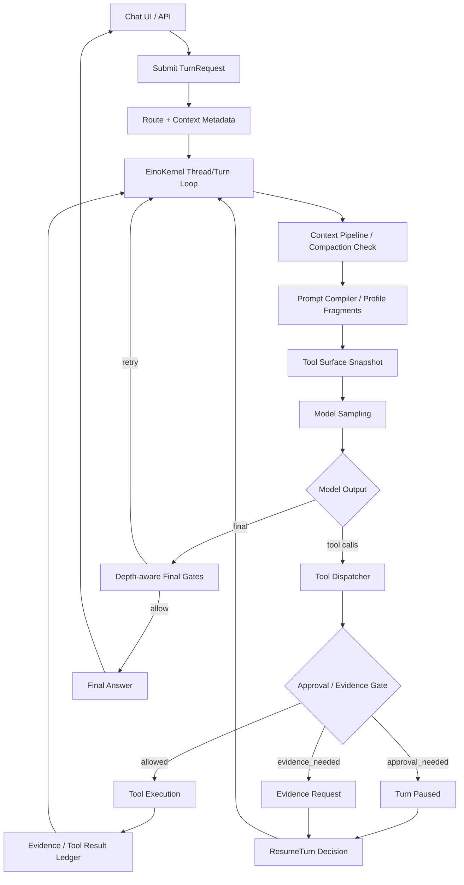

# aiops-v2 Codex Agent Runtime 迁移设计方案

日期：2026-06-24  
状态：Design Spec  
目标：把 aiops-v2 Agent Runtime 收敛为 Codex 式单一 thread/turn loop，让用户输入、工具调用、审批、恢复、压缩和最终回答贯穿同一个可观察运行时生命周期。  
关联分析：`docs/tech-sharing/2026-06-24-aiops-v2-vs-codex-agent-runtime-analysis.zh.md`  
关联既有设计：`docs/superpowers/specs/2026-06-23-aiops-v2-codex-like-ai-chat-runtime-v2-design.zh.md`

## 1. 设计结论

本次迁移不应理解为复制 Codex 的完整 prompt，而应复刻 Codex 的 Agent Runtime 合约：

```text
一个 thread 保存长期上下文。
一个 user turn 启动一次可恢复运行。
模型、工具、审批、拒绝、恢复、压缩、最终回答都发生在同一个 turn loop 内。
UI 只消费同一种 turn timeline。
```

aiops-v2 已经具备 `EinoKernel`、prompt compiler、tool dispatcher、approval/resume、context pipeline、tool surface snapshot、evidence refs、hostops child agent 等组件。迁移重点是收敛分叉路径，而不是重写 runtime：

1. Chat 前门只做 route/context/tool-profile metadata，不直接完成 HostOps mission。
2. `EinoKernel.RunTurn` / `ResumeTurn` 成为所有 Agent 工作的唯一运行入口。
3. 工具是否可见、可调用、需审批、需证据，由同一 tool surface + dispatcher contract 决定。
4. 审批拒绝或跳过必须作为同一 turn 的结构化结果回灌模型，不能让 turn 空结束。
5. 长上下文压缩产物必须是 handoff summary + evidence refs，不保留大段 raw output。

本设计的硬约束是防止形成第二套机制：新增代码只能收敛到一个 owner，旧路径只能作为 adapter 调用新 owner，不能继续独立决策、独立写 turn、独立审批或独立渲染 UI。

## 2. 设计目标

### 2.1 用户体验目标

1. 用户能感知到一个连续 Agent 在工作，而不是 route、mission、approval fallback 多条路径各自完成。
2. 运维问题可以从普通咨询自然升级到证据分析、主机只读检查、多主机协调、受控变更。
3. 多主机操作由 manager Agent 显式计划、分派 host-bound child Agent、等待结果并综合回答。
4. 审批暂停、批准、拒绝、继续分析都显示在同一个 turn timeline 中。
5. 最终回答包含结论、验证状态、证据引用和限制，不把缺失证据伪装成健康结论。

### 2.2 Runtime 目标

1. 形成单一 thread/turn loop：`submit -> model -> tool -> approval/evidence -> resume -> compact -> final`。
2. 支持 route profile，但 route 只改变上下文和初始工具面，不绕过模型 loop。
3. 支持统一 approval ledger，覆盖 runtime tool approval、host command approval、MCP/tool governance approval。
4. 支持 unified tool visibility：模型看到的 schema 就是当前允许尝试调用的 schema。
5. 支持 Codex-like compaction：压缩为可恢复摘要，而非堆叠历史 tool logs。
6. 支持 golden trace eval，用运行轨迹验证“通用运维能力”而不只看 final 文本。
7. 建立唯一 source of truth 表：每类 runtime 决策只能由一个模块拥有，其他模块只能读取结果或代理调用。
8. 支持 active turn 控制：同一 thread 同一时间最多一个 regular turn 运行，用户追加输入、取消、恢复都进入同一 runtime lifecycle。
9. 支持 per-turn safety snapshot：route、profile、权限、工具面、用户禁止项在 turn/iteration 内有明确 fingerprint，不能在运行中静默漂移。
10. 支持 mutation safety：变更工具必须有资源锁、幂等键、审批作用域、post-check 和部分失败语义，不能靠 prompt 自律保证安全。

### 2.3 非目标

1. 不在本设计中重写 Eino model adapter。
2. 不引入新的前端 transcript 协议；继续遵守 `TurnItem -> AiopsTransportState -> AssistantTransport`。
3. 不把 Coroot、OpsManual、PG timeline 写进核心 runtime。
4. 不默认绑定 `server-local`。
5. 不自动执行变更；所有 mutating 操作仍需 explicit user intent、scoped target、approval、post-check。
6. 不删除现有 evidence gate、task depth gate、prompt trace，而是重新分层启用。

## 3. 现状问题

### 3.1 HostOps Route 绕过主 loop

当前 `defaultChatService.handleHostOpsRoute` 会在 runtime 前创建 mission 并写入 completed `TurnSnapshot`。这导致多主机运维不经过模型计划、工具调用、approval/resume、evidence gate，也不符合 Codex 式“同一个 turn 持续推进”的体验。

### 3.2 Tool Surface 有可见性和可调用性冲突

`aiops.tool.execCommandAllowed=false` 可以通过 metadata 隐藏 `exec_command`，但 `IsAlwaysModelCallableTool` 又让 `exec_command` 绕过部分组装过滤。模型侧会收到矛盾信号：prompt 说不能执行，但工具可能仍被 runtime 认为始终可调用。

### 3.3 Approval 链路分散

当前审批来源包括 tool permission checker、policy engine、permissions engine、host command approval、runtime pending approval、approval fallback controller。它们各自合理，但用户体验上容易变成“审批后 turn 结束”或“拒绝后另起一个 fallback turn”。

### 3.4 Prompt 承担过多 runtime 决策

`developer_rules.go` 中 AIOps Investigation、OpsManual、Workflow、表单、Coroot、risk、completion 等规则大量常驻。模型能看到很多规则，但普通运维问题会被复杂策略干扰。Codex 的模式是 base prompt 短，权限/技能/插件/工具发现动态注入。

### 3.5 Context 压缩和证据账本未形成统一恢复语义

aiops-v2 有 context pipeline、compacted segments、external references、observation dedupe，但面向模型恢复的压缩契约还应更接近 Codex：保留目标、已验证事实、关键证据 refs、决策、限制、下一步，而不是保留大量历史文本。

## 4. 目标架构



核心原则：

1. `ChatService` 不再写 synthetic completed turn。
2. `EinoKernel` 是唯一 turn loop owner。
3. `ToolDispatcher` 是唯一工具调用和审批判定 owner。
4. `ApprovalService` 只负责列出和决定 pending approvals，不另起隐式业务路径。
5. `PromptCompiler` 只接收当前 profile 和 runtime state，不持有产品级长规则。

## 4.1 单机制治理原则

为防止迁移后出现多套机制，所有改动必须遵守以下规则：

1. 单 owner：每个 runtime 决策只有一个 owner。
2. 单写入点：turn lifecycle、final output、approval ledger、tool result、context compaction 只能由 owner 写入。
3. adapter-only：旧 API、旧 service、旧 UI projection 只能转换参数并调用新 owner，不能保留自己的业务判断。
4. 无双轨成功路径：同一用户请求不能同时存在“旧路径能完成”和“新路径能完成”两套成功逻辑。
5. feature flag 是迁移开关，不是产品机制；稳定后必须删除旧路径和对应 flag。
6. Prompt 不承担 runtime 分流；prompt 只能描述当前 owner 已决定的 profile、权限和工具面。
7. UI 不推断状态；UI 只能渲染 runtime 发出的 TurnItem，不从 final markdown 或 route metadata 二次推断过程。
8. Hook、policy、permissions engine 只能产出 decision 或 continuation，不能自己执行工具、结束 turn 或改写 final answer。
9. 用户禁止项、审批 grant、工具面 fingerprint 必须是 model-visible 的 runtime state，不能只存在于 UI 或 prompt 文本。
10. 任何 mutating 工具必须先通过 dispatcher 的资源锁和幂等检查；工具实现不能绕过 dispatcher 自行重试或扩大目标范围。

唯一 owner 表：

| 职责 | 唯一 owner | 禁止的第二套机制 |
| --- | --- | --- |
| Turn lifecycle | `runtimekernel.EinoKernel` | `appui` 直接写 completed/failed turn |
| Route/profile | `appui` route resolver 输出 metadata | prompt 或 tool dispatcher 重新判断业务 route |
| Tool visibility | `tooling` + runtime tool surface policy | 工具自身绕过 visibility 成为 model-callable |
| Tool execution | `runtimekernel.ToolDispatcher` | service 层直接执行工具并写结果 |
| Approval ledger | `runtimekernel.PendingApproval` / unified approval store | host command approval 独立存储、独立决策 |
| Approval decision | `runtimekernel.ResumeTurn` | approval fallback 直接另起业务 turn |
| HostOps orchestration | HostOps manager tools inside turn loop | `ChatService.handleHostOpsRoute` 创建 completed mission turn |
| Prompt assembly | `promptcompiler.Compiler` | 各工具或 UI 注入并行 prompt 规则 |
| Evidence ledger | evidence service + tool result materialization | final answer 自行引用未登记证据 |
| Compaction | context pipeline / compaction policy | tool 或 UI 生成私有摘要并影响模型 |
| Transcript/UI state | `AiopsTransportState` from TurnItem | final markdown parser、page-local stream、legacy projection |
| Active turn control | `runtimekernel.EinoKernel` active turn manager | transport disconnected、用户追加输入或 stop 由 UI/service 自行改终态 |
| Permission snapshot | `runtimekernel.TurnContext` / tool surface snapshot | route、prompt、工具实现各自重算权限 |
| Resource lock / idempotency | `runtimekernel.ToolDispatcher` | mutating tool 自行锁资源、自行重试或批量扩大 scope |
| Hook / extension decision | hook runtime normalized into runtime gates | hook 直接执行业务动作或阻断后写 final |

每个阶段的实现计划必须先声明被修改职责属于哪个 owner。如果发现一个职责需要两个 owner，优先调整边界，而不是增加同步逻辑。

## 5. Thread / Turn Loop Contract

### 5.1 Thread

Thread 对应 aiops-v2 的 `SessionState`。迁移后 thread 必须稳定保存：

1. `Messages`：用户、assistant、tool result 的模型历史。
2. `CurrentTurn` / `TurnHistory`：UI timeline 和恢复状态。
3. `PendingApprovals` / `PendingEvidence`：同一 ledger 中的 pending gate。
4. `ApprovalGrants`：session 级 exact-input 或 scoped-prefix 授权。
5. `ExternalReferences` / `CompactedSegments`：压缩和大结果引用。
6. `ObservationState` / `ContextGovernanceEvents`：去重和上下文治理。
7. `ToolDiscovery` / `SkillActivation` / `MCPInstructions`：动态能力状态。

### 5.2 Turn

每个 user turn 只能有以下生命周期：

```text
accepted -> running -> paused_approval | paused_evidence | completed | failed | cancelled
paused_* -> running -> completed | failed | cancelled
```

`blocked` 不再代表“用户看见一个结束的失败 turn”。它应只表示 turn 暂停等待外部输入，或明确不可继续的 final blocker。

### 5.3 Iteration

每轮 iteration 包含：

1. context pipeline。
2. prompt compile。
3. tool surface snapshot。
4. model sampling。
5. assistant message 持久化。
6. tool dispatch 或 final gates。

这与现有 `runHostIterationLoop` 基本一致，迁移重点是把外部绕路收敛进该 loop。

### 5.4 Active Turn、追加输入和取消

同一 thread 同一时间只能有一个 active regular turn。新的用户输入不能绕过 active turn 直接创建第二个业务 turn：

1. active turn 仍在 running 时，用户追加输入默认作为 pending input / steer event 进入同一 turn loop。
2. 如果用户明确要求停止，调用 `CancelTurn`，由 `EinoKernel` 写入 `cancelled` lifecycle 和 model-visible abort marker。
3. 取消中的工具必须收到 context cancellation；已经启动的工具返回 structured aborted result，不能静默丢失。
4. mutating 工具被取消时，final/blocker 必须说明可能的部分执行风险和需要的 post-check。
5. transport 断开只触发 runtime cancel/resume 策略，不能由 transport projection 自行写 failed/completed turn。

取消后的下一轮用户输入进入同一 thread，但必须看到上一个 turn 的 abort marker，模型需要知道“之前的工具可能部分执行过”。

### 5.5 Non-Regular Runtime Tasks

Codex 有 regular、compact、review、user shell 等 task kind。aiops-v2 也需要区分任务类型，但它们仍必须挂在同一个 runtime owner 下：

| Task kind | 允许写入 | 禁止行为 |
| --- | --- | --- |
| `regular` | turn lifecycle、tool result、approval、final output | 仍受 tool/approval/evidence/final gate 约束 |
| `compact` | context compacted item、replacement summary、evidence refs | 写业务 final、执行 HostOps、改变 approval decision |
| `review/eval` | eval trace、diagnostic finding | 写生产 turn final、触发 mutation |
| `transport_recovery` | recovery marker、telemetry | 当作正常业务 turn 成功路径 |
| `user_shell/manual` | user-originated command event | 被模型当作已验证工具证据，除非登记 evidence ref |

这些 task kind 可以有不同 prompt 或流程，但不能形成第二套 Agent Runtime。

## 6. Route Profile 设计

Route 仍然保留，但语义调整为“初始 profile 和 metadata”，不直接完成任务。

### 6.1 通用运维能力阶梯

通用运维能力不是让模型随时拥有所有工具，而是让 runtime 能按风险逐级升级和降级：

```text
advisor
  -> evidence_rca
  -> host_worker read-only
  -> host_worker mutation with approval
  -> host_manager orchestration
  -> final synthesis or blocker
```

升级条件必须来自结构化 state，而不是模型自由发挥：

1. `advisor -> evidence_rca`：用户提供日志、监控、报错、拓扑或明确要求 RCA。
2. `evidence_rca -> host_worker`：用户明确允许访问具体 host/local/ip，且没有“不要执行命令”的 turn guard。
3. `host_worker read-only -> mutation`：模型提出具体变更、目标、影响面、回滚/验证方式，并通过 approval gate。
4. `single host -> host_manager`：出现多个明确目标，或同一问题需要跨 host 对比。
5. 任意阶段降级：目标不明确、工具不可用、用户拒绝审批、证据不足或风险超出 policy 时，回到只读分析或 final blocker。

这套阶梯是 runtime contract，不是 prompt 建议。Prompt 只能解释当前阶梯位置、可用工具和下一步约束。

### 6.2 Profile 表

| Profile | 触发条件 | 初始工具面 | 允许升级 |
| --- | --- | --- | --- |
| `advisor` | 无 host mention、普通咨询、机制解释 | web/search/resource read、tool_search | 用户补充证据后升级到 `evidence_rca` |
| `evidence_rca` | 用户贴日志、命令输出、监控结果；或拒绝执行后继续分析 | evidence parser、web、observability read、tool_search | 用户显式选择 host 后升级到 `host_worker` |
| `host_worker` | 单个显式 host/local/ip mention | `exec_command` read-only、host resources、approval-capable mutation tools | mutating tool 需 approval |
| `host_manager` | 多个显式 host mentions | plan、spawn/wait/send host agents、tool_search | 子 Agent 各自进入 host_worker |

Route 输出字段：

```text
RuntimeRoute
  - mode
  - profile
  - reasons
  - targetRefs
  - allowsExecCommand
  - allowsHostMutation
  - allowsWebLearn
  - allowsObservability
  - requiresHostBinding
  - userProhibitedHostExec
  - metadata
```

关键约束：

1. `multi_host_ops` 不再调用 `CreateMission` 写 completed turn。
2. `host_manager` profile 只启用 HostOps manager tools。
3. `advisor` / `evidence_rca` 默认不暴露 `exec_command`。
4. 用户说“不要执行命令”时，本 turn 后续都不暴露 host exec。

## 7. Tool Surface 设计

### 7.1 拆分 Runtime Registered 和 Model Visible

新增概念：

```text
RuntimeRegisteredTool：runtime 可查找和执行的工具。
ModelVisibleTool：当前 prompt/model 可见且允许尝试调用的工具。
DeferredTool：当前不可调用，但可通过 tool_search 发现或加载的工具。
```

`exec_command` 可以始终 runtime registered，但不能始终 model visible。

### 7.2 Tool Surface Snapshot

每轮 iteration 生成：

```text
ToolSurfaceSnapshot
  - fingerprint
  - visibleTools
  - deferredTools
  - hiddenTools
  - hiddenReasons
  - loadedPacksDelta
  - policyHash
```

`hiddenReasons` 应明确区分：

1. route disallowed。
2. profile disallowed。
3. MCP unhealthy。
4. approval required but not requestable。
5. deferred until tool_search。
6. user prohibited execution。

### 7.3 Tool Search

`tool_search` 应返回 loadable tool spec 或明确的 selectable pack，而不是纯文字建议。

期望流程：

```text
模型调用 tool_search(query="coroot postgres rca")
runtime 返回 LoadableToolSpec[]
下一轮 tool surface 加载匹配工具
Prompt Delta 只提示新增工具
模型调用新增工具
```

### 7.4 Tool Dispatch Safety Contract

工具调度必须把“可见、可调用、可重试、可并发、可变更”合并成一个 dispatch decision：

1. 每个 tool call 绑定 `toolSurfaceFingerprint`、`permissionSnapshotHash`、`argumentsHash`。
2. 如果模型调用了 hidden/deferred/unavailable tool，dispatcher 返回 structured unavailable result，并把原因回灌模型。
3. read-only 工具可以按 `ReadOnlyRetryConfig` 做 bounded retry；mutating 工具默认不自动重试。
4. mutating 工具必须声明 `resourceLocks`、`idempotencyKey` 或 `argumentsHash`，并由 dispatcher 获取资源锁后执行。
5. 资源锁冲突返回 tool result/blocker，不降级为普通失败，也不让模型改名重试同一资源。
6. approval grant 只能匹配 normalized input hash 和 tool name，不能因为 prompt 语义相似而复用。
7. 工具实现不能扩大 scope。例如模型请求单 host，工具不能自行升级到 all hosts。
8. 工具失败必须分类为 `retryable_read_failure`、`unavailable`、`denied`、`partial_mutation`、`unknown_state` 等结构化 outcome。

这部分是 Codex-like 运维通用能力的安全底座：模型可以泛化处理问题，但 runtime 必须精确控制风险边界。

## 8. Unified Approval 设计

### 8.1 PendingApproval Contract

统一 pending approval：

```text
PendingApproval
  - id
  - sessionId
  - turnId
  - iterationId
  - toolCallId
  - source: tool | policy | permissions | host_command | mcp | hook
  - toolName
  - targetRefs
  - command
  - argumentsHash
  - risk
  - reason
  - requestedScope
  - preChangeEvidenceRefs
  - approvalOptions: approve | approve_for_session | deny
  - createdAt
```

所有审批来源都写入该结构。UI 不再需要分别拼 runtime approvals 和 host command approvals。

### 8.2 Approval Decision 回灌模型

审批结果必须变成同一 turn 的结构化 continuation：

```json
{
  "schemaVersion": "aiops.approval/v1",
  "approvalId": "...",
  "toolCallId": "...",
  "decision": "denied",
  "reason": "user_denied",
  "instruction": "Do not request the same scoped action again. Continue with read-only evidence or report a blocker."
}
```

批准：

1. 恢复原 tool call。
2. 记录 approval grant。
3. 执行 tool。
4. tool result 回写 evidence ledger。

拒绝：

1. 不执行 tool。
2. 写入 approval decision tool result。
3. 同一 turn 继续 model loop。
4. 模型输出受限分析、替代只读方案或 final blocker。

### 8.3 Fallback New Turn

保留现有 approval fallback controller 作为异常恢复兜底，不作为正常业务机制。它只在以下情况使用：

1. 原 turn 已不存在。
2. checkpoint 无法恢复。
3. runtime resume 失败。
4. transport 断开且无法继续同一 turn。

默认路径必须是同一 turn resume。fallback new turn 必须带 `aiops.approvalFallback.recoveryOnly=true`，并记录 telemetry；如果同类场景在 golden trace 中稳定触发 fallback，视为迁移失败，而不是接受第二套机制。

### 8.4 权限快照和审批作用域

审批等待期间，用户批准的是一个稳定 action，而不是一段自然语言意图：

1. `PendingApproval` 必须保存 `toolSurfaceFingerprint`、`permissionSnapshotHash`、`argumentsHash` 和 target refs。
2. `ResumeTurn` 执行批准动作前必须重新校验这些 fingerprint；发生漂移时返回新的 approval/evidence request，而不是执行旧批准。
3. `approve_for_session` 只对同 tool、同 normalized input hash、同 target scope 生效。
4. 用户在 turn 中说过“不要执行命令/不要改动/只读”后，该 guard 在本 turn 内不可被 route 或 prompt 静默覆盖；只能由用户新的明确授权创建新的 turn-level decision。
5. policy engine、permissions engine、hook review 的结果必须折叠成同一个 approval decision，不允许一个系统批准、另一个系统仍私下阻断或执行。

## 9. HostOps Manager 迁移设计

### 9.1 当前短路迁移

`handleHostOpsRoute` 调整为只做：

1. 解析 mentions。
2. 写 route metadata。
3. 启用 `hostops` tool pack。
4. 可选创建 pending mission record，但不写 completed turn。
5. 调用 `turnRunner.Start(ctx, req)`。

### 9.2 Manager Tool Contract

HostOps manager tools 保持四类：

1. `spawn_host_agent`
2. `send_host_agent_message`
3. `wait_host_agents`
4. `stop_host_agent`

调整点：

1. `spawn_host_agent` 的 mutating 语义改为 runtime-orchestration mutating，不代表主机状态 mutation。
2. `spawn_host_agent` 不需要用户审批，但必须在 UI timeline 标注“启动子 Agent，不执行主机变更”。
3. 子 Agent 的 host command 和 mutation approval 仍各自走 unified approval。
4. `wait_host_agents` 是 read-only，支持 manager 多轮综合。

### 9.3 Manager Prompt Fragment

只在 `host_manager` profile 注入：

```text
You are the manager for a multi-host operation.
Create a compact plan.
Do not run host commands directly.
Spawn one host-bound child agent per unique host target.
Wait for child results before final synthesis.
If a child is blocked by approval or missing evidence, summarize the blocker and ask for the smallest next decision.
```

该 fragment 替代常驻 HostOps Manager 大段规则。

### 9.4 Child Agent 并发和部分结果

HostOps manager 必须有运行时边界：

1. 每个 manager turn 有 `maxChildAgents` 和 `maxChildRuntime`，默认由 runtime config 控制。
2. 子 Agent 绑定唯一 host target，不能在 child 内自行扩大到其他 host。
3. `wait_host_agents` 返回 `completed`、`blocked_approval`、`blocked_evidence`、`failed`、`cancelled`、`timeout`。
4. manager final 必须区分 confirmed facts、partial results、unknown hosts 和 blocked next decisions。
5. 用户取消 manager turn 时，runtime 负责级联取消可取消 child，并记录无法取消或可能部分执行的 child。
6. 子 Agent 的 tool result 和 evidence refs 只通过 manager tool result 汇总进入父 turn，不能让 child store 直接写父 turn final。

## 10. Prompt 迁移设计

### 10.1 Thin Base Prompt

Base prompt 保留：

1. Role。
2. Operating Contract。
3. Task Triage。
4. Planning。
5. Responsiveness。
6. Evidence Contract。
7. Tool Use Contract。
8. Approval Contract。
9. Final Answer Contract。

### 10.2 Dynamic Profile Fragments

按 profile 注入：

1. `advisor`: 普通咨询、官方资料优先、不要执行主机命令。
2. `evidence_rca`: 区分用户证据、工具证据、推断和缺失证据。
3. `host_worker`: 目标 host、OS/transport、read-only first、mutation approval。
4. `host_manager`: 多 host manager rules。

### 10.3 Domain Rules 下沉

迁移规则：

1. OpsManual/Workflow 细则进入 opsmanual tool metadata 或 skill asset。
2. Coroot RCA 细则进入 Coroot skill/plugin metadata。
3. PG timeline 只能进入 evidence parser 或 case eval，不进入 base prompt。
4. WebLearn source policy 作为 web tool/profile fragment 动态注入。

## 11. Context 和 Compaction 设计

### 11.1 Compaction Trigger

触发条件：

1. model context 超阈值。
2. tool result 总量超过 inline budget。
3. child agents 返回大量结果。
4. 用户手动请求压缩或总结。

### 11.2 Compaction Output

压缩内容固定为：

```text
Task goal
Current profile and target refs
Decisions made
Observed facts with evidence refs
Inferences and confidence
Pending approvals/evidence
Rejected approvals
Tool packs loaded
Remaining next steps
```

禁止把完整 stdout/stderr、manual content、artifact payload 直接塞进压缩摘要。

### 11.3 Resume Semantics

压缩后恢复必须满足：

1. 模型知道当前目标。
2. 模型知道哪些事实已验证。
3. 模型知道哪些行动被拒绝或待审批。
4. 模型能继续调用当前 profile 允许的工具。

## 12. Final Gate 分层

Final gates 按 task depth/profile 启用：

| Task/Profile | Gate |
| --- | --- |
| trivial/simple_read/advisor | final completeness |
| evidence_rca | evidence coverage、final evidence verifier |
| host_worker readonly | evidence coverage、verification status |
| host_worker mutation | pre-change evidence、approval result、post-change verification |
| host_manager | child agent coverage、manager synthesis、blocked host summary |

每类 gate 最多 retry 一次。多个 gate 的 retry prompt 合并为一个 compact continuation，避免模型连续收到多条纠偏 prompt。

Final gate 还必须识别以下安全终态：

1. `insufficient_evidence`：没有足够证据，输出缺口和最小下一步。
2. `user_denied_action`：用户拒绝审批，输出只读结论或 blocker，不重复请求同一 action。
3. `partial_mutation`：变更工具可能部分执行，必须要求 post-check 或人工确认。
4. `tool_unavailable`：工具/MCP/host 不可用，不能把无法观测误判为健康。
5. `multi_host_partial`：多主机场景部分 host 完成，final 必须逐 host 标注状态。

## 13. UI / Transport 设计

保持生产路径：

```text
TurnItem -> AiopsTransportState -> AssistantTransport data stream -> assistant-ui React
```

新增或标准化 TurnItem 类型：

1. `route_selected`
2. `tool_surface_snapshot`
3. `assistant_progress`
4. `tool_call`
5. `tool_result`
6. `approval_requested`
7. `approval_decided`
8. `child_agent_started`
9. `child_agent_result`
10. `context_compacted`
11. `pending_input_accepted`
12. `turn_cancelled`
13. `permission_snapshot`
14. `resource_lock`
15. `final_answer`

UI 不从 final markdown 解析过程状态。

## 14. 模块修改方案

### 14.1 `internal/appui`

修改：

1. `chat_service.go`
   - 移除 HostOps completed turn 短路。
   - `handleHostOpsRoute` 改为 metadata enrichment。
   - 所有 chat request 最终进入 `turnRunner.Start`。
   - 禁止在 `appui` 内新增任何能写 `FinalOutput` 或 completed turn 的业务分支。
   - `StopTurn` / transport disconnect 只能调用 runtime cancel，不能自行写 terminal snapshot。
   - active turn running 时的新用户输入只入 pending input/steer 队列，不能直接创建第二个 regular turn。

2. `chat_runtime_route.go`
   - 输出 profile。
   - 明确 route 只影响 metadata/tool surface。
   - 用户禁止 exec 时写入 turn-level immutable guard。
   - route resolver 不直接选择工具实现，不调用 HostOps/Approval/Evidence service 执行业务动作。

3. `approval_service.go`
   - 读取 unified pending approval。
   - 决策统一调用 `ResumeTurn`。
   - host command approval 并入 runtime approval。
   - 旧 host command approval endpoint 保留时只能作为 adapter，不能维护独立 pending 状态。

4. `approval_fallback_controller.go`
   - 降级为同 turn resume 失败后的 recovery-only 兜底。
   - fallback 输出必须标记为恢复路径，不能被 UI 当作正常 Agent turn 模板。

### 14.2 `internal/runtimekernel`

修改：

1. `eino_kernel.go`
   - 将 paused approval/evidence 作为 turn lifecycle，而不是普通 failed/blocked。
   - ResumeTurn 将 approval/evidence decision 写成 model-visible tool result。
   - final gate 按 task depth/profile 分层。
   - 作为 turn lifecycle 和 final output 的唯一写入点，拒绝 service 层直接完成 turn。
   - 增加 active turn manager：同一 thread 最多一个 regular turn running，追加输入、取消、恢复都进入同一 lifecycle。
   - cancel/interrupt 写入 abort marker 和 structured aborted tool result，保留可能部分执行的风险提示。

2. `dispatch.go`
   - pending approval 输出统一 `PendingApproval`。
   - 不同 source 的 approval_needed 统一结构。
   - hidden tool call 返回 structured unavailable result，帮助模型自我修正。
   - 工具 permission checker、policy engine、permissions engine 的结果必须归一为同一种 dispatch decision。
   - dispatch decision 必须包含 tool surface fingerprint、permission snapshot hash、arguments hash。
   - mutating tool 统一通过 resource lock / idempotency / approval grant 校验后执行。
   - read-only retry 只适用于结构化可重试失败；mutation 和 partial mutation 不自动重试。

3. `model_input.go` / context pipeline
   - compaction summary 注入 evidence refs。
   - prompt trace 输出 profile、route、tool surface、approval ledger 状态。
   - prompt trace 增加 active turn、permission snapshot、resource lock、aborted tool 和 partial mutation 状态。

### 14.3 `internal/tooling`

修改：

1. `base_registry.go`
   - 拆分 always runtime registered 和 always model callable。
   - `exec_command` 不再无条件 model callable。
   - 删除或重命名 `IsAlwaysModelCallableTool`，避免继续表达错误语义。

2. `registry.go`
   - `AssembleToolsWithOptions` 输出 hidden reasons。
   - route/profile visibility 优先于 always-load。
   - `AlwaysLoad` 只表示 runtime registered，不表示 prompt visible。

3. `tool_search_v3.go`
   - 返回 loadable spec/selectable pack。
   - 记录 tool_search -> loaded tools delta。

### 14.4 `internal/promptcompiler`

修改：

1. 拆出 `base_runtime_contract.go`。
2. 新增 `profile_fragments.go`。
3. 将 OpsManual/Coroot/HostOps 长规则变成 dynamic assets。
4. Runtime policy prompt 只保留当前 permission/profile 约束。

### 14.5 `internal/hostops`

修改：

1. Mission creation 从 chat front door 移入 `spawn_host_agent` manager tool；如需提前创建 pending mission，只能由 runtime 调用并附着到当前 turn。
2. `spawn_host_agent` 输出 child agent refs 和 no-host-mutation guarantee。
3. Child agent result 必须写 evidence refs 或 blocker refs。
4. HostOps store 不写 completed user turn，只写 mission/child 状态供 runtime tool result 引用。
5. manager 配置 `maxChildAgents`、`maxChildRuntime`，并在 final synthesis 中显式区分 completed/blocked/failed/timeout/cancelled child。
6. parent turn cancel 时，HostOps runtime 负责级联 cancel child，并记录无法取消或 unknown state。

### 14.6 `internal/integrations/localtools`

修改：

1. `exec_command` 输出 target profile、host id、permission mode。
2. remote host-agent read-only failure 作为 evidence unavailable，不作为健康证明。
3. non-read-only remote action 统一生成 PendingApproval。
4. 所有 host mutation 输出 idempotency key、pre-check refs、post-check refs 和 partial mutation 状态。

## 15. 数据迁移和兼容

### 15.1 Feature Flag

Feature flag 只用于迁移和回滚，不是长期运行机制。采用一个总开关和阶段开关：

```text
AIopsCodexRuntimeContractV3
AIopsUnifiedApprovalLedger
AIopsHostOpsInTurnLoop
AIopsToolSurfaceStrictVisibility
AIopsProfilePromptFragments
```

默认策略：

1. `AIopsCodexRuntimeContractV3` 是总开关；同一 session 内不能混用旧 runtime 成功路径和新 runtime 成功路径。
2. 阶段开关只允许控制某个 owner 是否接管职责，不允许形成两边同时写入。
3. 本地开发开启全部阶段。
4. 测试环境按 eval suite 开启，并用 golden trace 验证无双写入。
5. 生产先灰度 advisor/evidence_rca，再开启 host_worker/host_manager。
6. 每个阶段开关必须有删除条件：对应 golden trace 稳定通过两个迭代后，删除旧路径和阶段开关。

### 15.2 Snapshot 兼容

旧 turn snapshot 继续可读。新字段缺失时：

1. `profile` 从 route metadata 推断。
2. `approvalLedger` 从 `PendingApprovals` 迁移。
3. `toolSurface.hiddenReasons` 为空时只展示 visible tools。

### 15.3 回滚策略

回滚策略必须避免同一 session 混用两套机制：

1. 关闭总开关 `AIopsCodexRuntimeContractV3`，整个 session 使用旧机制。
2. 阶段开关只允许在灰度阶段对新 session 生效，不允许对 active turn 中途切换 owner。
3. 如果 `AIopsHostOpsInTurnLoop` 关闭，HostOps 旧 route 只能在旧 session 使用；新 session 不允许同时启用 host_manager profile。
4. 如果 `AIopsUnifiedApprovalLedger` 关闭，approval adapter 不写 unified ledger；开启后旧 approval store 只读迁移。
5. 如果 `AIopsToolSurfaceStrictVisibility` 关闭，必须在 trace 中标记 legacy tool visibility，不允许用新 prompt profile 宣称 strict visibility。

回滚不删除新 snapshot 字段，只忽略读取。

## 16. 测试方案

### 16.1 Unit Tests

1. route profile selection。
2. tool surface visibility。
3. `exec_command` hidden/callable mismatch。
4. pending approval normalization。
5. approval denied tool-result continuation。
6. compaction summary content。
7. final gate profile matrix。
8. owner single-writer guard：非 owner 模块不能写 completed turn、final output、approval ledger。
9. legacy adapter guard：旧 endpoint 只能调用新 owner，不能直接改业务状态。
10. active turn guard：running regular turn 存在时，新输入只能 pending/steer，不能创建第二个 regular turn。
11. cancel propagation：CancelTurn 写 cancelled lifecycle、aborted tool result 和 model-visible abort marker。
12. permission drift guard：approval resume 前 fingerprint 漂移时不执行原 action。
13. resource lock/idempotency guard：mutation 未声明锁或锁冲突时不执行工具。
14. mutation retry guard：partial mutation 和 unknown state 不自动重试。

### 16.2 Runtime Golden Trace

新增 trace cases：

1. `advisor_no_host_no_exec`
2. `evidence_rca_user_logs_no_exec`
3. `single_host_readonly_exec`
4. `single_host_mutation_approval_approved`
5. `single_host_mutation_approval_denied`
6. `multi_host_manager_spawn_wait_synthesis`
7. `tool_search_deferred_coroot_load`
8. `long_turn_compaction_resume`
9. `active_turn_pending_input_steer`
10. `turn_cancel_aborts_tool_and_resumes_next_turn`
11. `approval_permission_snapshot_drift`
12. `mutation_resource_lock_conflict`
13. `mutation_partial_failure_requires_postcheck`
14. `multi_host_partial_child_results`
15. `unknown_host_degrades_to_evidence_or_blocker`

每个 golden trace 校验：

1. route/profile。
2. visible tools。
3. tool calls。
4. approval pause/resume。
5. evidence refs。
6. final verification status。
7. no synthetic completed turn。
8. no dual mechanism：同一职责只有一个 owner 写入事件。
9. no concurrent regular turns：同一 thread 不出现两个 running regular turn。
10. permission/tool surface fingerprint 在 approval/resume 前后一致，或触发重新审批。
11. partial/unknown 状态不会被 final answer 描述为 confirmed healthy。

### 16.3 UI Snapshot Tests

涉及 UI timeline 变更时，按 repo 规则补 Playwright snapshot：

1. approval pause。
2. approval denied continuation。
3. multi-host child agent timeline。
4. context compacted marker。
5. pending input accepted / steer marker。
6. turn cancelled / aborted tool marker。
7. resource lock conflict marker。

### 16.4 Eval Metrics

1. Time to first useful evidence。
2. 不必要 approval 次数。
3. 被隐藏工具误调次数。
4. 用户拒绝后重复请求率。
5. final answer evidence coverage。
6. 多主机任务 child coverage。
7. prompt token / visible tool schema token。
8. active turn duplicate rate。
9. approval drift prevented count。
10. partial mutation correctly reported rate。
11. resource lock conflict recovery quality。

## 17. 分阶段落地

### Phase 0：Trace 和测试护栏

1. 固化当前行为 golden traces。
2. 增加 route/profile/tool surface trace 字段。
3. 增加 synthetic completed turn 检测。
4. 增加 owner write trace：记录 turn lifecycle、approval ledger、tool result、final output 的写入 owner。
5. 增加 active turn trace：记录 regular turn start/cancel/pending input/resume。
6. 增加 permission snapshot trace：记录 tool surface fingerprint、permission hash、approval arguments hash。

验收：可以用 trace 明确看到旧路径问题，并能检测双写入或双成功路径。

### Phase 1：Tool Surface Strict Visibility

1. 拆分 runtime registered 和 model visible。
2. 修正 `exec_command` always callable。
3. advisor/evidence_rca 不暴露 host exec。
4. tool call 绑定 tool surface fingerprint 和 permission snapshot hash。

验收：无 host mention 时模型看不到 `exec_command` schema。

### Phase 1.5：Active Turn 和 Mutation Safety Guard

1. 同一 session/thread 增加 active regular turn guard。
2. pending input/steer/cancel 都由 `EinoKernel` 写入 lifecycle。
3. mutating tool 强制 resource lock/idempotency metadata。
4. read-only retry 和 mutation retry 策略分离。

验收：重复提交、取消、资源锁冲突、partial mutation 都不会产生第二个业务 turn 或自动重试变更。

### Phase 2：HostOps 进入 Eino Turn Loop

1. `handleHostOpsRoute` 不再写 completed turn。
2. host_manager profile 启用 HostOps tools。
3. manager 通过工具启动、等待、汇总 child agents。

验收：多主机 turn timeline 包含 manager plan、spawn、wait、final synthesis。

### Phase 3：Unified Approval Ledger

1. 合并 runtime approval 和 host command approval。
2. denied/approved decision 作为同 turn continuation。
3. fallback new turn 只保留兜底。
4. 旧 approval service 变成 unified ledger adapter。
5. approval resume 前校验 permission/tool surface fingerprint，漂移则重新请求最小审批。

验收：用户拒绝命令后，同一 turn 给出受限分析或 blocker。

### Phase 4：Prompt Profile 化

1. 瘦身 base prompt。
2. 新增 advisor/evidence_rca/host_worker/host_manager fragments。
3. OpsManual/Coroot/HostOps 规则按工具或 profile 动态注入。

验收：四类 profile prompt snapshot 稳定，普通咨询不含 ops manual 长规则。

### Phase 5：Compaction 和 Evidence Handoff

1. 压缩输出 evidence refs。
2. Resume 后模型保留目标、事实、限制、下一步。
3. long-turn eval 通过。

验收：压缩后继续调查不丢目标、不重复已拒绝行动、不重复读取大结果。

## 18. 验收标准

1. 所有 Chat 请求都进入 `EinoKernel.RunTurn` 或 `ResumeTurn`，没有 HostOps synthetic completed turn 默认路径。
2. 无显式 host mention 的 advisor/evidence RCA turn 不暴露 `exec_command`。
3. 多主机请求由 manager Agent 在 turn loop 内调用 HostOps tools。
4. mutation approval 被拒后，同一 turn 继续受限分析或明确 blocker。
5. final answer 对 investigation/operations 任务包含验证状态和 evidence refs。
6. context compaction 后能继续同一任务，不丢 pending approvals/evidence。
7. golden trace suite 覆盖核心运维场景并通过。
8. owner single-writer trace 证明每类职责只有一个 owner 写入。
9. 旧 HostOps route、旧 host command approval、旧 final markdown process parser 不再作为正常成功路径存在。
10. 同一 thread 不出现两个并发 running regular turn；追加输入、取消、恢复都能在 timeline 中解释。
11. approval resume 前权限和工具面 fingerprint 不漂移；漂移时重新审批，不执行旧批准。
12. mutating 工具都有资源锁/幂等/审批作用域；partial mutation final 不会被描述为成功或健康。
13. 多主机 final 能区分 completed、blocked、failed、timeout、cancelled 和 unknown host。

## 19. 实施风险和缓解

| 风险 | 影响 | 缓解 |
| --- | --- | --- |
| 关闭 HostOps 短路后多主机任务变慢 | 用户等待更久 | UI timeline 展示 manager/child progress，支持并发 child agents |
| strict tool visibility 影响旧 prompt 依赖 | 模型少了一些兜底工具 | 通过 profile 和 tool_search 渐进加载 |
| unified approval 改动面大 | 可能影响现有 host command approval | feature flag 灰度，先兼容旧 approval view |
| prompt 瘦身导致领域策略遗漏 | 某些 OpsManual 流程退化 | 把规则移入 tool metadata/skill asset，并加 prompt snapshot |
| compaction 摘要不充分 | 长任务恢复质量下降 | golden trace 校验 compressed resume 的目标、证据、限制 |
| feature flag 形成长期双轨 | 机制复杂度继续上升 | 每个阶段开关必须有删除条件，owner write trace 检测双写入 |
| active turn 并发未收敛 | 重复执行、重复审批、UI 状态错乱 | active turn guard、pending input queue、cancel propagation trace |
| approval 权限漂移 | 用户批准的 action 与实际执行不一致 | permission/tool surface fingerprint resume 校验 |
| mutation 部分失败 | 用户误以为变更成功或系统健康 | partial mutation outcome、post-check gate、禁止自动 mutation retry |
| child agent 失控并发 | 多主机任务拖垮 runtime 或证据不可汇总 | maxChildAgents、maxChildRuntime、partial child synthesis gate |

## 20. 第一批最小修改集

1. `handleHostOpsRoute` 改为 metadata-only，保留旧短路 behind feature flag。
2. `IsAlwaysModelCallableTool` 改为不覆盖 route/profile visibility。
3. `ApprovalDecision` denied 写回同 turn continuation，fallback new turn 降级为异常兜底。
4. `host_manager` profile 注入短 HostOps manager fragment，并启用 HostOps tools。
5. 新增 owner write trace，防止 turn、approval、tool result、final output 双写入。
6. 新增 active turn guard 和 permission/tool surface fingerprint trace。
7. mutating tool 接入 resource lock/idempotency guard，read-only retry 与 mutation retry 分离。
8. 新增 15 个 runtime golden trace cases。

完成这批修改后，aiops-v2 的 agent 会更接近 Codex：同一个 thread/turn loop 贯穿用户输入、工具调用、审批、恢复、压缩和最终回答，同时保留 aiops-v2 的主机、证据、审批和多 Agent 运维能力。
