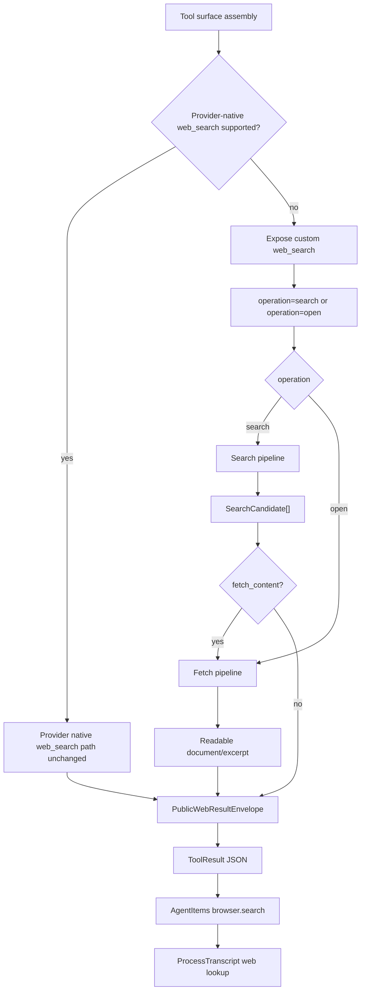

# aiops-v2 单一自定义网页搜索工具优化设计方案

日期：2026-06-28  
状态：Design Spec  
目标：优化 aiops-v2 当前自定义公开网页能力，把模型可见的 `web_search` 与 `browse_url` 收敛成一个自定义网页搜索 tool，让它同时支持“按 query 搜索”和“按 URL 打开/读取”，并参考 Firecrawl 的搜索、抓正文、结构化结果实现方式提升质量。  
硬约束：不把 Firecrawl 内置到 aiops-v2，不新增 Firecrawl 服务依赖、配置项或后端调用；如果当前 LLM/provider 支持原生 `web_search`，provider-native 逻辑保持不变；非 native provider 才走 aiops-v2 自定义 `web_search`。React Chat 仍只通过 `browser.search -> transport_projector -> ProcessTranscript` 展示一个网页检索块。

## 1. 背景

当前 aiops-v2 的公开网页能力集中在 `internal/integrations/localtools/register.go`：

- `web_search` 是 model-visible core tool，优先调用 provider-native `web_search`，失败或无文本时 fallback 到 public web search。
- `browse_url` 是 deferred tool，只打开已知 URL 并抽取可读文本。
- `web_search` 输入支持 `query`、`search_context_size`、`allowed_domains`、`blocked_domains`。
- public fallback 当前默认访问 `https://www.bing.com/search`，解析 HTML 结果，再做 domain filter、简单 relevance filter 和官方域 fallback。
- 结果通过 `Payload.Kind = "browser.search"` 投影到 `ProcessTranscript` 的同一个网页检索块。
- provider-native 搜索事件也会被 runtime 规范化为 synthetic `web_search` tool call / tool result，继续走 `browser.search`。

这个方向是对的：搜索属于结构化 tool result，不应该由前端猜测；公开网页工具也不应该用于本机、私有环境、Prompt Trace 或部署状态。

需要调整的是模型可见工具边界：`web_search` 和 `browse_url` 对模型来说是两个相邻动作，但实际都属于公开网页读取。保留两个工具会让模型在“先 search 再 browse”和“直接 browse”之间来回选择，也会让预算、去重、引用和 UI 状态分散。更好的方式是保留一个自定义 `web_search`，让它通过参数表达 operation。

## 2. 当前问题

### 2.1 fallback 搜索源单薄

现在 public fallback 主要依赖 Bing HTML：

```text
provider-native web_search
  -> responses API
  -> chat completions web_search_options
  -> Bing HTML /search
  -> official-domain fallback
```

这能覆盖简单查询，但稳定性受搜索页 DOM、反爬、地区、动态页面影响。Firecrawl 的实现里搜索源是多级的：Fire Engine、SearXNG、DuckDuckGo，并把搜索 provider 与后续 scrape 分开。

### 2.2 搜索和打开 URL 分成两个工具

当前 `web_search` fallback 主要返回 title、URL、snippet；要读取页面正文时，模型还要再发现或选择 `browse_url`。这带来三个问题：

- 同一个公开网页任务被拆成两个模型可见工具，提示词和工具选择更复杂。
- `web_search` 与 `browse_url` 各自做输出预算和正文处理，引用来源不容易统一。
- 过程 UI 上虽然都会折到 `web_lookup`，但 runtime 工具面仍是两个入口。

对于运维问题，snippet 经常不足以支撑结论，例如：

- PostgreSQL / pgBackRest / pg_auto_failover 文档中的关键段落。
- 云厂商文档中版本相关参数。
- issue、release note、changelog 中的上下文。
- 动态或复杂页面中搜索 snippet 不完整。

Firecrawl 的 search pipeline 可以把搜索结果继续扩展为 markdown 正文；它的 `executeSearch -> scrapeSearchResults -> mergeScrapedContent` 流程值得借鉴。但这里借鉴的是 pipeline 思想，不是在 aiops-v2 里调用 Firecrawl API。

### 2.3 `browse_url` 可以并入 `web_search`

`browse_url` 的语义其实是“打开一个已知公开 URL 并读取正文”。这不是独立能力，而是 `web_search` 的 `open/read` 子操作。应把模型可见工具收敛为：

```text
web_search
  operation=search: 按 query 找公开网页来源
  operation=open:   按 url 读取公开网页正文
```

Firecrawl 的设计把能力分得更清楚：

- Search：找 URL，并可选抓正文。
- Scrape：对指定 URL 生成 markdown / html / links / screenshot / json。
- Map：发现站点 URL。
- Crawl：批量抓站点。

aiops-v2 不需要复制这些工具名，只需要在一个 `web_search` tool 的参数和内部 pipeline 里表达 search/open 两类操作。

### 2.4 输出结构不够面向证据

当前 output schema 只有：

```json
{
  "query": "string",
  "source": "string",
  "content": "string"
}
```

投影层可以解析 `results`，但 `web_search` 自身没有稳定承诺输出结构化 results。这样会逼迫 UI 或 projector 从 content 文本里再解析搜索结果，长期不稳。

## 3. Firecrawl 可借鉴点

本设计只借鉴 Firecrawl 的工程边界，不把 Firecrawl 原样搬成产品概念，也不把 Firecrawl 作为 aiops-v2 的运行时依赖。

### 3.1 Search provider 与 scrape pipeline 分离

Firecrawl 的 `executeSearch` 先搜索，再根据 `scrapeOptions.formats` 决定是否抓正文，并把抓取结果 merge 回搜索结果。

aiops-v2 应该采用同样分层：

```text
Search backend: 返回候选 URL / title / snippet / source rank
Fetch backend: 对候选 URL 抽取 markdown / readable text / metadata
Broker: 决定何时只返回搜索结果，何时升级抓正文
Projector: 统一投影为 browser.search
```

### 3.2 输入参数表达检索意图

参考 Firecrawl search 这类实现，搜索输入通常需要表达：

- `limit`
- `includeDomains` / `excludeDomains`
- `tbs`
- `lang`
- `country`
- `location`
- `timeout`
- `scrapeOptions.formats`

aiops-v2 当前已有 `allowed_domains` / `blocked_domains`，应该继续用这些名称以兼容现有 Claude Code 风格输入；broker 内部只需要把它们规范化为统一 domain filter，不映射或调用任何 Firecrawl 后端。

### 3.3 搜索结果可以带正文，但正文需要预算控制

Firecrawl 会把 markdown merge 回 result。aiops-v2 也应支持“有限正文增强”，但必须遵守 runtime 结果预算：

- 默认只返回结构化结果和 snippet。
- 当模型显式请求 `fetch_content=true`，或 route 判定为 version-sensitive docs / current public facts，才抓取前 N 个结果正文。
- 大正文进入 evidence/artifact 或 spill summary，不把整页 markdown 全塞进 `ToolResult.Content`。

### 3.4 后端实现内聚，不暴露成新工具概念

aiops-v2 不应该增加 “Firecrawl 模式” 或 `firecrawl_*` 工具。内部可以重构出 Search backend、Fetch backend、正文清洗和结果 merge，但对模型只暴露一个自定义 `web_search`；对 UI 只暴露 `browser.search`。

## 4. 设计结论

采用一个统一的公开网页 tool：

```text
if provider supports native web_search:
  -> keep current provider-native web_search path unchanged
  -> normalize provider-native sources into synthetic web_search items

else:
  -> model calls custom web_search
  -> operation=search or operation=open
  -> internal public_web broker
  -> lightweight public search / direct URL fetch / readable text extraction
  -> optional search-result content fetch using aiops-v2 internal fetcher
  -> official-domain fallback for known ops domains
  -> ToolResult.Content JSON
  -> TurnItem browser.search
  -> transport_projector
  -> ProcessTranscript web lookup group
```

不新增默认模型可见工具 `firecrawl_search`，也不保留模型可见 `browse_url`。如果历史流程或 MCP 仍调用 `browse_url`，它只能作为兼容 alias 或 runtime wrapper 转到同一个 `web_search(operation=open)` 实现，不能保留第二套抓取逻辑。

## 5. 目标架构



## 6. 具体设计

### 6.1 新增内部接口，收敛模型可见工具

建议新增内部 package：

```text
internal/integrations/publicweb/
```

核心接口：

```go
type SearchRequest struct {
	Operation         string // search | open
	Query             string
	URL               string
	SearchContextSize string
	AllowedDomains    []string
	BlockedDomains    []string
	Limit             int
	TimeRange         string
	Language          string
	Country           string
	Location          string
	FetchContent      bool
	MaxContentResults int
	ContentFormats    []string
	Timeout           time.Duration
}

type SearchResult struct {
	Title       string
	URL         string
	Snippet     string
	Markdown    string
	Text        string
	Source      string
	Provider    string
	ContentKind string
	Fetched     bool
	Score       float64
}

type Backend interface {
	Name() string
	Search(ctx context.Context, req SearchRequest) ([]SearchResult, error)
	Fetch(ctx context.Context, url string, req FetchRequest) (SearchResult, error)
}
```

`localtools.NewWebSearchTool` 只保留工具注册、输入校验和 ToolResult 生成，真正搜索和 URL 打开都交给 `publicweb.Broker`。

`NewBrowseURLTool` 的目标状态：

- 不再作为默认模型可见工具注册。
- 如果必须保留历史兼容，只作为 `web_search(operation=open)` 的薄 alias。
- 不拥有独立 HTTP 抓取、正文抽取、预算或投影逻辑。

### 6.2 单一 `web_search` 输入契约

保持现有字段，新增 `operation` 和 `url`。为了降低模型负担，`operation` 可省略：有 `url` 时默认为 `open`，否则默认为 `search`。

```json
{
  "operation": "search",
  "query": "PostgreSQL recovery_target_timeline official docs",
  "search_context_size": "medium",
  "allowed_domains": ["postgresql.org", "pgbackrest.org"],
  "blocked_domains": [],
  "limit": 5,
  "time_range": "d|w|m|y|YYYY-MM-DD..YYYY-MM-DD",
  "language": "zh-CN|en",
  "country": "CN|US",
  "location": "Shanghai, China",
  "fetch_content": true,
  "max_content_results": 2,
  "content_formats": ["markdown"]
}
```

打开 URL：

```json
{
  "operation": "open",
  "url": "https://www.postgresql.org/docs/current/runtime-config-wal.html#GUC-RECOVERY-TARGET-TIMELINE",
  "content_formats": ["markdown"],
  "max_bytes": 12000
}
```

字段含义借鉴 Firecrawl，但全部由 aiops-v2 自己实现：

| 字段 | 含义 |
|---|---|
| `operation` | `search` 或 `open` |
| `query` | 搜索查询，`operation=search` 必填 |
| `url` | 公开 http(s) URL，`operation=open` 必填 |
| `allowed_domains` | 限定搜索或打开 URL 的允许域 |
| `blocked_domains` | 排除域 |
| `limit` | 搜索候选数量 |
| `time_range` | 时间范围过滤，内部可映射到搜索 query 或后端参数 |
| `language` / `country` / `location` | 地域和语言提示 |
| `fetch_content` | search 后是否抓取前 N 个候选正文 |
| `max_content_results` | search 后最多抓正文的结果数 |
| `content_formats` | 期望输出格式，P0 只实现 `markdown` / `text` |
| `max_bytes` | 单次 open 的最大 inline 字节预算 |

默认值：

- `limit=5`
- `max_content_results=2`
- `content_formats=["text"]`
- `fetch_content=false`，除非 broker 判断需要正文增强。

### 6.3 `browse_url` 合并策略

可以合并，而且应该合并。目标不是删除“打开 URL”能力，而是删除第二个模型可见入口：

```text
browse_url old behavior
  -> web_search {"operation":"open","url":"..."}
  -> same validation / fetch / readable text extraction / budget / output schema
```

迁移方式：

- P0：`browse_url` 从 initial/deferred model-visible surface 移除，但保留 runtime 注册或 alias，避免历史 replay/test 崩。
- P1：prompt、tool_search 结果和 docs 都只推荐 `web_search`。
- P2：确认没有历史依赖后，删除 `NewBrowseURLTool` 或改成内部 helper。

### 6.4 Broker 路由策略

推荐顺序：

1. **ProviderNativeSearchBackend**
   - 当 provider 明确支持 native web search 且没有 domain hard filter 时优先。
   - 如果返回结构化 sources 或有文本摘要，直接使用。
   - 这一条路径保持当前行为，不因为自定义 tool 合并而改。

2. **CustomSearchPipeline**
   - 仅当 provider 不支持 native web_search，或 native path 已明确无可用文本并需要 fallback 时使用。
   - `operation=search`：调用 lightweight public search，解析候选 URL。
   - `fetch_content=true` 或版本敏感 docs 场景：对前 N 个候选走内部 Fetch pipeline。

3. **CustomFetchPipeline**
   - `operation=open`：直接 fetch URL，HTML 清洗为 text/markdown-like readable content。
   - 参考 Firecrawl 的 `onlyMainContent`、正文清洗、链接保留、超时预算，但用 aiops-v2 内部 Go 实现。

4. **LightweightSearchBackend**
   - 保留现有 Bing HTML fallback 或后续替换为 SearXNG / DuckDuckGo。
   - 作为自定义 search 的第一版搜索源。

5. **OfficialDomainFallback**
   - 保留现有 PostgreSQL / pgBackRest / pg_auto_failover 兜底表。
   - 只作为“搜索源不可用或无相关结果”时的起点，并提示用 `web_search(operation=open)` 打开具体 URL。

### 6.5 结果输出契约

`ToolResult.Content` 改为稳定 JSON，保留旧字段并新增 `results`：

```json
{
  "operation": "search",
  "query": "PostgreSQL recovery_target_timeline official docs",
  "url": "",
  "source": "custom_public_web:search",
  "content": "Search results for ...",
  "results": [
    {
      "title": "PostgreSQL: Documentation: recovery_target_timeline",
      "url": "https://www.postgresql.org/docs/current/runtime-config-wal.html#GUC-RECOVERY-TARGET-TIMELINE",
      "snippet": "Set recovery_target_timeline to latest ...",
      "text": "bounded readable excerpt when fetched",
      "source": "custom_public_web",
      "fetched": true
    }
  ],
  "meta": {
    "backend": "lightweight_search+internal_fetch",
    "providerNativeAttempted": true,
    "fallbacks": ["provider_native_no_text"],
    "fetchedCount": 2,
    "truncated": true
  }
}
```

`content` 继续存在，保证旧 projector 和 trace 可读；`results` 是新主契约，让 `transport_projector.decodeTransportSearchResults` 不再依赖从纯文本解析列表。

### 6.6 预算和证据策略

运维场景不能把网页正文无限塞进上下文：

- 每个 result 的 inline markdown excerpt 默认限制 2,000-4,000 字符。
- 完整正文如超过预算，写入 evidence artifact 或 context artifact，ToolResult 只保留摘要和引用 ID。
- 对同一 URL 做 canonical URL 去重，去掉 fragment，限制同域最多 2 条。
- 搜索结果排序优先官方域、文档域、release note、issue tracker，再考虑普通博客。
- 对实时价格、新闻、政策这类时间敏感问题，结果必须带 `fetchedAt` 或明确查询日期。

### 6.7 配置

建议配置项：

```text
AIOPS_PUBLIC_WEB_BACKENDS=provider_native,lightweight
AIOPS_WEB_SEARCH_DEFAULT_LIMIT=5
AIOPS_WEB_SEARCH_DEFAULT_CONTENT_RESULTS=2
AIOPS_WEB_SEARCH_MAX_INLINE_BYTES=20000
AIOPS_WEB_SEARCH_FETCH_CONTENT_DEFAULT=false
```

不新增 Firecrawl 配置项。未来如果引入 SearXNG、DuckDuckGo HTML 或其他搜索源，也应作为 `lightweight` 后端内部实现选择，不暴露给模型或 UI。

### 6.8 UI 和 ProcessTranscript

不新增 UI 分支。仍然只通过：

```text
ToolResult Payload.Kind = "browser.search"
transport_projector -> AiopsProcessBlock kind=search displayKind=web_search
ProcessTranscript -> web_lookup fold group
```

UI 可做的轻量增强：

- 搜索折叠行继续显示 `网页检索 N 次 · 找到 M 个来源`。
- 展开详情显示 title / domain / snippet。
- 如果 result 有 `fetched=true`，显示“已读取正文”状态；但不把完整 markdown 直接展开成长文本。
- 如果正文被 externalized，显示 artifact 引用而不是长内容。

## 7. 不做的事

- 不新增默认模型可见 `firecrawl_search`，避免模型在 `web_search` 和 `firecrawl_search` 间摇摆。
- 不新增 Firecrawl 服务依赖、API key、base URL 或部署编排。
- 不把自定义 `web_search` 作为 provider-native `web_search` 的替代品；provider-native 仍保持当前逻辑。
- 不保留模型可见 `browse_url` 作为第二套公开网页工具。
- 不让前端从 final answer 或 markdown 里解析来源。
- 不让 `exec_command curl` 成为网页浏览的推荐路径。
- 不在 P0 做 Firecrawl Agent、deep research、full-site crawl 的用户可见入口。

## 8. 分阶段落地

### Phase 1：单一工具输入和结构化结果契约

- 给 `web_search` 增加 `operation`、`url`、`fetch_content`、`max_content_results`、`max_bytes`。
- 给 `web_search` 输出增加 `operation`、`url`、`results` 和 `meta`。
- `transport_projector` 优先读取 `results`，保留文本 parser 作为兼容兜底。
- 测试覆盖 provider-native、public fallback、official-domain fallback 都输出稳定 `results`。

### Phase 2：合并 `browse_url`

- 新增 `internal/integrations/publicweb`。
- 把 `browse_url` 的 fetch/readable text 能力迁入 `publicweb.Fetch`。
- `browse_url` 不再默认进入模型可见 surface；历史兼容 alias 调用同一实现。
- prompt 和 discovery 文案只推荐 `web_search`。

### Phase 3：搜索后正文增强

- `web_search` 支持 `fetch_content` 和 `max_content_results`。
- `operation=search` 可对前 N 个候选调用内部 Fetch pipeline。
- 大正文走 evidence/artifact，inline 只放 bounded excerpt。

### Phase 4：治理和体验优化

- 给 Prompt Trace 记录 backend、fallbacks、fetchedCount、truncated。
- 加入 per-turn public web budget，超过预算后提示停止继续搜索并基于已收集来源回答。
- browser-in-app 验证搜索过程：`说明 -> 网页检索 -> 已读取正文/来源 -> 最终回答`。

## 9. 测试策略

### Go 单元测试

- `parseWebSearchInput` 接受新增字段并拒绝非法 domain/filter。
- `operation=open` 必须要求 http(s) URL，拒绝 file/local/private scheme。
- `operation=search` 必须要求 query，保持 vague query 校验。
- `browse_url` alias 与 `web_search(operation=open)` 输出一致。
- provider-native web_search 支持路径的请求和投影不变。
- 输出始终包含 `query/source/content/results/meta`。
- 大正文被截断或 externalized。

### Runtime / transport 测试

- provider-native 结果、自定义 search 结果、自定义 open 结果都投影成 `browser.search`。
- `ProcessTranscript` 不需要知道 backend 名称。
- 搜索结果去重、同域限制和 title/domain 清洗稳定。

### Playwright / browser-in-app

- 用 fixture 模拟：
  - provider-native 有 sources。
  - 自定义 search 返回 results。
  - 自定义 open 返回 readable excerpt。
- 展开过程时看到稳定搜索折叠行和来源列表。
- 最终回答引用 source URL，不引用 raw query。

## 10. 风险和处理

| 风险 | 处理 |
|---|---|
| 合并后模型不知道如何打开 URL | `web_search` schema 明确 `operation=open`，tool_search/discovery 文案只教一个工具 |
| 抓取正文过长 | inline excerpt + artifact/evidence spill |
| 动态页面超时 | timeout / waitFor 上限，失败返回搜索结果而非整个工具失败 |
| 搜索后端结果质量不一致 | 统一 result ranking、domain filter、dedupe |
| 模型重复搜索 | runtime public-web synthesis-only phase 继续生效，并记录 backend meta |
| 用户把网页搜索用于本机状态 | 保留现有 route/tool surface policy，local/private facts 不暴露 public_web |

## 11. 验收标准

完成后应该满足：

- `web_search` 是唯一默认公开网页搜索入口，同时覆盖 search 和 open URL。
- Provider-native `web_search` 支持路径行为不变。
- `browse_url` 不再作为模型可见工具；如保留 alias，也必须复用 `web_search(operation=open)`。
- 自定义 search 结果能带受控正文 excerpt，且不依赖 Firecrawl 服务。
- `ProcessTranscript` 仍只显示一个 `web_lookup` 搜索组，不暴露 Firecrawl 内部概念。
- 最终回答能引用真实 source URL，减少只基于 snippet 的结论。
- 所有搜索输出有结构化 `results`，不依赖 projector 从自然语言列表里解析。

## 12. Firecrawl 搜索质量机制复盘

本节基于本地 Firecrawl `v2.11.34` 服务端实现复盘，可参考但不内置。

### 12.1 它提高搜索质量的主要方式

Firecrawl 的质量提升不是一个单点，而是一条 pipeline：

1. **多搜索源降级**
   - 优先 Fire Engine。
   - 如果没有 Fire Engine，则用 SearXNG。
   - 如果 SearXNG 没结果，再用 DuckDuckGo HTML。
   - provider 出错时返回空结果，不让搜索异常直接破坏整个调用。

2. **查询改写和 domain/category 约束**
   - `includeDomains` / `excludeDomains` 被改写成 `site:` / `-site:`。
   - `categories` 可以把 `github`、`research`、`pdf` 改写为站点或 filetype 过滤。
   - 搜索结果会根据 URL 回填 category，方便下游排序或展示。

3. **扩大候选再裁剪**
   - `executeSearch` 先请求 `limit * 2` 个候选。
   - 后续再按结果类型裁剪到 `limit`。
   - 这能给 domain filter、去重、正文抓取留下余量。

4. **搜索后正文增强**
   - 当 `scrapeOptions.formats` 非空时，对搜索结果 URL 并发 scrape。
   - scrape 结果的 `markdown/html/rawHtml/links/metadata` 会 merge 回原 search result。
   - 单个 scrape 失败只落到该 result 的 metadata/error，不让整个 search 失败。

5. **主内容抽取和缓存语义**
   - scrape pipeline 支持 `onlyMainContent`、HTML 清理、markdown 转换、metadata。
   - 搜索触发的 scrape 带 `maxAge=3 days`，避免重复抓取同一页面。

6. **安全和治理**
   - 抓取前有 URL blocklist。
   - HTTP dispatcher 会在连接建立后拦截 private/non-unicast IP，降低 SSRF 风险。
   - timeout、重试、anti-bot retry、billing/credit、ZDR、tracking 都在 pipeline 里显式记录。

7. **可选 query highlights**
   - 如果已有索引和 highlight model，Firecrawl 可以用最近 30 天的 indexed markdown 替换 provider snippet。
   - 这是高阶增强，不在 aiops-v2 P0 移植。

### 12.2 能移植到 aiops-v2 的部分

优先移植这些低耦合机制：

| 机制 | 是否移植 | aiops-v2 落点 | 价值 | 风险 |
|---|---|---|---|---|
| 搜索候选扩大到 `limit * 2` 再裁剪 | 是，P0 | `publicweb.Broker.Search` | 提高 domain filter 后剩余结果质量 | 低 |
| 结构化 `results` + `meta` | 是，P0 | `ToolResult.Content` / `transport_projector` | UI 和最终回答不再解析自然语言 | 低 |
| domain filter query rewrite | 是，P0 | `publicweb.QueryBuilder` | 保留当前 allowed/blocked 语义 | 低 |
| 搜索后正文增强 | 是，P1 | `fetch_content` / `max_content_results` | 从 snippet 证据升级为正文证据 | 中 |
| scrape 失败不失败 search | 是，P1 | `SearchResult.FetchError` / `Fetched=false` | 降低搜索不稳定性 | 低 |
| safe fetch 防 SSRF | 必须，P0 | `publicweb.Fetch` | 避免 `operation=open` 打本机/私网 | 中 |
| SearXNG / DuckDuckGo fallback | 可选，P1/P2 | `SearchBackend` | 改善 Bing HTML 单点问题 | 中 |
| category filters | 部分移植，P1 | `source_types` / `source_categories` | 官方文档、GitHub、PDF 优先 | 中 |
| main-content extraction | 是，P1 | `ReadableExtractor` | 减少导航/脚本噪声 | 中 |
| cache/maxAge | 可选，P2 | URL fetch cache | 降低延迟和重复抓取 | 中 |
| query highlights model | 暂不移植 | 无 | 价值高但依赖模型/索引服务 | 高 |
| Fire Engine | 不移植 | 无 | 闭源/外部服务依赖 | 高 |
| crawl/map/screenshot/agent | 不移植 | 无 | 超出单一网页搜索工具 | 高 |

### 12.3 推荐移植顺序

P0 只做“质量地基”，不扩大产品概念：

1. `web_search` 输出稳定 `results` 和 `meta`。
2. 自定义 search 内部请求 `limit * 2` 候选，再做 domain filter、去重、相关性排序、同域限制。
3. `operation=open` 必须使用 safe fetch：拒绝 localhost、loopback、link-local、private IP、unix/file scheme，并校验重定向后的最终地址。
4. `browse_url` 只作为 alias，不保留第二套抓取逻辑。
5. Provider-native `web_search` 分支测试锁死，确保不被 custom path 改坏。

P1 再做“证据质量”：

1. `fetch_content=true` 时抓取前 N 个搜索结果正文。
2. 对版本敏感、官方文档、release note、GitHub issue 场景自动抓前 1-2 个官方候选。
3. 抓取失败不失败 search，只在 result meta 记录 `fetch_error`。
4. 引入 `ReadableExtractor`，优先 main/article/docs content，保留 title、canonical URL、statusCode、contentType、fetchedAt。

P2 才考虑“召回质量”：

1. 在 `lightweight` 后端内部增加 DuckDuckGo HTML 或可配置 SearXNG。
2. 增加 per-host/per-query 短 TTL cache。
3. 增加 `source_categories=["official_docs","github","pdf","release_notes"]`，但不暴露 Firecrawl 的完整 categories。
4. 如果后续已有网页索引，再考虑 query-relevant excerpt/highlights；不能为了这个工具新增索引服务。

## 13. 风险检查

### 13.1 最高优先级风险

1. **SSRF / 私网访问**
   - 合并 `browse_url` 后，`operation=open` 变成模型可见能力。
   - 当前 `browse_url` 只校验 http(s)，不足以防止访问 `127.0.0.1`、私网 IP、云元数据地址或重定向到私网。
   - 必须在 P0 加 safe fetch，DNS 解析和最终连接地址都要检查；重定向后重新校验。

2. **破坏 provider-native web_search**
   - 用户要求 provider 支持原生 `web_search` 时逻辑不改。
   - 因此 custom `publicweb.Broker` 不能接管 provider-native 路由，只能服务非 native/fallback。
   - 单测必须覆盖 native path 请求、响应归一化和 `browser.search` 投影不变。

3. **工具 schema 过宽导致模型乱用**
   - Firecrawl 的完整 search schema 很宽，直接移植会让模型在参数上分心。
   - P0 只暴露 `operation/query/url/allowed_domains/blocked_domains/limit/fetch_content/max_content_results/max_bytes`。
   - `lang/country/time_range/source_categories` 后续按真实收益再加。

4. **搜索后抓正文导致延迟和 token 爆炸**
   - 正文增强必须默认关闭，或者只在明确需要证据正文时自动抓 1-2 个。
   - 每页 inline excerpt 要硬限制，完整正文只能 externalize。

5. **多搜索源引入不稳定和合规问题**
   - DuckDuckGo HTML、Bing HTML 都可能反爬或 DOM 变化。
   - SearXNG 需要独立服务或外部 endpoint，不应作为默认硬依赖。
   - P0 继续保留现有 Bing fallback；P2 再做可选多源。

### 13.2 中低风险

| 风险 | 处理 |
|---|---|
| 官方域兜底变成陈旧 hardcode | meta 标记 `fallback=official_domain_seed`，提示必须 open/fetch 后再作版本结论 |
| 中文 query 相关性过滤误杀英文官方结果 | 候选扩大后再过滤；官方域和 allowed domain 结果降低过滤阈值 |
| 动态页面正文为空 | 返回 title/snippet/status，不失败 search；提示可换来源 |
| URL 去重误删 fragment 文档锚点 | canonical 去重时保留原始 URL，display/citation 使用原始 URL |
| UI 折叠行不清楚 open/search | `operation=open` 的 input summary 用 host/path，`operation=search` 用 query |
| cache 返回旧信息 | cache 只用于 docs/静态页面；新闻、价格、政策默认不缓存或极短 TTL |

## 14. 最终判断

可以移植，但应该移植 Firecrawl 的“质量策略”，不是移植 Firecrawl：

- P0 移植：结构化结果、候选扩大、统一 query/open、safe fetch、provider-native 不变。
- P1 移植：搜索后正文增强、main content extraction、失败隔离。
- P2 移植：多搜索源、短 TTL cache、轻量 categories。
- 不移植：Fire Engine、Firecrawl API、索引/highlight model、crawl/map/screenshot/agent。

这样能显著提高 aiops-v2 自定义网页搜索的可用质量：从“搜到几个 snippet”升级为“拿到可引用 URL + 受控正文 excerpt + 稳定 meta”。但真正的搜索召回质量要等 P2 多源后端才会明显提升；P0/P1 的主要收益是证据完整性和回答稳定性。
