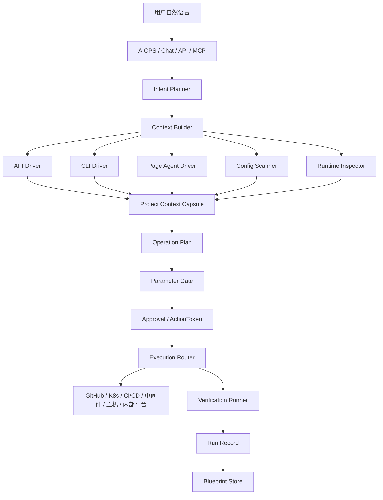

# Context-Aware Connector Hub 设计方案

## 1. 背景

企业内部通常已经有大量平台：CI/CD、发布系统、Kubernetes 控制台、GitHub / GitLab、主机管理平台、中间件控制台、权限系统和工单系统。问题不在于这些平台没有能力，而在于能力被封装在不同系统、不同页面、不同权限和不同配置规则里。

对普通用户来说，完成一个看似简单的目标，例如“把 GitHub 的某个项目部署到 Kubernetes 上”，实际需要理解很多细节：

```text
代码仓库在哪里
项目是什么技术栈
如何构建镜像
镜像推到哪个仓库
CI/CD 流程怎么配
发布平台需要哪些字段
Kubernetes namespace 怎么选
Service / Ingress / ConfigMap / Secret 怎么写
生产环境是否需要审批
失败后如何回滚
```

这些知识往往藏在平台页面、历史配置、内部文档和少数专家经验里。单纯接 API 只能看到一部分事实；单纯用页面 Agent 又容易不了解真实环境和配置关系，产生无意义操作。

因此需要一个独立项目，用来辅助 AIOPS 和其他 LLM Agent 连接企业已有平台，让用户用自然语言表达意图，系统自动收集上下文、生成配置、引导补参、执行受控操作，并把成功路径沉淀为可重复使用的资产。

## 2. 项目定位

建议将该独立项目定位为：

```text
Context-Aware Connector Hub
面向 LLM 的上下文感知连接与配置编排平台
```

它不是新的 CI/CD，不是新的 Kubernetes 控制台，也不是单独的页面自动化工具。它的职责是把企业已有系统包装成 LLM 能理解、能查询、能规划、能配置、能验证、能复用的能力层。

核心目标：

```text
用户自然语言意图
  -> 多源上下文采集
  -> 生成操作计划和配置方案
  -> 引导用户补齐必要参数
  -> 通过 API / CLI / 页面 Driver 执行受控操作
  -> 验证执行结果
  -> 沉淀为可重复使用的 Blueprint
```

这个项目应该独立于 AIOPS 主体。AIOPS 负责运维智能、RCA、经验沉淀、自愈策略和运维手册；Connector Hub 负责连接企业系统、读取上下文、生成配置、执行适配和保存可复用配置蓝图。

## 3. 设计原则

### 3.1 上下文优先

LLM 不能一上来就点页面、写配置或执行命令。系统必须先构建项目上下文，弄清楚当前项目、环境、权限、配置、依赖和风险边界。

### 3.2 多 Driver 协同

企业平台的信息分布在不同入口：

```text
API：资源状态、流水线状态、部分配置
CLI：运行时状态、集群对象、主机探测
页面：环境选项、权限状态、审批入口、隐藏校验、表单默认值
配置文件：Dockerfile、pipeline、manifest、helm values
运行时探测：端口、健康检查、依赖连通性
```

所以 Connector Hub 不能只做 API Adapter，而要同时支持 API Driver、CLI Driver、Page Driver、Config Scanner 和 Runtime Inspector。

### 3.3 Page Agent 是一等 Driver

Page Agent 不只是 API 不可用时的 fallback。很多企业内部平台虽然有 API，但 API 不开放完整能力，真正的环境选择、权限判断、审批动作和隐藏校验都在页面里。

因此 Page Agent 的定位应该是：

```text
页面事实采集 Driver
页面操作执行 Driver
```

但 Page Agent 不能独立决策。它必须受上下文、操作计划、参数校验、审批和验证约束。

### 3.4 结果必须资产化

系统不能只完成一次部署。每次成功的配置和执行路径都要沉淀为 Blueprint，后续用户可以复用同一套流程，只补齐不同环境、镜像版本、域名、namespace 等参数。

## 4. 总体架构



## 5. 核心模块

### 5.1 Connector Registry

登记所有可连接系统及其能力。

```yaml
name: internal-cicd
type: cicd
drivers:
  - api
  - page
capabilities:
  - inspect_project
  - list_environments
  - inspect_required_fields
  - configure_pipeline
  - submit_deploy_request
  - read_deploy_result
risk_levels:
  configure_pipeline: medium
  submit_deploy_request: high
```

Registry 的价值是让 LLM 知道每个系统能做什么、哪些能力只读、哪些能力高风险、哪些能力需要页面操作。

### 5.2 Adapter SDK

为每类系统提供统一适配接口。

```ts
interface ConnectorAdapter {
  discover(input: DiscoverInput): Promise<ResourceSummary>
  inspect(input: InspectInput): Promise<ResourceDetail>
  plan(input: PlanInput): Promise<ConfigPlan>
  validate(input: ValidateInput): Promise<ValidationResult>
  apply(input: ApplyInput): Promise<ApplyResult>
  verify(input: VerifyInput): Promise<VerifyResult>
  exportBlueprint(input: ExportInput): Promise<Blueprint>
}
```

不是每个 Adapter 都必须实现全部方法，但必须声明 capabilities。执行前系统根据 capabilities 判断是否能继续。

### 5.3 Context Builder

Context Builder 负责从多源采集事实，形成统一上下文。

```yaml
project:
  name: order-service
  repo: github.com/acme/order-service
  language: nodejs
  build_tool: npm
  dockerfile: missing

runtime:
  target: kubernetes
  clusters:
    - prod-cluster
  namespaces:
    - staging
    - prod

cicd:
  provider: internal-release-platform
  api_available: partial
  page_required: true
  visible_envs_from_page:
    - staging
    - prod
  approval_required: true

permissions:
  github:
    can_create_pr: true
  kubernetes:
    can_apply_staging: true
    can_apply_prod: false
  release_console:
    can_publish_staging: true
    can_publish_prod: approval_required

missing_params:
  - service_port
  - domain
  - image_registry

known_constraints:
  - prod 发布必须走页面审批
  - namespace 只能从发布平台页面选择
  - ingress 域名必须符合公司规范
```

LLM 看到的是 Context Capsule，而不是一个裸 API 或裸页面。这样它不会凭空猜配置，也不会做无意义操作。

### 5.4 Page Agent Driver

Page Agent Driver 负责页面事实采集和页面操作执行。底层可以使用 `alibaba/page-agent` 这类页面内 GUI Agent 能力，但上层不能暴露低级点击接口。

不要直接暴露：

```text
click_button
fill_input
```

应该暴露语义化能力：

```text
release_console.inspect_project
release_console.list_environments
release_console.inspect_permissions
release_console.inspect_required_fields
release_console.configure_pipeline
release_console.submit_deploy_request
release_console.read_deploy_result
```

Page Agent Driver 需要记录：

```text
页面 URL
页面 DOM 摘要
可见字段
可见按钮
当前账号权限提示
表单默认值
隐藏校验错误
操作前后 DOM 差异
页面操作 Trace
截图或录像引用
```

### 5.5 Operation Planner

Planner 根据用户意图和 Context Capsule 生成操作计划。

示例：

```yaml
intent: deploy_github_repo_to_k8s
target:
  repo: github.com/acme/order-service
  environment: staging
plan:
  - inspect_repo
  - generate_dockerfile_if_missing
  - generate_github_actions_workflow
  - generate_k8s_manifest
  - create_pull_request
  - trigger_ci_build
  - configure_internal_release_platform
  - deploy_to_k8s
  - verify_rollout
  - save_blueprint
risk:
  max_level: medium
requires_approval:
  - configure_internal_release_platform
  - deploy_to_k8s
missing_params:
  - service_port
  - domain
  - image_registry
```

Planner 的输出必须是结构化计划，不能只是自然语言建议。

### 5.6 Parameter Gate

缺参数时必须问用户，不能猜。

```yaml
required_params:
  service_port:
    type: number
    source: user
    suggestion:
      - 8080
      - 3000
  namespace:
    type: enum
    options:
      - staging
      - prod
    source: page_agent.visible_options
  domain:
    type: string
    rule: must_match_company_domain_policy
```

页面上能读取到的选项，可以作为候选项展示给用户；无法确定的值必须由用户确认。

### 5.7 Execution Router

Router 根据能力、风险和上下文选择执行方式。

```text
能走 GitHub API 创建 PR -> GitHub API
能走 K8s dry-run -> K8s API
只能在内部发布页面配置环境 -> Page Agent Driver
需要跑构建 -> CI/CD Adapter
需要检查主机端口 -> Host Driver
```

执行前必须通过权限和风险检查。

### 5.8 Verification Runner

Verification Runner 负责确认配置真的生效。

验证来源可以包括：

```text
CI/CD pipeline 状态
Kubernetes rollout status
Service endpoint 连通性
Ingress HTTP 健康检查
日志关键字
指标变化
页面结果
API 查询结果
```

页面显示“成功”不能作为唯一依据。最终验证必须尽量通过独立信号确认。

### 5.9 Blueprint Store

Blueprint 是该项目最重要的资产。

```yaml
kind: DeploymentBlueprint
name: order-service-k8s-deploy
source:
  provider: github
  repo: github.com/acme/order-service
build:
  provider: github-actions
  dockerfile: Dockerfile
  image_registry: ghcr.io/acme/order-service
deploy:
  provider: internal-release-platform
  runtime: kubernetes
  namespace_param: namespace
  manifests:
    - deployment.yaml
    - service.yaml
    - ingress.yaml
params:
  required:
    - image_tag
    - namespace
    - domain
    - service_port
verify:
  - check_pipeline_success
  - check_rollout_status
  - check_http_health
rollback:
  strategy: previous_image
```

后续用户可以说：

```text
用上次的方式，把 order-service 部署到 staging。
```

系统只需要加载 Blueprint，提示用户补齐本次差异参数。

## 6. Page Agent 的正确使用方式

Page Agent 应该被纳入完整计划，而不是直接接管页面。

### 6.1 页面事实采集

适合采集：

```text
当前用户能看到哪些环境
哪些按钮是 disabled
生产发布是否需要审批
表单有哪些必填字段
字段默认值是什么
页面校验错误是什么
某个项目是否已存在配置
发布结果页面显示了什么
```

### 6.2 页面操作执行

适合执行：

```text
填写内部发布平台表单
选择环境
提交审批申请
保存发布配置
读取发布结果
进入配置页面导出摘要
```

### 6.3 页面操作 Gate

每个页面操作都要经过以下 gate：

```text
Context Gate：没有完整上下文，不允许写操作
Plan Gate：没有结构化计划，不允许写操作
Parameter Gate：缺参数时必须问用户
Approval Gate：高风险动作必须审批
Assertion Gate：每个动作必须有前置条件和后置校验
Verification Gate：页面成功后还要做独立验证
```

页面动作 Recipe 示例：

```yaml
kind: PageActionRecipe
name: configure-internal-release-pipeline
preconditions:
  - user_logged_in
  - project_exists
  - environment_visible
params:
  - project_name
  - namespace
  - image_registry
  - service_port
steps:
  - open_release_console
  - search_project
  - select_environment
  - fill_image_registry
  - fill_service_port
  - save_config
assertions:
  - page_shows_saved_successfully
  - config_summary_matches_params
verify:
  - query_pipeline_config
  - run_dry_run_pipeline
```

## 7. 典型场景：GitHub 项目部署到 Kubernetes

用户输入：

```text
我想要将 GitHub 的 xxx 项目部署到 Kubernetes 上。
```

系统执行：

```text
1. 解析意图：GitHub 项目部署到 K8s
2. GitHub Driver 检查仓库语言、Dockerfile、workflow、默认分支
3. Config Scanner 检查项目端口、启动命令、依赖文件
4. K8s Driver 查询可用 cluster、namespace、已有 workload
5. Page Agent Driver 打开内部发布平台，读取用户可见环境、必填字段和审批要求
6. Context Builder 生成 Project Context Capsule
7. Planner 生成部署计划
8. Parameter Gate 向用户询问缺失参数
9. 生成 Dockerfile、CI/CD workflow、K8s manifest 或 Helm values
10. GitHub Driver 创建 PR
11. CI/CD Driver 触发构建和测试
12. Page Agent Driver 配置内部发布平台中 API 不开放的字段
13. K8s / 发布平台执行部署
14. Verification Runner 验证 rollout、service、ingress 和健康检查
15. 保存 Deployment Blueprint
```

用户体验：

```text
我检查了仓库和发布平台：

- 项目是 Node.js 服务
- 当前没有 Dockerfile
- 当前没有 GitHub Actions workflow
- 发布平台中你能看到 staging 和 prod 两个环境
- prod 需要审批，staging 可以直接发布
- 缺少服务端口、访问域名和镜像仓库

我可以为你生成 Dockerfile、CI/CD workflow、K8s manifest，并保存为可复用部署蓝图。
请确认：
1. 先部署到 staging 吗？
2. 服务端口是多少？
3. 访问域名是什么？
```

## 8. 安全和权限

安全原则：

```text
LLM 不能直接读取密钥
LLM 不能直接调用高风险操作
所有凭证放入 Secret Manager
所有写操作使用短期 ActionToken
所有高风险动作需要审批
所有操作都写入 Run Record
所有页面操作保存 Trace
默认优先生成 PR，而不是直接修改生产
```

权限分级：

```text
read：只读查询
plan：生成方案
propose：生成配置和 PR
apply_dev：应用到开发或测试环境
apply_prod：应用到生产环境
rollback：回滚
admin：管理连接和凭证
```

风险分级：

```text
low：只读查询、生成本地配置
medium：创建 PR、修改非生产配置、触发测试流水线
high：发布、回滚、修改生产配置、变更权限
critical：删除资源、切主、清空数据、关闭保护策略
```

## 9. 与 AIOPS 的关系

```text
AIOPS：
  - 告警响应
  - RCA 根因分析
  - 记忆系统
  - 运维手册
  - Workflow
  - 自愈策略
  - Prompt Trace

Connector Hub：
  - 连接 GitHub / K8s / CI/CD / 主机 / 中间件 / 页面系统
  - 构建项目上下文
  - 生成配置和 Blueprint
  - 执行受控配置操作
  - 验证结果
```

AIOPS 可以把 Connector Hub 当成工具层。遇到部署、配置、巡检、接入、发布、回滚等任务时，AIOPS 调用 Connector Hub；Connector Hub 返回结构化证据、执行结果和可复用资产。

## 10. MVP 路线

### Phase 1：打通部署配置闭环

```text
GitHub Connector
Kubernetes Connector
GitHub Actions Connector
Internal CI/CD Page Connector
Blueprint Store
Parameter Gate
Run Record
Verification Runner
```

目标：支持“GitHub 项目部署到 Kubernetes”，并能保存可复用 Blueprint。

### Phase 2：补齐企业内部平台

```text
Jenkins / GitLab / ArgoCD Connector
Host Connector
Redis / MySQL / PostgreSQL Connector
Page Agent Driver Recipe
审批流
Secret Manager
Web Console
```

目标：支持常见企业平台和中间件配置，不再局限于部署场景。

### Phase 3：连接 AIOPS 自治闭环

```text
MCP Server
AIOPS Tool API
OpsGraph 写入
Prompt Trace 关联
容器矩阵验证
Blueprint 版本治理
配置漂移检测
```

目标：让 AIOPS 可以复用 Connector Hub 的上下文、配置、页面操作和 Blueprint 资产。

## 11. 推荐目录结构

```text
aiops-connect-hub/
  apps/
    api-server/
    web-console/
    mcp-server/

  packages/
    adapter-sdk/
    connector-registry/
    context-builder/
    planner/
    blueprint-engine/
    secret-manager/
    verification-runner/
    page-agent-driver/

  connectors/
    github/
    github-actions/
    kubernetes/
    internal-cicd/
    host/
    redis/
    mysql/
    jenkins/
    argocd/

  blueprints/
    github-to-k8s/
    nodejs-service-to-k8s/
    java-service-to-k8s/
    internal-cicd-release/

  recipes/
    page-actions/
      configure-internal-release-pipeline.yaml
      submit-prod-approval.yaml
      read-release-result.yaml
```

## 12. 结论

这个独立项目的关键不是“让 AI 操作页面”，也不是“把所有平台都接 API”，而是建立一层上下文感知的连接中台。

API 解决机器可见事实，Page Agent 解决页面可见事实，配置扫描和运行时探测解决项目现场事实。Connector Hub 把这些事实合成完整上下文，再让 LLM 基于上下文生成计划、补齐参数、执行受控操作，并把成功路径沉淀为 Blueprint。

这样企业已有 CI/CD、发布平台、中间件控制台和 Kubernetes 能力不需要被重做，但可以被 AI 低门槛地使用起来。用户不需要先学习每个平台的配置细节，只需要表达目标；系统负责理解平台、补齐配置、执行验证，并让这次配置变成下次可以复用的资产。
